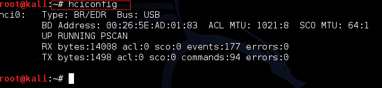
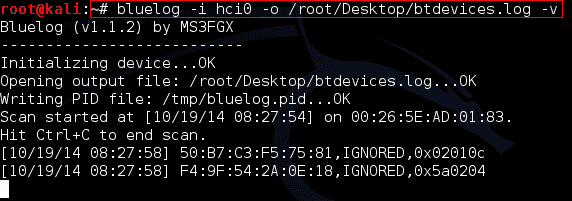
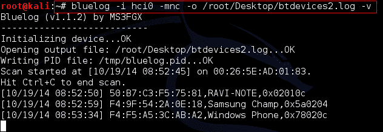

# Bluelog

> 原文：<https://kalilinuxtutorials.com/bluelog/>

## **简单蓝牙发现与 Bluelog** 

Bluelog 是一个简单的蓝牙扫描仪，它被设计成基本上只做一件事，记录该地区所有可发现的设备。它旨在用作现场调查工具，识别周围环境中可能存在的蓝牙目标的数量。这个工具只显示可见的设备，如电脑，电话，打印机等。这不会显示可见性关闭的设备。

注意:请确保您不是在虚拟机上测试该工具，如果是，您需要插入一个 USB 蓝牙设备并将其连接到您的虚拟机上。还要确保设备已打开。请继续阅读，了解更多指导方针。

### **选项**

```
Syntax: bluelog -i <interface> <options>
```

**基本选项:**

-i <interface>设置扫描设备，默认为“hci0”</interface>

-o <filename>设置输出文件名，默认为“devices.log”</filename>

-v Verbose，将发现的设备打印到终端

-q 静音，关闭不重要的终端输出

-d 启用守护模式，Bluelog 将在后台运行

-k 终止一个已经运行的 Bluelog 进程

-l 启动“Bluelog Live”，默认为禁用

**记录选项:**

-n 将设备名称写入日志，默认为禁用

-m 将设备制造商写入日志，默认为禁用

-c 将设备类别写入日志，默认为禁用

-f 使用“友好”设备类，默认为禁用

-t 将时间戳写入日志，默认为禁用

-x 混淆发现的 MAC，默认为禁用

-e Encode 发现带有 CRC32 的 MAC，默认禁用

-b 启用 BlueProPro 日志格式，请参见自述文件

**高级选项:**

-r <retries>名称解析重试次数，默认值为 3</retries>

-a <minutes>失忆，Bluelog 会在给定时间后忘记设备</minutes>

-w <seconds>以秒为单位扫描窗口，参见 README</seconds>

-s 仅系统日志模式，无日志文件。默认为禁用

蓝皮书主页:[http://www.digifail.com/software/bluelog.shtml](http://www.digifail.com/software/bluelog.shtml)

* * *

### **实验 1:扫描所有蓝牙设备，并将它们记录到一个文件中。**

在本实验中，我们简单地扫描周围的所有蓝牙设备，并将它们记录到一个文件中。首先，我们需要检查我们的蓝牙接口。正如我前面所说的，确保在一台物理机器上打开蓝牙设备。在一些笔记本电脑中，如果运行 kali linux，用于打开/关闭设备的热键不能很好地工作。那么您可能需要添加额外的内核模块来解决这个问题。在接下来的两个实验中，我使用了一台联想笔记本电脑，它在开始运行 kali linux 时出现了一些问题。不管怎样，我们继续吧。

第一步:确保你的蓝牙设备正在工作，并得到它的 MAC。

```
Command:hciconfig
```

[](http://kalilinuxtutorials.com/wp-content/uploads/2015/05/bluelog1.png)

Bluetooth interface details

由此我们可以看到我们系统/机器中的蓝牙设备。这里我们有一个 hci0 接口。

第二步:开始扫描

```
Command: bluelog -i hci0 -o /root/Desktop/btdevices.log –v
```

[](http://kalilinuxtutorials.com/wp-content/uploads/2015/05/bluelog2.png)

Blog scanning, devices appearing

10 分钟后检查 btdevices.log 后的文件。您可以看到您/您的工作机器附近的所有设备。

[](http://kalilinuxtutorials.com/wp-content/uploads/2015/05/bluelog3.png)

Output file

* * *

### **实验 2:记录附加信息**

在本实验中，我们记录有关制造商、广播名称和设备类别的其他信息。

```
Command: bluelog -i hci0 -mnc -o /root/Desktop/btdevices2.log –v
```

[](http://kalilinuxtutorials.com/wp-content/uploads/2015/05/bluelog4.png)

Advanced options

然后检查文件 btdevices2.log

[](http://kalilinuxtutorials.com/wp-content/uploads/2015/05/bluelog5.png)

Output File

注意:记住扫描是一个耗时的过程。你越有耐心，结果就越好。这个过程也类似于开车的过程。如果你有一个便携的设备，并能四处走动，加上你的一些社会工程技能，你会得到很好的结果。