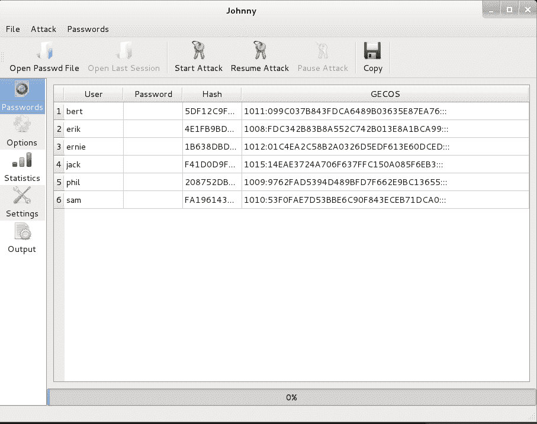
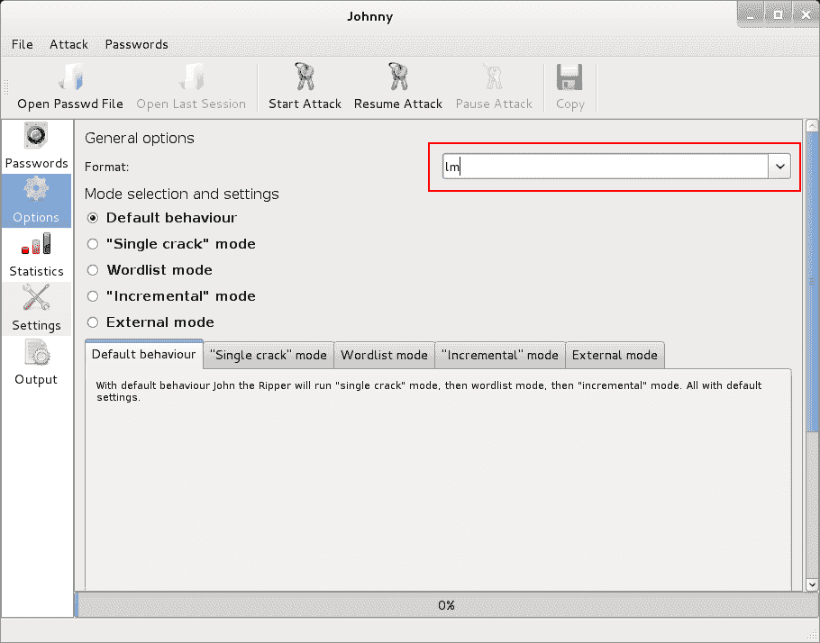
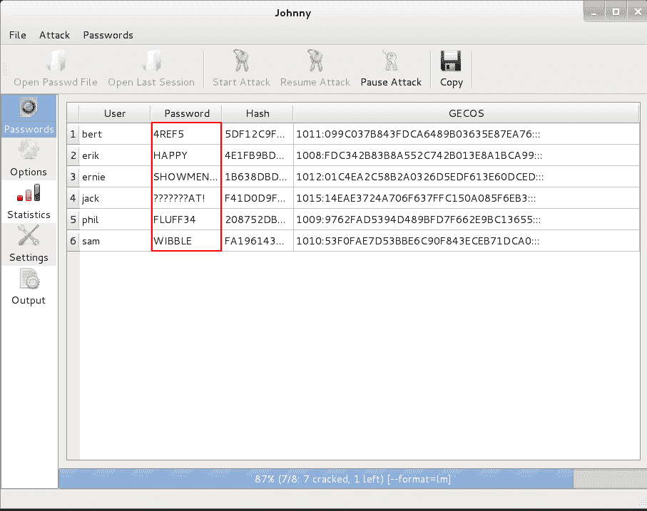

# 男人

> 原文：<https://kalilinuxtutorials.com/johnny-win/>

## 实验 2:测试 Windows 系统的复杂性，使用 Johnny 破解 Windows 散列

在未禁用 LM 哈希的情况下破解 Windows 密码时，两个哈希存储在 SAM 数据库中。SAM 是安全客户经理。它以加密的形式存储 LM & NTLM 散列。因此，首先我们必须解密或转储散列到一个文件中。为此，kali linux 中的其他工具在本系列中有所描述。检查用于解密和转储 SAM 的工具“samdump2”。在本实验中，我们有一个包含 LM 和 NTLM 哈希的转储文件，名为“哈希”。

第一个是 LM 哈希(由于设计缺陷，相对容易破解，但通常为了向后兼容而存储)

第二个是 NTLM 散列，它更难破解(当使用强密码时)。

**步骤 1** :将哈希文件加载到 Johnny 中。

Loading the LM Hash

**第二步**:在选项页签中选择 LM 作为格式。

Selecting the Format

第三步:开始攻击并寻找结果

Passwords Shown

这一个&前一个关于 Johnny 的，这些可能真的很耗时&处理器密集。用暴力破解密码可能要花上一千年。所以有时候(事实上大多数时候)我们使用单词列表攻击，提供一个单词列表来破解密码。

如果你想知道引擎盖下发生了什么，请继续阅读。

强力是一种在特定的键空间尝试所有组合的简单方法。假设我们有一个带 3 位数密码锁的手提箱。假设你忘记了解锁密码。你想不出那是什么，你会怎么做？简单地说，你可以尝试从 000 到 999 的所有三位数组合。那么破解密码需要多少时间？暴力破解也是如此。程序和脚本分析使用的加密算法的类型，计算密钥空间并遍历其中的所有值。

还有单词列表攻击。在这种情况下，包含常用密码列表的单词表被提供给攻击者。程序(这里是 john)首先找出在提供的散列中使用的散列/加密技术。然后程序计算提供的列表中每个单词对应的哈希，并与需要破解的哈希进行比较。我们将在后面的教程中做一些单词列表攻击。这也被称为“字典攻击”。

http://en.wikipedia.org/wiki/Brute-force_attack

http://searchsecurity.techtarget.com/definition/dictionary-attack