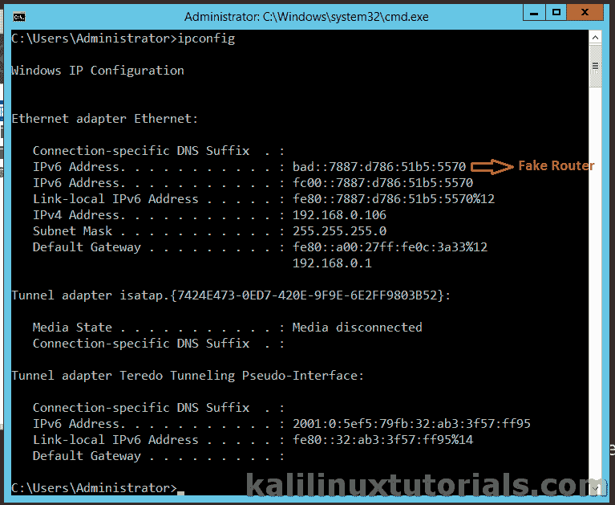
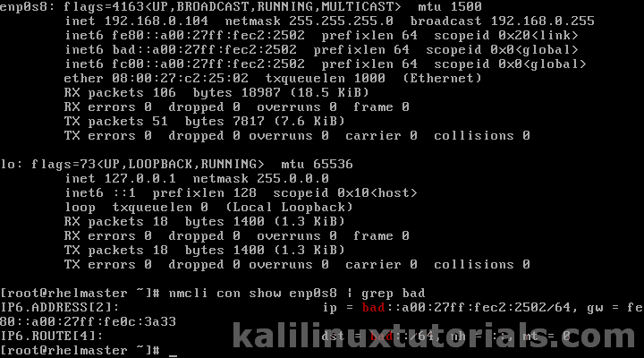
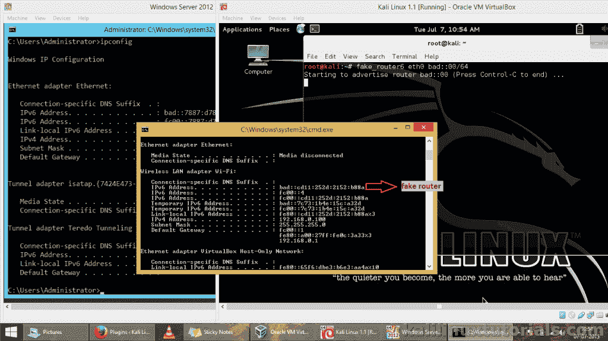

# 山寨 _ 路由器 6

> 原文：<https://kalilinuxtutorials.com/fake_router6/>

## 使用 fake_router6 通过一个简单的步骤创建一个 rouge ipv6 路由器

fake_router6 是捆绑在 Kali linux 中的 THC-IPv6 工具中的一个工具，用于测试 IPv6 和 icmp6 协议中的漏洞利用和攻击弱点以及协议复杂性。顾名思义，来自黑客的选择。在我们开始攻击之前，让我们在引擎盖下呆一会儿。在 IPv4 中，你知道什么是“ARP”，在 IPv6 中，它被 ND 取代，扩展为邻居发现。ND 结合了 IPv4 中存在的 ARP、ICMP、ICMP 重定向和路由器发现的功能。ND 还有其他一些优点和附加功能，如发现相邻设备和主机、链接第 2 层(链路层)地址、通告主机/路由器的存在等。基本上有 5 种类型的 ND 消息。

*   路由器请求(ICMPv6 类型 133)
*   路由器广告(ICMPv6 类型 134)
*   邻居请求(ICMPv6 类型 135)
*   邻居通告(ICMPv6 类型 136)
*   重定向(ICMPv6 类型 137)

在这里，我们可以关注第二个，路由器广告。IPv6 路由器以不规则的方式向多播地址发送包含链路层信息的 RA 数据包。这可以包含关于路由器的链路层地址、网络范围、主机所需的 MTU 等信息。当客户端主机或机器进入网络时，它接收该 RA 数据包并连接到相应的路由器，并获得在该范围内定义的 IPv6 地址。

fake_router6 向优先级最高的网络发送路由器广告数据包。因此，即使网络中存在其他 IPv6 路由器，新客户端也会连接到 fake_router6 创建的 rouge 路由器。

首页:[https://www.thc.org/thc-ipv6/](https://www.thc.org/thc-ipv6/)

参考资料:[http://tools.kali.org/information-gathering/thc-ipv6](http://tools.kali.org/information-gathering/thc-ipv6)

[http://computernetworkingnotes . com/IPv6-features-concepts-and-configuration s/IPv6-neighbor-discovery . html](http://computernetworkingnotes.com/ipv6-features-concepts-and-configurations/ipv6-neighbor-discovery.html)

[https://TechNet . Microsoft . com/en-in/library/cc 781672% 28v = ws . 10% 29 . aspx](https://technet.microsoft.com/en-in/library/cc781672%28v=ws.10%29.aspx)

让我们看看它的作用

**注:本教程是 Kali 1.0.9 最新的时候写的。在较新的版本(卡利萨那&卡利滚动)的命令已经改为 atk6-工具。例如你正在使用 fake_router6，在较新的版本中就变成了 atk6-fake_router6。**

### 选择

```
Syntax: fake_router6 [-HFD] interface network-address/prefix-length [dns-server [router-ip-link-local [mtu [mac-address]]]]
```

```
-H adds hop-by-hop
-F fragmentation header
-D dst header

```

### 实验室:在网络中宣传假路由器

注意:这可能会导致 DOS 攻击，请谨慎使用。请在获得许可的情况下或在测试网络上使用它。

简单地通过一行命令发起攻击。

```
command: fake_router6 eth0 <replace with your interface> bad::00/64 <replace with your fake n/w>
```

[](http://kalilinuxtutorials.com/fake_router6/fake_router6-2/)

Command

现在，我将打开我拥有的一台 Windows 2012 Server 虚拟机。相反，你可以尝试任何支持 IPv6 的机器。

之后，打开 cmd & issue

```
Command: ipconfig
```

[](http://kalilinuxtutorials.com/fake_router6/fake_router6-3/)

New Clients being affected

现在让我们在 RHEL7 服务器上试试。

启动系统后，打开终端&问题

```
Command : ifconfig
```

如果是版本 7(CentOS/RHEL v7)，可以试试

```
nmcli con <name> show | grep bad<replace with your network suffix>
```

[](http://kalilinuxtutorials.com/fake_router6/fake_router6-5/)

Fake address on a RedHat server on interface with auto configuration.

令人惊讶的是，即使我没有重启网络，我运行 Windows 8.1 的实时系统也获得了 rouge 网络的地址。

[](http://kalilinuxtutorials.com/fake_router6/fake_router6-4/)

Real Machines being affected

希望你喜欢这个教程。记住！做一个怀特哈特/格雷哈特，不要做一个孩子。还记得订阅，评论和关注。