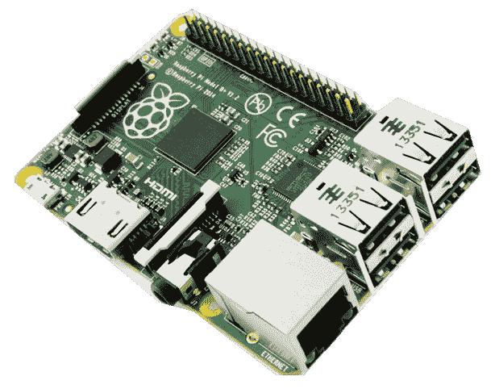
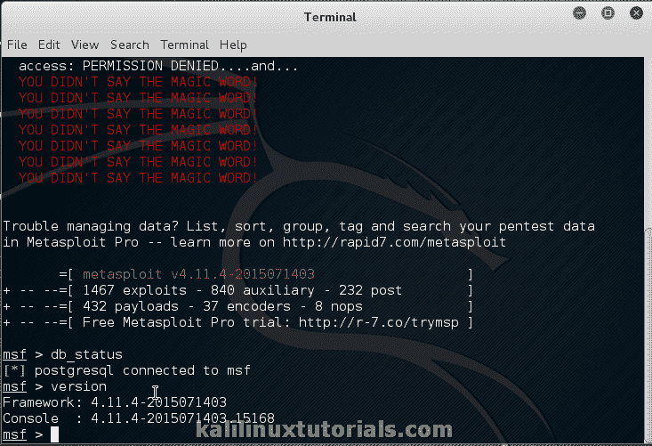

# 先看 Kali Linux 2.0

> 原文：<https://kalilinuxtutorials.com/first-look-kali-linux-2-0/>

# 渗透测试发行版的重生——Kali Linux 2.0 代号:Kali Sana

8 月 11 日，Kali Linux 版发布。它的代号是 Sana。经过从 Kali 1.0 到 1.1 的严格更改和更新，Kali Linux 的制造商，进攻型安全已经决定从 Kali Linux 发布以来进行重大更改的 2.0 版本。主要是一些最终用户的修改，如可访问性，更新的工具，更稳定和更新的内核是一些更新。开发人员已经使新版本更加用户友好，并与最新的桌面环境互动。开发者还说它是高度可定制的。另一个值得注意的是，Kali Linux 现在支持多种 ARM 设备，包括一些最新的智能手机。

以下是主要的更新

### GNOME 3 会话

Kali Linux 新版本中最巧妙的更新是引入了完整的 Gnome 3 会话。在旧版本中，它是一个后备方案(功能有限)。许多人不想从原路返回到卡利，因为那里完全黑暗的环境和漆黑的墙纸。新版本带有一个明亮的新壁纸，GNOME 3 热角(应用概述)，一个高度可定制的侧边栏，新的，改进的和定制的 GTK 外壳和许多更多的视觉 tweeks。

**优点**:

1.  更加用户友好
2.  高度可定制
3.  默认情况下带有 Gnome-Tweak-Tool
4.  更明亮的体验。
5.  附加功能，如多桌面，简易屏幕和录音机，应用角落等。

**缺点**:

1.  最低要求更高。
2.  消耗更多资源。

以下是一些截图

### 更好地支持 ARM 和其他机器人套件。

官方上，Kali Linux 现在可用于所有主要版本的谷歌 Chromebooks、Raspberry PI Odroids 和一些更多的机器人套件。除此之外，Kali & the Nethunter images 对 Nexus、One Plus 1 等设备有更稳定的支持，这是一个新的补充。此外，开发人员声称编译新的驱动程序会更容易，因为它们已经包含了所有的源代码内核头文件。

除此之外，他们还提供了一个新的 VMware/VirtualBox 映像，并改进了来宾添加软件包。

**优点**:

1.  完整内核解决了早期版本中发现的许多驱动程序问题。
2.  更适合那些有嵌入式/机器人/电子系统知识的人。现在可以安装在 Chromebooks 和其他基于 ARM 的系统上。
3.  适用于 Nexus 5–10 和一加 1 的 Nethunter。

反对意见:可能没有

了解更多:[https://www . offensive-security . com/kali-Linux-net hunter-download/](https://www.offensive-security.com/kali-linux-nethunter-download/)

图片列表:[https://www . offensive-security . com/kali-Linux-VMware-arm-image-download/](https://www.offensive-security.com/kali-linux-vmware-arm-image-download/)

### Metasploit

这是新版本的主要缺点之一。Kali Linux 的新版本带有 metasploit 的开源基础包，WebUI 和其他社区/专业服务不可用。无论如何，Metasploit 社区可以从 [Rapid7](http://www.rapid7.com/) 的网站下载、注册和安装。

Metasploit

**优点:**

那会是什么呢？是的，开发者声称，这样做的好处是，由于使用了原生 ruby 包，它有更快更流畅的体验。

**缺点:**

1.  服务 Metasploit 不可用。因此，必须手动启动 PGSql，初始化数据库并连接它。
2.  Metasploit Community/PRO 的用户友好型 WebUI 不可用。

### 更新和更好的工具。

从第一眼看，旧的菜单系统经历了一些小的变化，但增加了一些新的工具。值得注意的一点是增加了 PixieWPS，它可以更快地攻击和破解 WPS。然后当然内核是 Linux 内核 4.0。开发者也坚持 debian 标准。源代码包不断地从 debian 测试库中取出&更新的包也在 Kali Linux 上测试。这使得它成为符合 Debian 标准的稳定且前沿的发行版。

### 结论

总而言之，进攻性安全，Kali Linux 的制作者们已经非常认真地对待 Kali Linux 2.0 的发布。他们带来了一些巨大的变化，使这个平台兼容更多的设备&确保更高的稳定性。此外，Kali sana 还引入了新的和改进的工具集和界面，使其成为迄今为止最强大的渗透测试发行版。