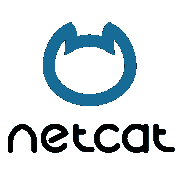

# NMAP 7.0 发布

> 原文：<https://kalilinuxtutorials.com/nmap-7-0-released/>

# NMAP 7.0 有什么新功能？

Nmap 一直是安全专业人员的扫描仪之王。自第一版发布 18 年后，第七版已经发布。这是当前主要的稳定版本，包含了大约 330 个重要的改进。在这段时间里，开发人员设法提高了扫描速度，增加了更多的功能，包括更多的脚本等等。这一次也有一些重大发展。根据官方文档，有 7 个方面的重大改进。Nmap v7 有 7 项重大改进——真是太巧了！

让我们简短地看一看它们。

### Nmap 脚本引擎(NSE)

Nmap Scripting Engine
Orginal: Maserati

Nmap 脚本引擎允许用户用 [lua](http://www.lua.org/about.html) 脚本语言编写自定义脚本。它赋予用户权力&灵活性，在高级环境中自动&列举各种任务&目标。对于那些不知道的人来说，NMAP 6.xx 系列默认打包了大约 340 个预先编写的脚本。然而，在这个主要版本中，这个数字已经跃升到 515。在这 171 个中，增加了 4 个删除，其中 35 个专门用于版本检测(-sV)扫描。

详细描述参见此处的

### IPv6 支持

IPv6

自 2002 年以来，Nmap 项目一直支持 ipv6。现在，由于 ARIN 用完了 IPv4 地址，他们已经转移到 IPv6。慢慢地，全球趋势正在向 IPv6 转变，nmap 也是如此。在此版本中，IPv6 模块进行了一些重大更改。以下是对它们的简要描述:

#### 1.空闲扫描支持

由于 IPv6 数据包的结构和特性，空闲扫描尚未在 IPv6 网络中实现。但是现在新的技术已经开发出来了，并且它也已经在 Nmap 7.0 中实现了。

#### 2.单播-CIDR 距离风格扫描。

现在使用 Nmap，我们可以像在旧的 IPv4 扫描中一样扫描范围。例如:google.co.in/120.

#### 3.增强型 NSE 脚本

许多现有的脚本现在都支持 IPv6。此外，还引入了 4 个专用 IPv6 脚本，用于主机发现、DOS、traceroute 等。

#### 4.并行反向 DNS 解析器

现在，反向 DNS 解析器支持 IPv6 和使用“-6”选项的更快扫描，因为代码中的核心级别发生了变化。

#### 5.操作系统检测

使用新技术，IPv6 中的操作系统检测在此版本中得到了改进。

#### 6.高级跟踪路由

现在，traceroute 也可用于 IPV6 扫描。它甚至能够使用 UDP，SCTP 等就像 IPv4 扫描。

### 高级 SSL 扫描功能 

现在 Nmap 具有扫描 SSL/TLS 中不同安全漏洞的功能，如 Heartbleed、Poodle、LOGJAM、FREAK 等。新的脚本也可以执行这些任务。还支持通过 TLS 运行的各种其他服务，如 LDAP、POP3、IMAP 等。

### 基础设施升级

Nmap 正式宣布在他们的开发和维护中的一些重大升级。nmap.org 现在正式启用了 TLS，并通过 GIT 等进行了版本控制。

### 性能提升

新的 NSOC 引擎给新版本更快更准确的扫描结果。nmap 扫描的方式有了很大的改进。开发人员已经注意到提高准确性和速度。

Netcat

### Ncat 增强

开发人员声称新的 ncat 包对 nc & netcat 命令中的错误提供了更好的支持和解决方案。他们声称这是 RedHat/Fedora 团队宣布的对 Ncat 包的官方支持，这使得人们可以更好地理解这种系统，并最终解决许多错误。

### 便携性极限

尽管该工具可以在多种平台上工作，但其可移植性却得到了提高。现在，nmap 可以在 Windows 10、MAC OS-X 10.11 El Capitan、Solaris 和 AIX 上运行。

## 结论

除了上面列出的变化，这个版本中还有更多的变化，提高了这个工具的功能和效率。此版本中还引入了许多功能变化，如 IPv6 空闲扫描和更新的扫描技术。综上所述，从版本 6 到版本 7 大约 2 年的开发已经得到了回报。我的观点是，nmap 已经从一个简单的侦察工具发展成为一个专用的漏洞扫描器。此外，nmap 的功能也在不断发展，随着该版本的发布，许多用户端功能(如 IPv6 扫描和更好的 NSE 脚本)已经实现。所以总结一下，我们可以得出结论，在 Pentester 的瑞士军刀中，刀片的数量和锋利度都增加了。

一定要分享这篇文章&把你的观点作为评论发表出来。

## 参考

[https://nmap.org/7/#7changes](https://nmap.org/7/#7changes)