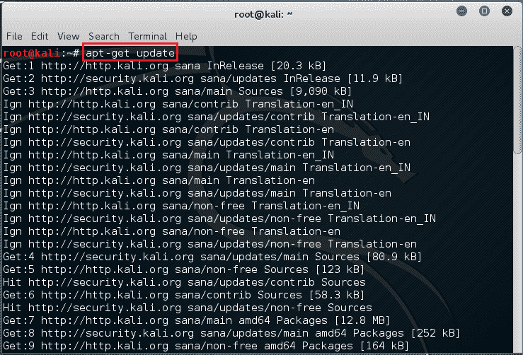
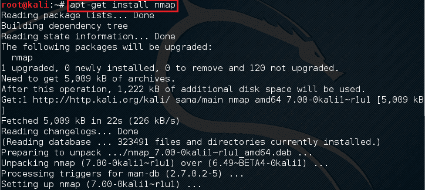
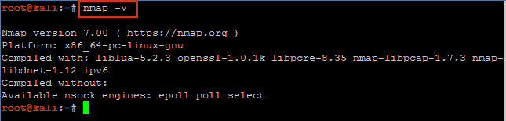

# 在 Kali Linux 中更新 Nmap

> 原文：<https://kalilinuxtutorials.com/update-nmap-in-kali-linux-2-0/>

# 在 Kali Linux Rolling、Sana 和早期版本中安装和更新 Nmap

本教程将向您展示如何在 kali linux 2.0 中更新 nmap。Nmap 7.0 于本月早些时候发布。请参考此处查看 Nmap 7 的新增功能。

Kali Rolling 默认自带 nmap v7。您仍然可以使用下面的步骤来更新 nmap 或任何其他工具，同时编辑源。列表

要更新到，我们首先需要确保所有存储库都已就绪。

您可以通过以下命令来验证这一点

```
Command: cat /etc/apt/sources.list/
```

## Kali Rolling 回购的官方列表

```
deb http://http.kali.org/kali kali-rolling main contrib non-free
#Source Repo
deb-src http://http.kali.org/kali kali-rolling main contrib non-free
```

## Kali 2.0 的官方存储库(SANA):

```
deb http://old.kali.org/kali sana main non-free contrib
deb-src http://old.kali.org/kali sana main non-free contrib

```

## 旧版本(Kali 1.0 MOTO)

```
deb http://old.kali.org/kali moto main non-free contrib
deb-src http://old.kali.org/kali moto main non-free contrib
```

如果您没有以上所有内容，您可以从列表中复制并粘贴到“/etc/apt/”中的“sources.list”文件中

接下来，更新操作系统中现有的软件包数据库。

```
command: apt-get update
```

[](http://kalilinuxtutorials.com/kali/update-nmap-in-kali-linux-2-0/attachment/nmap7-1/)

Updating the database

这需要几分钟时间。时间取决于你的互联网连接和更新的数量。

完成后，我们就可以安装新版本了。

为此，只需安装一次 nmap。Apt 会智能地将现有版本更新到最新版本。

```
command: apt-get install nmap
```

[](http://kalilinuxtutorials.com/kali/update-nmap-in-kali-linux-2-0/attachment/nmap7-3/)

Install Nmap

完成后，我们可以通过执行以下命令来验证版本:

```
command: nmap –V
```

[](http://kalilinuxtutorials.com/kali/update-nmap-in-kali-linux-2-0/attachment/nmap7-4/)

Checking Version

请记住，在您安装时，可能会有更新的版本。这些步骤适用于所有这些更新，直到 Kali 的基础版本相同。一旦卡利萨那升级，你可能需要改变仓库。如果您使用的是 Kali Linux 1.X，也请记住使用第二个回购列表。

可选地，在 GUI 包 Zenmap 中有一些小的更新。更新 nmap 后，您也可以更新 zenmap 包。这个也简单。只需打开一个终端并执行以下命令:

```
Command: apt-get install zenmap
```

希望这有所帮助&请留意 Nmap 上的完整教程系列。