# 打嗝-使用打嗝入侵者来强行形成

> 原文：<https://kalilinuxtutorials.com/burp-intruder-bruteforce-forms/>

# 利用打嗝入侵者来破解密码。

Burpsuite 是用于任何 web 应用程序安全测试的工具和插件的集合，捆绑在一个可执行的 jar 文件中。它包含大约 8 个有用的工具，用于执行爬行，模糊，解码等。但是它的主要特点是，它是一个工作在应用层的拦截代理。因此，即使是 HTTPS 连接穿过囊岩也是可见的。在这篇文章中，我们将看到如何使用 burp 入侵者在 web 应用程序中强制输入。对于不熟悉 burpsuite 的人来说，请阅读这篇关于 Burpsuite 入门的文章。其他人可以直接进行。

## 打嗝闯入者

burp 入侵者是 burpsuite 中的一个特性，它有助于执行广泛的模糊测试。它帮助我们用提供的单词表枚举请求中的各种参数。从密码暴力到 XSS 测试，我们可以使用 burpsuite 中这个神奇的插件执行各种模糊处理。

### 入侵者是如何工作的？

为了开始处理入侵者，我们需要捕获请求。这可以是 GET 或 POST 请求，具体取决于 web 应用程序。一旦 rwquest 被捕获，就可以发送给入侵者。然后入侵者分析请求中可以插入有效载荷的可变位置。有效载荷只是我们提供的一个单词表。在提供了单词表之后，入侵者可以在位置集合上遍历单词表中的所有组合。

## 实验室设置

在本教程中，我使用 Mutillidae 作为目标，运行在 Kali 上的 Burpsuite 作为攻击者。教程的最后给出了 Mutillidae 的下载链接。

**目标**:OWASP-BWA-章鱼-IP = 10 . 0 . 2 . 4

**目标 URL**:10 . 0 . 2 . 4/mutillidae/index . PHP/page = log in . PHP

**攻击者**:Kali Linux 2.0–IP = 10 . 0 . 2 . 5

## 实验 1:强力登录表单

在本实验中，对密码执行简单的暴力破解。本教程展示了在 mutillidae 上执行此操作。您可以在任何登录表单上执行此操作。

### 步骤 1:将 Burp 设置为拦截代理

为此，您需要首先将 burp 设置为代理。如果你不清楚这一点，请参考 Burpsuite 文章开始。

### 步骤 2:捕获请求

配置好 burp 后，开始拦截并打开目标页面。

[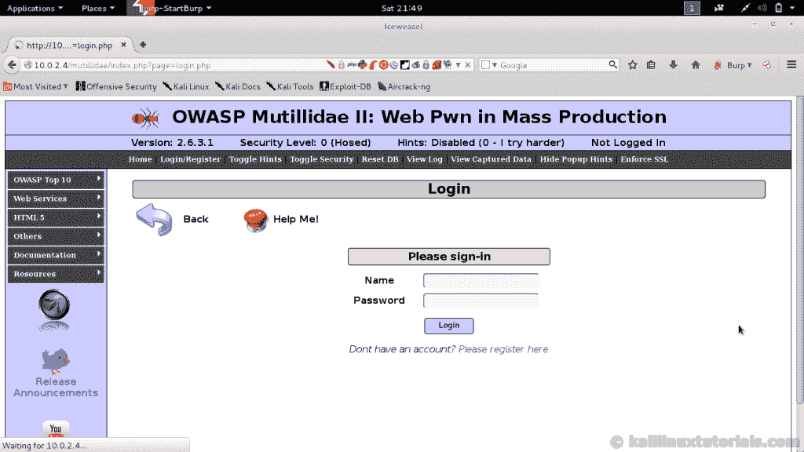](http://kalilinuxtutorials.com/burp-intruder-bruteforce-forms/burp-intruder-1/)

Opening the Target Page

[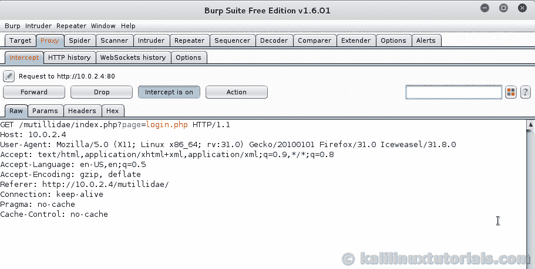](http://kalilinuxtutorials.com/burp-intruder-bruteforce-forms/burp-intruder-2/)

Forwarding the Request

### 步骤 3:捕获 POST 请求

捕获 POST 请求，其中用户名和密码被提供给 web 应用程序。这有时也是一个 GET 请求。无论如何，我们需要捕获一个请求，其中一些变量值被提供给服务器。

[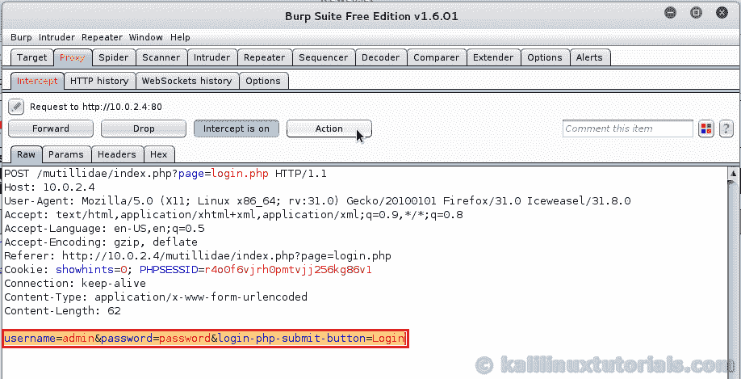](http://kalilinuxtutorials.com/burp-intruder-bruteforce-forms/burp-intruder-3/)

Capturing POST Request

### 步骤 4:发送给入侵者&配置选项

点击右上角的操作按钮，并选择发送给入侵者。

[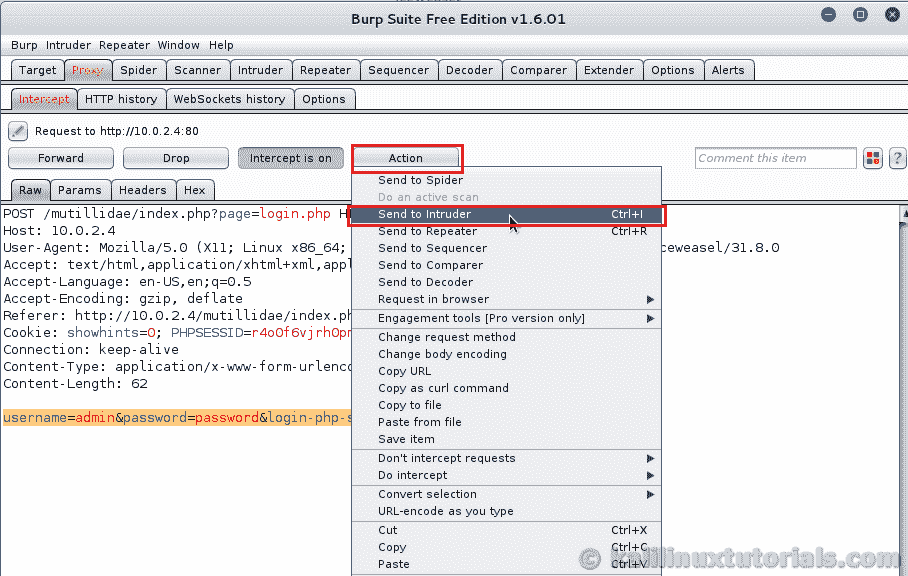](http://kalilinuxtutorials.com/burp-intruder-bruteforce-forms/burp-intruder-4/)

Sending to Intruder

然后，你会看到入侵者的选项和第一个目标将被显示。此页面/选项卡包含目标选项，如主机端口使用 SSL 等。只需交叉验证您攻击的目标是否正确显示在此部分，然后继续下一步

[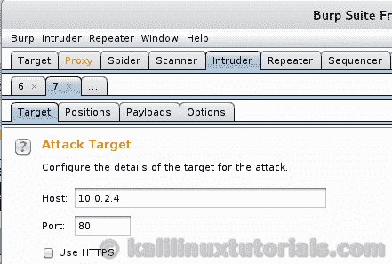](http://kalilinuxtutorials.com/burp-intruder-bruteforce-forms/burp-intruder-5/)

Intruder – Host Options

接下来，转到位置选项卡。这是我们设置要攻击/模糊的变量的地方。Burp 将自动填充所有可以运行模糊测试的位置。您可以使用选项卡右侧的选项对其进行自定义。

[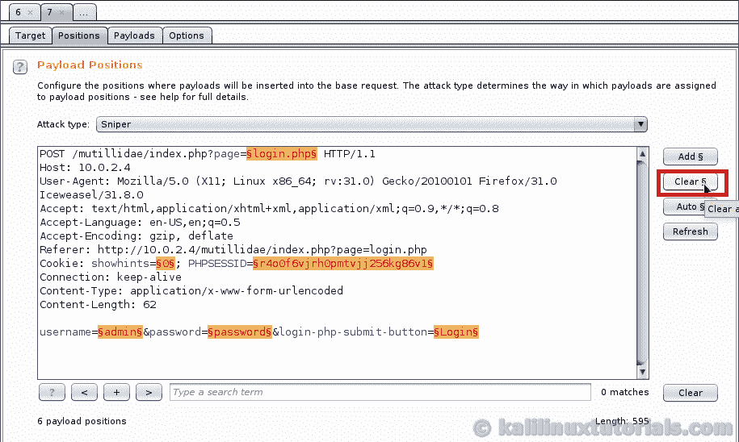](http://kalilinuxtutorials.com/burp-intruder-bruteforce-forms/burp-intruder-6/)

Intruder Positions

在这种情况下，清除所有位置并在密码变量中添加位置。在整个请求的底部可以看到。通过单击“添加”按钮来完成此操作。首先将光标放在“=”后面，然后单击 add。然后转到该字段的最后一个字母，并将光标放在那里。在那里添加一个位置，否则该位置后的所有内容将被视为一个位置。就像编程或数学中的闭括号一样，确保开仓和平仓。

[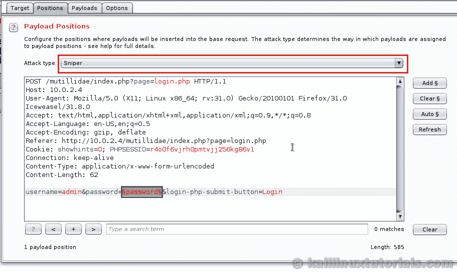](http://kalilinuxtutorials.com/burp-intruder-bruteforce-forms/burp-intruder-7/)

Setting Position & Type

一旦设置好位置，确认攻击类型是否为 Sinper。这种攻击类型的工作原理就像狙击枪。它将有效载荷精确地发射到一个点上。如果你有多个位置，它将在第一个位置发射有效载荷，然后移动到第二个位置，以此类推。(一次一个)。说到有效载荷，请继续阅读，这将在下一段解释，所以请继续阅读有效载荷选项卡。

在 Payloads 选项卡中，您可以设置单词列表或变量列表，以便根据我们之前设置的有效负载位置运行。你可以在这里尝试多种可能性和组合。你可以加载一个包含所有单词或字符串的列表，或者你可以根据你提供的字符生成单词。可以在有效负载类型下拉菜单中指定。试着浏览它们，你会明白入侵者的力量。现在我们提供一个简单的列表。选择有效负载类型为简单列表&单击 load 按钮打开一个浏览器窗口。选择包含密码的单词列表。在 Kali 中，sme 默认单词列表位于“/usr/share/wordlists/”中。对于这一个，我选择了“/usr/share/word lists/metasploit-jtr/password . lst”。

[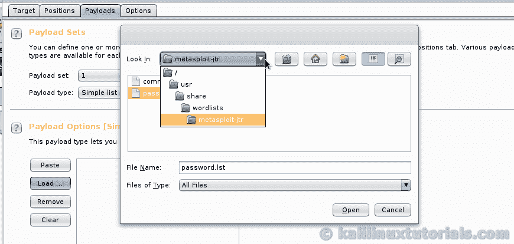](http://kalilinuxtutorials.com/burp-intruder-bruteforce-forms/burp-intruder-9/)

Loading word list

成功加载后，您可以在 Load 按钮旁边的区域看到列表的内容。您也可以使用那里的其他按钮来编辑内容。

[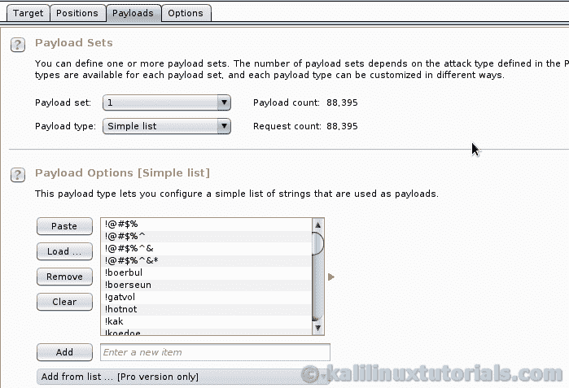](http://kalilinuxtutorials.com/burp-intruder-bruteforce-forms/burp-intruder-10/)

### 第五步:开始进攻。

一旦一切都设置好了，点击顶部的入侵者菜单并选择开始攻击。

Starting the Attack

现在，入侵者攻击窗口弹出，显示正在进行的攻击。在这里，您可以看到 HTTP 代码和响应长度等细节。现在是分析结果的困难部分。根据攻击的目标和性质，结果会有所不同。从一堆结果中，你需要适当地分析它。一种方法是分析结果的模式。对于某些条目，响应代码或长度可能会有所不同。这可能是一次成功的攻击，也可能是一次失败的攻击。这取决于攻击的目标和性质。在这种情况下，我知道如果用户名和密码是正确的，服务器将返回一个 HTTP 302。所以我会留意的。这里的想法就是我刚才说的，寻找模式&模式的变体。首先详细检查变化。它可能包含成功攻击的详细信息。

[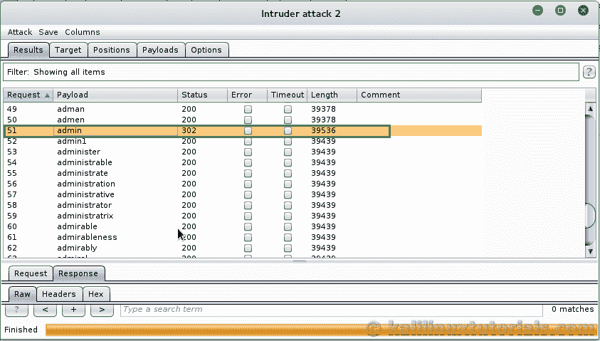](http://kalilinuxtutorials.com/burp-intruder-bruteforce-forms/burp-intruder-13/)

Successful Result

在上面的截图中，我们有一个 302 响应，这表明这可能是一次成功的攻击。如果您有这样的结果，请从主区域单击特定的请求，并查看下面的结果选项卡。

[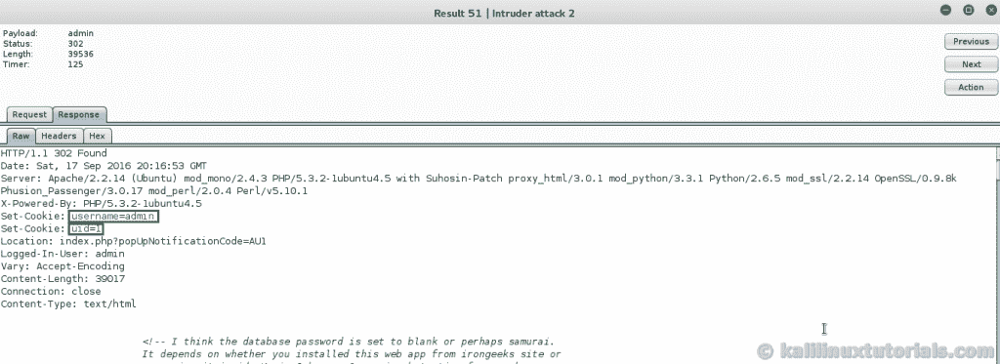](http://kalilinuxtutorials.com/burp-intruder-bruteforce-forms/burp-intruder-14/)

Attack Results

这里，对于用户名为 admin 的请求，我们有一个 uid=1 的 cookie，这意味着这个特定的请求已经成功。在顶部查找有效负载，或者分析 Request 选项卡以查看提供的密码。在本例中，密码是“admin”。所以你成功地进行了一次密码暴力破解。

这篇文章很长，涉及了很多概念和过程。如果你还没有这样做的话，你可以在这篇文章开始的时候自己做这件事。然后你会遇到许多问题，你会了解不同的技术来运行这种攻击。

如果你觉得这篇文章内容丰富或者喜欢这篇文章，请分享这篇文章。

## 参考和链接

[打嗝入侵者攻击类型](http://nitstorm.github.io/blog/burp-suite-intruder-attack-types/)

[章鱼下载](https://sourceforge.net/projects/mutillidae/files/latest/download)

[OWASP 断网应用](https://sourceforge.net/projects/owaspbwa/files/latest/download)