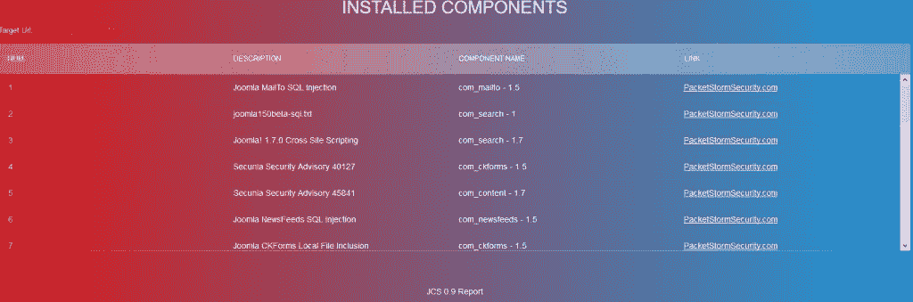

# Joomla 漏洞组件扫描器 JCS

> 原文：<https://kalilinuxtutorials.com/joomla-component-scanner/>

Joomla CMS JCS 上的 JCS(**Joomla Component Scanner**)可以帮助您处理最新的组件漏洞和问题。数据库可以通过少量的资源进行更新，并且实现了一个爬虫来发现组件和组件之间的连接。

这个版本的后台利用数据库和 Packetstorm 漏洞为 Joomla 组件创建一个数据库，JCS 同样可以为你创建一个 HTML 格式的报告。

## **Joomla 组件扫描仪特性:**

*   多线程
*   请求之间的延迟
*   自定义 Http 标头
*   支持 Http 代理
*   支持 Http 身份验证:
    1.  基本的
    2.  摘要
*   基于正则表达式模式组件爬虫
*   组件的页面标识方式:
    1.  页面比较
    2.  正则表达式模式
    3.  在 HTML 标签中搜索示例:<title>未找到</title>
    4.  正在检查 Http 状态代码

### **报表样本:**

