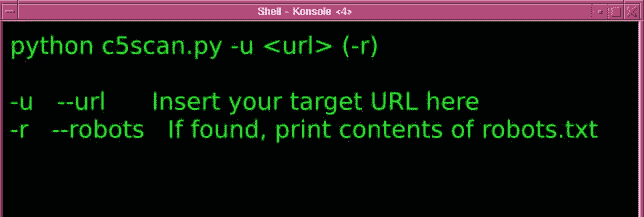
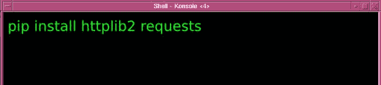

# Concrete5 CMS 的漏洞扫描器和信息收集器–C5 scan

> 原文：<https://kalilinuxtutorials.com/concrete5-cms-c5scan/>

Concrete5 CMS 或 C5Scan 的漏洞[扫描器](http://kalilinuxtutorials.com/joomla-component-scanner/)和数据收集器。在等待重构的时候有点过时了。

Concrete5 是一个开源的内容管理系统(CMS ),用于在万维网和内部网上分发内容。混凝土 5 包括上下文变更。可编辑区域的特征在于具体的布局，这使得编辑者能够嵌入内容块。这些可以包含基本内容，如文本和图片，或者具有更复杂的用途。

## **用途:** 



## **依赖:** 



## **例子具体 5 CMS :** 

```
$ python c5scan.py -u localhost -r

**********************************************************
*                      ~ C5scan ~                        *
* A vulnerability and information gatherer for concrete5 *
*                auraltension@riseup.net                 *
**********************************************************

No http:// or https:// provided. Trying http://
URL: http://localhost/

[+] Discovered version 5.6.2.1 from meta 'generator' tag
[+] Interesting header: server: Apache/2.2.14 (Ubuntu)
[+] Interesting header: x-powered-by: PHP/5.3.2-1ubuntu4.24
[+] robots.txt found at  http://localhost/robots.txt
User-agent: *
Disallow: /blocks 
Disallow: /concrete 
Disallow: /config 
Disallow: /controllers 
Disallow: /css 
Disallow: /elements 
Disallow: /helpers 
Disallow: /jobs 
Disallow: /js 
Disallow: /languages 
Disallow: /libraries 
Disallow: /mail 
Disallow: /models 
Disallow: /packages 
Disallow: /single_pages 
Disallow: /themes 
Disallow: /tools
Disallow: /updates

Enumerating updates in /updates/
[+] Update version 5.5.2.1 exists
[+] Update version 5.6.2.1 exists

Looking for Readme files
[+] Found a readme at:  http://localhost/concrete/libraries/3rdparty/adodb/readme.txt
[+] Found a readme at:  http://localhost/concrete/libraries/3rdparty/adodb/docs/docs-adodb.htm
[+] Found a readme at:  http://localhost/concrete/blocks/video/README
[+] Found a readme at:  http://localhost/concrete/libraries/3rdparty/StandardAnalyzer/Readme.txt
[+] Found a readme at:  http://localhost/concrete/libraries/3rdparty/securimage/README.txt

Checking for known vulnerabilities in updates
[+] A known vulnerability exists for 5.6.2.1:
SQL Injection in index.php cID param
http://www.exploit-db.com/exploits/31735/

Checking for known vulnerabilities in current version
[+] A known vulnerability exists for 5.6.2.1:
SQL Injection in index.php cID param
http://www.exploit-db.com/exploits/31735/

Finished.
```

[](https://github.com/auraltension/c5scan)`