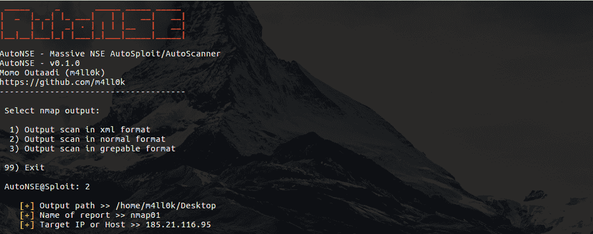
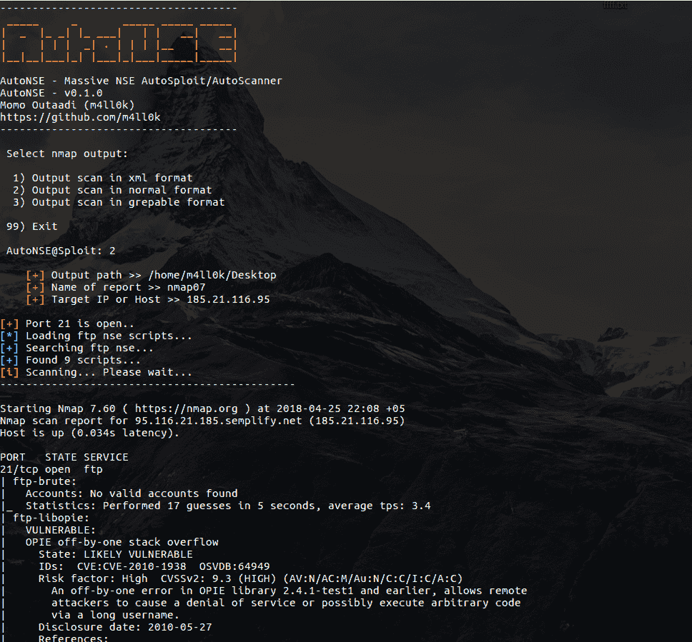
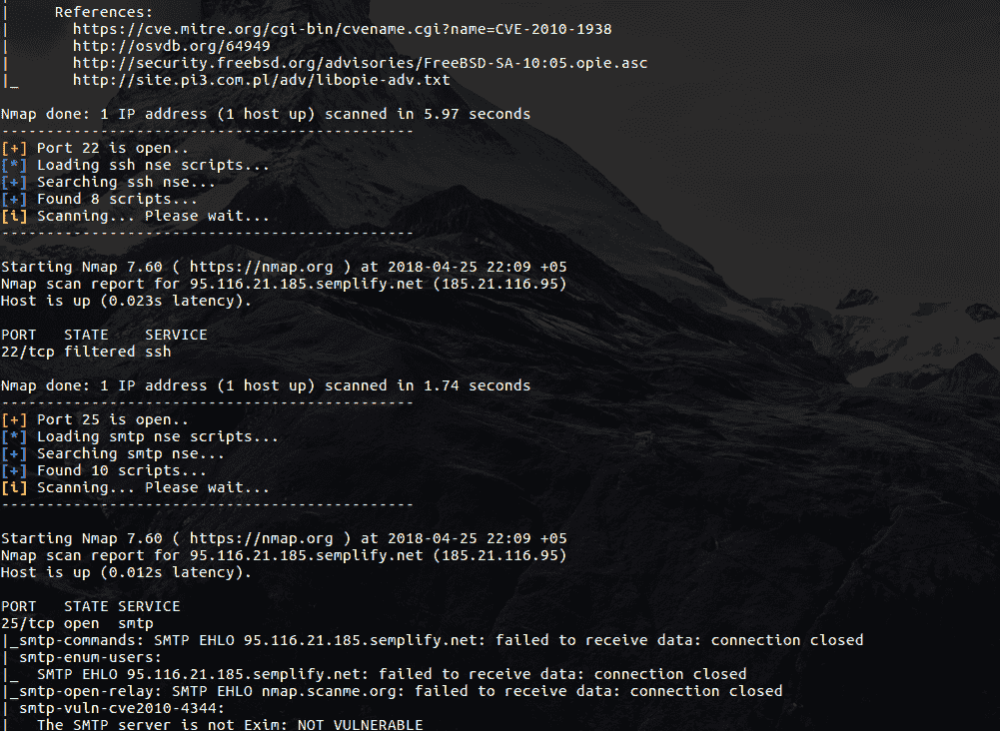

# autonet–大规模 nse 自动拆分和自动扫描

> 原文：<https://kalilinuxtutorials.com/autosploit-and-autoscanner/>

Massive NSE (Nmap 脚本引擎)AutoSploit 和 AutoScanner。Nmap 脚本引擎(NSE)是 Nmap 最强大、适应性最强的功能之一。它使客户能够编写(和共享)基本脚本(利用 Lua 编程方言)来计算各种各样的网络任务。这些内容以您预期的速度和效率从 Nmap 并行执行。客户端可以依赖 Nmap 开发的各种脚本，或者自己编写脚本来解决自定义问题。



更多信息请点击**[。](https://nmap.org/book/man-nse.html)**

## **安装自动扫描和自动扫描
**

```
**$ git clone https://github.com/m4ll0k/AutoNSE.git
$ cd AutoNSE 
$ bash autonse.sh**
```

**又读[WiFi-南瓜——流氓 Wi-Fi 接入点攻击框架](http://kalilinuxtutorials.com/wifi-pumpkin-framework/)**

## **例题**

`$ bash autonse.sh`

 

[](https://github.com/m4ll0k/AutoNSE)