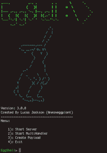
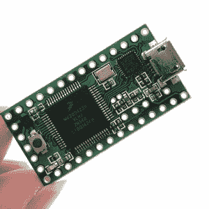
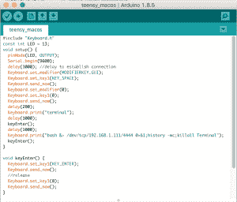
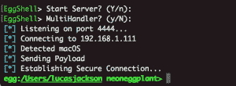
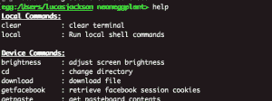
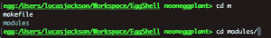
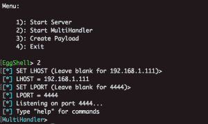
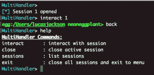

# 蛋壳——iOS/MAC OS 远程管理工具

> 原文：<https://kalilinuxtutorials.com/eggshell-remote-administration-tool/>

蛋壳是一个用 Python 写的误用后监视工具。它给你一个命令行会话，在你和目标机器之间有额外的用处。蛋壳为您提供上传/下载记录、标签完成、拍照、位置跟踪、Shell 命令执行、持久性、升级权限、密码检索等功能和便利。这是 venture 的概念验证，预计将用于您声称的机器上。


有关详细信息和参观方法，请访问 [**链接**](http://lucas-jackson.me/eggshell) 。

**也读作[Drozer——Android 领先的安全测试框架](http://kalilinuxtutorials.com/drozer-security-testing-framework)**

## **蛋壳入门** 

*   需要 python 2.7

### **macOS/Linux 安装**

```
git clone https://github.com/neoneggplant/eggshell
cd eggshell
python eggshell.py
```

### **iOS(越狱)**

添加 Cydia 来源:[http://lucasjackson.io/repo](http://lucasjackson.io/repo)安装蛋壳 3 使用任意移动终端应用并运行命令蛋壳



## **创建有效载荷**

蛋壳有效负载在目标机器上执行。有效负载首先发送获取设备详细信息的指令并将其发送回我们的服务器，然后选择适当的可执行文件来建立安全的远程控制会话。

### **痛击**

从 payload 菜单中选择 bash 将给出一个 1 liner，它在目标机器上执行时建立一个蛋壳会话


 **Teensy 是一个 USB 开发板，可以用 Arduino ide 编程。它模仿 usb 键盘敲击速度极快，可以在几秒钟内注入蛋壳有效载荷。



选择 teensy 将为 teensy 板提供一个基于 arduino 的有效载荷。


上传到 teensy 后，我们可以使用该设备插入 macOS usb 端口。一旦连接到计算机，它会自动模拟执行有效载荷所需的按键。



## **与会话** 为伍



会话建立后，我们可以通过蛋壳命令行界面在该设备上执行命令。我们可以通过键入“help”来显示所有可用的命令



### **选项卡完成**

与大多数命令行界面类似，蛋壳支持制表符补全。当您开始键入目录或文件名的路径时，我们可以使用 tab 键完成路径的其余部分。



 **Multihandler 选项允许我们处理多个会话。我们可以选择与不同的设备进行交互，同时在后台监听新的连接。

## 

与会话界面类似，我们可以键入“help”来显示 Multihandler 命令



## **命令**

#### **macOS**

*   **亮度**:调节屏幕亮度
*   **cd** :更改目录
*   **下载**:下载文件
*   **getfacebook** :检索 facebook 会话 cookies
*   **获取粘贴**:获取粘贴板内容
*   **getvol** :获取扬声器输出音量
*   **idletime** :获取键盘/光标被触摸后的时间
*   **imessage** :通过“信息”应用程序发送信息
*   **itunes** : iTunes 控制器
*   **键盘**:你的键盘- >是目标的键盘
*   **lazagne** :火狐密码找回|(【https://github.com/AlessandroZ/LaZagne/wiki】T2)
*   **ls** :列出一个目录的内容
*   **话筒**:录音话筒
*   **持续**:关闭后尝试重新建立连接
*   **图片**:通过 iSight 拍摄图片
*   **pid** :获取进程 id
*   **提示**:提示用户输入密码
*   **截图**:截图
*   **setvol** :设定输出音量
*   **睡眠**:使设备进入睡眠模式
*   **苏**:你的登录
*   **暂停**:暂停当前会话(返回登录屏幕)
*   **上传**:上传文件

#### **iOS**

*   **警报**:让警报显示在设备上
*   **电池**:获取电池电量
*   **捆绑包**:列出捆绑包标识符
*   **cd** :更改目录
*   模拟双击 home 键
*   **拨打**:拨打电话号码
*   **下载**:下载文件
*   **getcontacts** :下载通讯录
*   **获取笔记**:下载笔记
*   **获取密码**:获取设备密码
*   **获取短信**:下载短信
*   **getvol** :获取音量级别
*   **home** :模拟 home 键按压
*   **installpro** :安装基板命令
*   **ipod** :控制音乐播放器
*   **是否锁定**:检查设备是否锁定
*   **lastapp** :获取最后打开的应用程序
*   **定位**:获取设备位置坐标
*   **位置服务**:切换位置服务
*   **锁定**:模拟锁定按钮的按下
*   **ls** :列出一个目录的内容
*   **话筒**:录音话筒
*   **静音**:更新和查看静音状态
*   **打开**:打开应用程序
*   **openurl** :在设备上打开 url
*   **持续**:关闭后尝试重新建立连接
*   **图片**:通过 iSight 拍摄图片
*   **pid** :获取进程 id
*   **重起**:重起跳板
*   **安全模式**:将设备置于安全模式
*   **说出**:文字说话
*   **setvol** :设置设备音量
*   **sysinfo** :查看系统信息
*   **上传**:上传文件
*   **振动**:振动装置

#### **Linux**

*   **cd** :更改目录
*   **下载**:下载文件
*   **ls** :列出一个目录的内容
*   **pid** :获取进程 id
*   **pwd** :显示当前目录
*   **上传**:上传文件

[](https://github.com/neoneggplant/EggShell)****