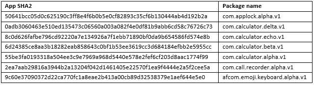

# 恶意应用改名重回谷歌 Play 商店

> 原文：<https://kalilinuxtutorials.com/malicious-apps-google-play-store/>

谷歌 Play 商店以在线获取 Android 应用程序最安全的地方而闻名，谷歌在鼓励客户抑制恶意软件和不同危险方面做得很好，方法是安排他们的智能手机，以排除 Android 设置中的侧加载和替代应用程序市场。

这个恶意软件"**安卓。Reputation.1** ”出现在 Play Store 上，隐藏在美国至少七个应用程序中，提供有趣、有价值、偶尔也有危险的功能。其中包括表情键盘、空间清洁器、计算器、应用程序储物柜和通话记录器。我们研究的例子没有一个真的像他们的 Google Play 页面上宣传的那样有效。一旦应用程序被引入，它会采取不同的措施来保持在小工具上，消失，并删除其踪迹。

#### **也读 [Linset:用这个工具黑掉 WPA WPA2](http://kalilinuxtutorials.com/linset-hack-wpa-wpa2/)**

通过采取以下预防措施来抵御移动恶意软件:

*   让您的软件保持最新
*   不要从陌生的网站下载应用程序
*   仅安装来自可信来源的应用
*   密切注意应用程序请求的权限
*   安装合适的移动安全应用程序，如 Norton 或 SEP Mobile，以保护您的设备和数据
*   经常备份重要数据

