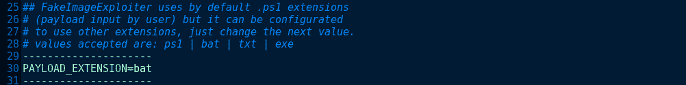
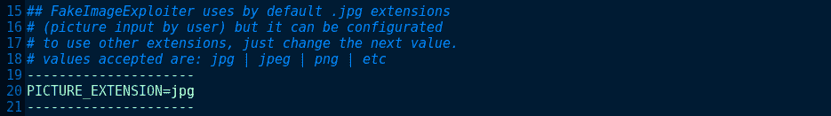
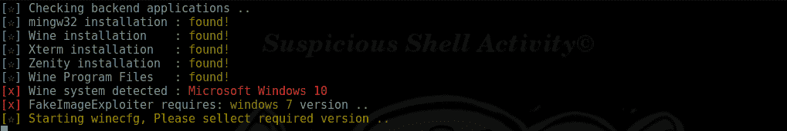
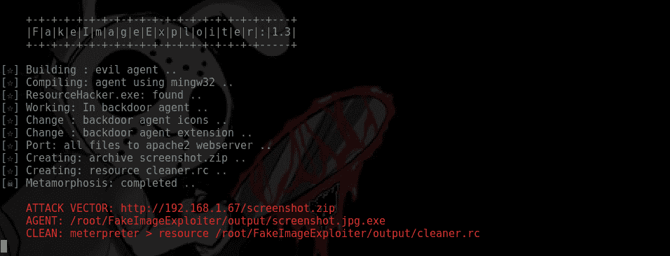
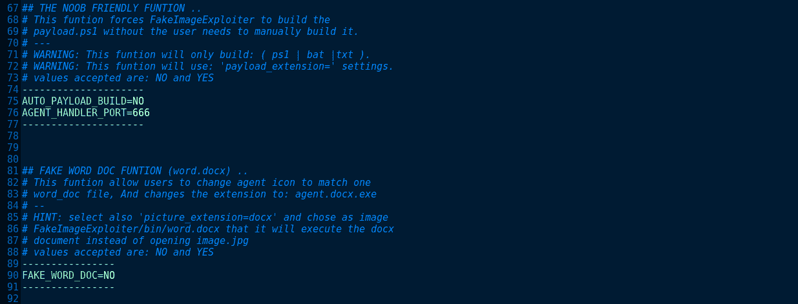
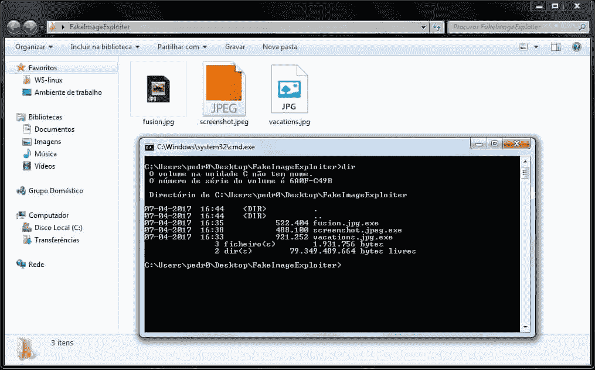

# 使用假冒的 image.jpg“FakeImageExploiter”来开发目标

> 原文：<https://kalilinuxtutorials.com/fakeimageexploiter-exploit-targets/>

FakeImageExploiter 将所有记录存储在 apache2 webroot，zips(.zip)专家，启动 apache2 和 metasploit 服务(处理程序)，并给出一个发送到目标的 URL(触发 agent.zip 下载)。当伤亡人员运行我们的可执行文件时，我们的照片将被下载并在默认的图片观察器中打开，我们的恶意有效载荷将被执行，我们将获得一个 meterpreter 会话。

但是，如果我们希望利用另一个不同的攻击媒介来传达 agent.jpg.exe，它还会将操作符(未压缩)存储到假的 ImageExploiter/output 文件夹中。

**该设备同样会构建一个 cleaner.rc 文件来清除目标**中剩余的有效负载


#### **也可理解为 [WinPirate:从可启动 USB](http://kalilinuxtutorials.com/winpirate-automated-hack-bootable-usb/)** 自动破解粘滞键

## **描述**

这个模块采用一个现有的 image.jpg 和一个有效载荷. ps1(由用户输入)，并建立另一个有效载荷(agent.jpg.exe)，如果执行它将触发下载 2 个过去的文件放入 Apache 2(image.jpg+有效载荷. ps1)并执行它们。

此外，该模块还更改了 agent.exe 图标，以协调一个 file.jpg，然后使用讽刺的“已知记录类型的覆盖扩展”策略来隐藏 agent.exe 扩展。

所有有效负载(客户端输入)将从我们的 apache2 服务器下载，并执行到目标 RAM 中。需要将有效载荷合成到板上的主要扩展(用户贡献的有效载荷)是。exe 替身。

## **FakeImageExploiter v 1.3–后门图片. jpg[.ps1]**

```
CodeName: Metamorphosis
Version release: v1.3 (Stable)
Author: pedro ubuntu [ r00t-3xp10it ]
Distros Supported : Linux Ubuntu, Kali, Mint, Parrot OS
Suspicious-Shell-Activity (SSA) RedTeam develop @2017
```

## **接受有效载荷(用户输入):**

```
payload.ps1 (default) | payload.bat | payload.txt | payload.exe [Metasploit]
"Edit 'settings' file before runing tool to use other extensions"
```



## **图片受理(用户输入):**

```
All pictures with .jpg (default) | .jpeg | .png  extensions (all sizes)
"Edit 'settings' file before runing tool to use other extensions"
```



## **依赖/限制**

```
xterm, zenity, apache2, mingw32[64], ResourceHacker(wine)
'Auto-Installs ResourceHacker.exe under ../.wine/Program Files/.. directorys'

WARNING: To change icon manually (resource hacker bypass) edit 'settings' file.
WARNING: Only under windows systems the 2º extension will be hidden (so zip it) 
WARNING: The agent.jpg.exe requires the inputed files to be in apache2 (local lan hack)
WARNING: The agent.jpg.exe uses the powershell interpreter (does not work againts wine).
WARNING: This tool will not accept payload (user input) arguments (eg nc.exe -lvp 127.0.0.1 555)
WARNING: The ResourceHacker provided by this tool requires WINE to be set to windows 7
```



## **下载/安装/配置:**

```
1º - Download framework from github
     git clone https://github.com/r00t-3xp10it/FakeImageExploiter.git

2º - Set files execution permitions
     cd FakeImageExploiter
     sudo chmod +x *.sh

3º - Config FakeImageExploiter settings
     nano settings

4º - Run main tool
     sudo ./FakeImageExploiter.sh
```

## **框架横幅**



## **设置文件**



## **windows 系统中的代理**



## **视频教程**

**FakeImageExploiter【官方发布-主要功能】**

[https://www.youtube.com/watch?v=4dEYIO-xBHU](https://www.youtube.com/watch?v=4dEYIO-xBHU)

**FakeImageExploiter【noob 友好功能】**

[https://www.youtube.com/watch?v=abhIp-SG4kM](https://www.youtube.com/watch?v=abhIp-SG4kM)

**FakeImageExploiter【bat payload–word doc . docx agent】**

[https://www.youtube.com/watch?v=Ah4hejGhj-M](https://www.youtube.com/watch?v=Ah4hejGhj-M)

**FakeImageExploiter [ txt 有效负载–msfdb 重建]**

[https://www.youtube.com/watch?v=g2E73GyxKhw](https://www.youtube.com/watch?v=g2E73GyxKhw)

[](https://github.com/r00t-3xp10it/FakeImageExploiter#agents-in-windows-systems)**