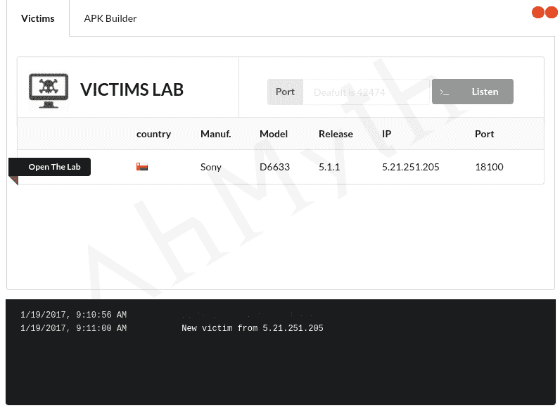

# AhMyth Android Rat–远程管理工具

> 原文：<https://kalilinuxtutorials.com/ahmyth-android-rat/>

AhMyth Android RAT 是一款 Android 远程管理工具。它由两部分组成:

1.  **服务器端:**基于电子框架的桌面应用(控制面板)
2.  **客户端:**安卓应用(后门)

## **你有两种选择安装** **AhMyth**

## **来自源代码**

*   电子(启动应用程序)
*   Java(生成 apk 后门)
*   电子构建器和电子打包器(为(OSX、WINDOWS、LINUX)构建二进制文件)

1.  **T2`git clone https://github.com/AhMyth/AhMyth-Android-RAT.git`**
2.  **T2`cd AhMyth-Android-RAT/AhMyth-Server`**
3.  `**npm start**`

#### **也读 [MITM:中间人路由器](http://kalilinuxtutorials.com/mitm-man-in-the-middle-router/)**

## **来自二进制**

*   通过[点击此处](https://github.com/AhMyth/AhMyth-Android-RAT/releases)从下载二进制文件
*   Java(生成 apk 后门)

## **截图**

## **视频教程**

[https://youtu.be/DDIZTABABzs](https://youtu.be/DDIZTABABzs)

