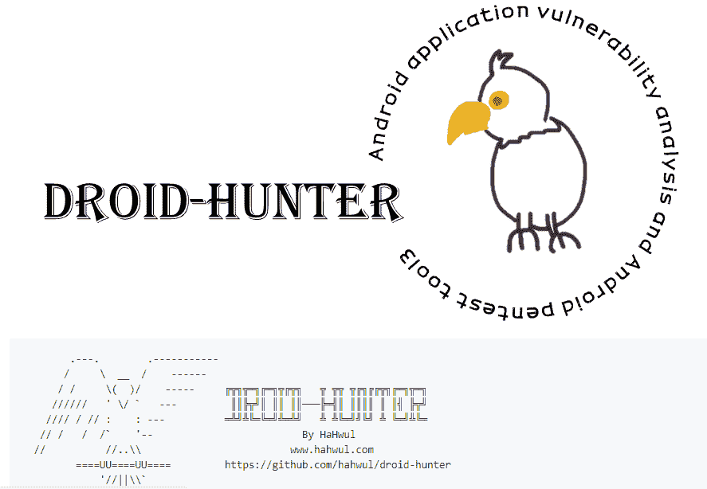
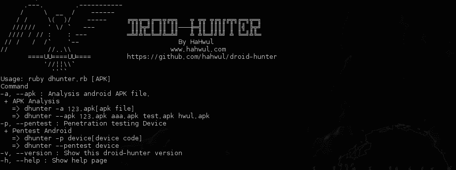
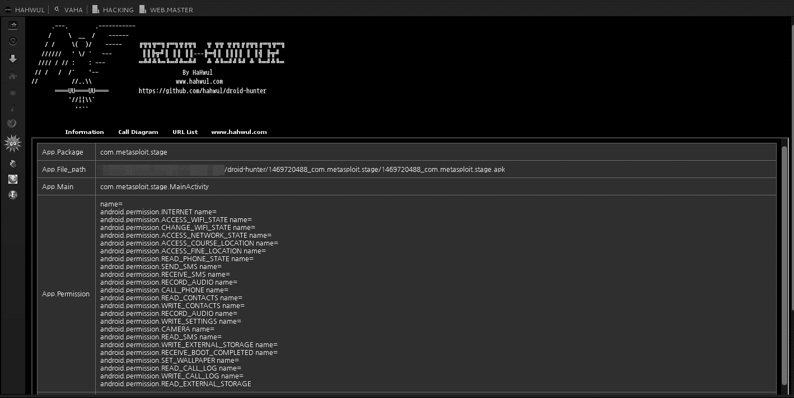

# droid Hunter——Android 应用程序漏洞工具

> 原文：<https://kalilinuxtutorials.com/droid-hunter/>

Droid Hunter Android 应用程序漏洞分析和 Android pentest 工具。



*   应用信息检查
*   Baksmaling android app
*   反编译 android 应用程序
*   提取类文件
*   提取 java 代码
*   基于模式信息泄漏

#### **亦读[AhMyth Android Rat——远程管理工具](http://kalilinuxtutorials.com/ahmyth-android-rat/)**

## **如何安装 Droid Hunter？**

*   **下载(克隆)&解开机器人猎人**

```
git clone [https://github.com/hahwul/droid-hunter.git](https://github.com/hahwul/droid-hunter.git)
cd droid-hunter
```

*   **安装红宝石宝石**

```
gem install html-table
gem install colorize
```

*   **设置外部工具**

**编辑”。/config/config.rb"**

```
**# Tool path
$p_adb = "/usr/bin/adb"     
$p_aapt = "/usr/bin/aapt"   # Path aapt
                            # macOS > (https://github.com/hahwul/droid-hunter/issues/12)
$p_dex2jar = File.dirname(__FILE__)+"/../ex_tool/dex2jar-0.0.9.15/dex2jar.sh"
$p_apktool = File.dirname(__FILE__)+"/../ex_tool/apktool/apktool_2.3.1.jar"
$p_jad = File.dirname(__FILE__)+"/../ex_tool/jad/jad"
$p_grep = "/bin/grep"
$p_unzip = "/usr/bin/unzip"
$p_sfilter = File.dirname(__FILE__)+"/../string_filter"** 
```

*   运行机器人亨特

```
ruby dhunter.rb
```

## **怎么用？**

```
**Usage: ruby dhunter.rb [APK]
Command
-a, --apk : Analysis android APK file.
 + APK Analysis
   => dhunter -a 123.apk[apk file]
   => dhunter --apk 123.apk aaa.apk test.apk hwul.apk
-p, --pentest : Penetration testing Device
 + Pentest Android
   => dhunter -p device[device code]
   => dhunter --pentest device
-v, --version : Show this droid-hunter version
-h, --help : Show help page**
```

## **待办事项**

**添加漏洞扫描模块**
**更新字符串模式**
**意图图**

## **截屏**

 

[](https://github.com/hahwul/droid-hunter)