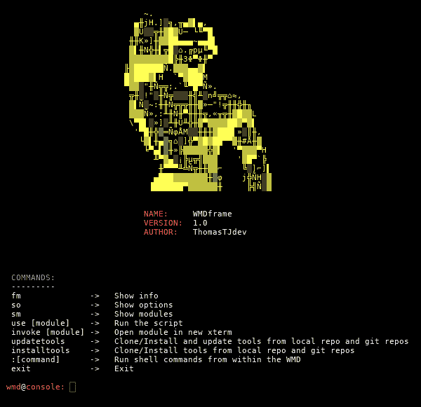
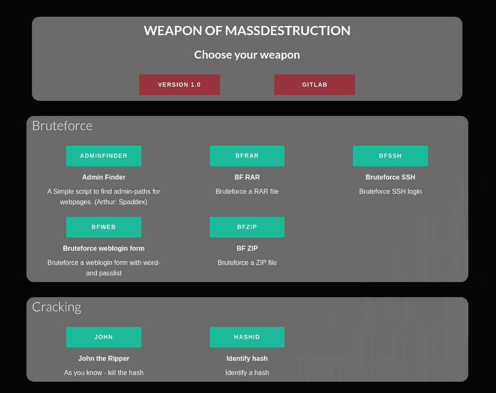

# WMD——大规模杀伤性武器

> 原文：<https://kalilinuxtutorials.com/wmd-weapon-mass-destruction/>

WMD 是一个 python 工具，有 IT 安全软件的积累。该产品被封装在“模块”中。这些模块由纯 python 代码和/或外部第三方程序组成。

## **WMD 的主要功能**

*   要使用模块，运行命令“使用[模块 _ 调用]”，例如“使用 apsniff”，以激活模块。
*   模块选项可通过“设置[参数][值]”进行更改。
*   在模块内部，您总是可以使用命令“so”来查看选项。
*   您的环境设置在 core/config.ini 中。请在运行之前调整它们。

**也读 [空气锤——一种在线暴力攻击工具](http://kalilinuxtutorials.com/air-hammer-brute-force-attack/)**

## **WMD 网络菜单**

从控制台运行命令“www ”,激活 Flask 服务器，在浏览器中显示模块。从 127.0.0.1:5000 访问它。

模块被直接加载到 xterm 中。
**DEV:** 试试 SniffHTTP 和 APsniff 模块——在浏览器中定义参数。

## **WMD 模块**

| 

##### **猫**

 | 

##### **type**

 | 

##### **call**

 | 

##### **Name**

 | 

##### **Describe**

 |
| --- | --- | --- | --- | --- |
| 布鲁特斯 | creds | 改变我 | 默认信用扫描 | 扫描 IP 的服务，并尝试使用默认凭证登录(Arthur: ztgrace) |
| 蛮力 | 登录路径 | adminfinder | 管理查找器 | 一个简单的脚本来查找网页的管理路径。(亚瑟:斯巴德克斯) |
| 蛮力 | rar | bfrar | BF 很好 | bruteforce 重新打开文件 |
| 蛮力 | 嘘 | bfssh | SSH 核心 | bruteforce ssh 登录 |
| 蛮力 | 网 | bfweb | 原始 web 逻辑形式 | 使用 word 和 passlist 强制 web 登录表单 |
| 蛮力 | 活力 | bfzip | BF ZIP 档 | 强制压缩文件 |
| 破裂 | 大学教师协会（Association of University Teachers 的缩写） | 约翰 | 开膛手约翰 | 如你所知——消灭杂碎 |
| 破裂 | 混杂 | 哈希 id | 身份散列 | 识别散列 |
| 破裂 | 单独海损赔偿（With Particular Average 的缩写） | 可卡因 | 破解 WPA 4 次握手 | 从 accesspoint 收集 WPA 4 次握手并破解它 |
| 剥削 | 浏览器 | 浏览者 | Browser Autopwn2 | 该模块将自动为浏览器漏洞服务(Arthur:sinn3r[at]metasploit . com) |
| 剥削 | 搜索 | exploitdb | Exploitdb | Shell 风格的脚本搜索 exploit-db.com 漏洞。(亚瑟:马特富图) |
| 邮件 | 犯罪 | mspoofcheck | 欺骗检查器电子邮件域 | 检查一个域是否可以被欺骗，例如发送电子邮件 |
| 班长 | 阿尔普 | 阿拉蒙 | ARP 监控警报 | 监控 ARP 表并对变化发出警报 |
| 班长 | 互联网协议（Internet Protocol 的缩写） | 伊普曼 | IP 监视器警报 | 监控 IP 并对变化发出警报 |
| 其他的 | 设置 | 设置 | 更改设置 | 更改您的环境设置，例如界面 |
| pentesting | 尼普特 | 斯巴达 | 斯巴达 | SPARTA 是一个 python GUI 应用程序，它简化了网络基础设施渗透测试。 |
| 网络钓鱼 | 美国联合通讯社（Associated Press 的缩写） | 埃特菲斯 | ewl 双网搜索 | 创建一个邪恶的双胞胎和重定向用户到假密码页面。 |
| 网络钓鱼 | 网页 | 网络钓鱼 | 网页仿冒 | 运行带有钓鱼页面的本地 flask 服务器。 |
| 侦察 | 十进位计数制 | 挖苦 | 域信息搜索器 | 使用 dig 命令，您可以查询 DNS 名称服务器，以执行与 DNS 查找相关的任务 |
| 侦察 | 十进位计数制 | dnsmap | dnsmap | DNS 网络映射器。枚举和暴力。 |
| 侦察 | 十进位计数制 | dnsrecon | dnsrecon | 多重 DNS 侦察能力。 |
| 路由器 | 结构 | dsploit | Routersploit | 利用和获取信任的路由器框架。(亚瑟:反向外壳安全) |
| 扫描 | 犯罪 | 兰斯坎 | 局域网扫描 | 扫描本地网络-侦察 |
| 嗅 | 大学教师协会（Association of University Teachers 的缩写） | 阿普斯尼夫 | AP 嗅探 | 创造 AP 和嗅 HTTPS，避免 HSTS +牛肉 |
| 嗅 | 超文本传送协议（Hyper Text Transport Protocol 的缩写） | sniffhttp | 嗅 HTTP | 嗅探 HTTP 包。从流量中提取用户名和密码。 |
| 嗅 | 犯罪 | ettercap | ettercap | Bettercap 集成，用于嗅探数据包并绕过 HSTS 和 HTTPS |
| socialeng | instagram | instabot | Instagram 机器人 | 用于执行各种活动的 insta gram bot(Arthur:lev pasha) |
| 愚弄 | 阿尔普 | ARP 欺骗 | ARP 欺骗 | 欺骗 ARP |
| 结构化查询语言 | sqli | gdsqli | Gdork SQLi | 刮净网址，并检查他们是否容易 SQL 注入 |
| 结构化查询语言 | sqli | sqlcmap | sqlcmap | 只是激活 SQLmap。 |
| 系统 | 老兄 | 阿霉素 | mac 转换器 | 更改您的 MAC 地址 |
| 工具 | 搜索 | 搜索 | 搜索黑客工具 | 黑客工具的搜索引擎 |
| 无线局域网（wireless fidelity 的缩写） | 接入点 | 创建地图 | 创建一个接入点 | 创建一个接入点 |
| 无线局域网（wireless fidelity 的缩写） | 无线局域网（wireless fidelity 的缩写） | wifiutils | WiFi utils | WiFi 实用程序，例如 deauth、WiFi、客户端、探头等。 |

## **运行**

***在您第一次运行之前，请:*** *1。在`core/config.ini.default`* *2 中调整您的环境设置。将`core/config.ini.default`重命名为`core/config.ini`T10*

使用`python3 wmd.py`启动控制台

启动单个模块:`python3 wmd.py -m [CALL]`

启动网络服务器:`python3 wmd.py -w`

不检查要求就启动:`python3 wmd.py -nc`

## **大规模杀伤性武器需求**

***在您第一次运行之前，请:*** *1。在`core/config.ini.default`* *2 中调整您的环境设置。将`core/config.ini.default`重命名为`core/config.ini`T10*

**要求:**

*   Linux 操作系统
*   Python3
*   **requirements.txt** 中的 Python 库需求

可选工具/软件/GIT:
*需要它们的模块会通知你，只是不运行..*

*   转到:管理员查找器
*   空气裂化
*   艾罗蒙-ng
*   空气引擎 mp-ng
*   Airolib-ng
*   阿尔普
*   ARP 欺骗
*   牛肉
*   ettercap
*   GIT:改变我
*   CrackMapExec
*   创建 _ap
*   挖苦
*   Dnsmap
*   GIT: Dnsrecon
*   git:exploit b
*   go:哈希 id
*   咳嗽药
*   GIT: Instabot
*   开膛手约翰
*   Nmap
*   转到:路由器堆栈
*   斯巴达
*   GIT:欺骗检查
*   GIT: XSSER

## **发展**

### 结构

*   core –>核心文件，包含在代码中使用的函数
*   文件–>静态文件、密码列表等。
*   日志–>用于保存日志的标准文件夹
*   模块–>包含模块
*   tmp –>猜猜
*   工具–> GIT 工具
*   www –>网络服务器的文件

#### 新模块

在`modules/module_template.py`中检出模板

#### 添加模块

运行`python3 wmd.py -a modulePathName.py`

#### 拉取请求

*   只有 python3 代码
*   代码需要遵循 pep8 flake8(不需要换行)

## **待办事项**

### 最优先

*   更多模块
*   交互式网络界面。在浏览器 <中设置设置并获取结果——sniff http 和 apsniff 完成
*   将 config.ini 重命名为 config.ini.default，以避免覆盖特定于用户的配置文件

### **各种**

*   代理链
*   突岩
*   在所有 BF 上穿线
*   在与 os.system 一起运行的模块的导入上尝试/except
*   在模块中添加带有:的运行命令
*   在模块中添加关于“设置参数值”的信息(缺少？！)
*   重新生成 modules.xml(循环通过模块)
*   设计具有核心导入和解析器的设计模块
*   检查工具、回购等是否有足够的信用。
*   将 updatetools 拆分为本地工具和 git
*   添加模块时，剥离<>以保证 XML 格式
*   更改安装和更新工具的行为
*   在所有模块中添加调用选项
*   所有模块–将选项更改为选项
*   将文件夹分割成列表等
*   核心网和 wifi——合并？
*   原版亚瑟王将显示在模块的横幅下方。Todo。
*   当显示模块时，以某种方式表明它们需要什么
*   ~~在浏览器对话框中设置模块参数~~
*   向所有模块添加参数并创建对话框 HTML(开发中的自动化工具)

### **core/tools.py**

在两个函数中运行 config.ini 并提取 updatecommand 的名称，而不是 DRY

### **内部代号**

*   清除函数中的 getLocalIP (local_ip)
*   用于旧模块的 PEP8/Flake8

### **模块**

*   ~~sqlcmap~~的缩写
*   ~~斯巴达~~
*   ~~http sniff pwd~~<–完成
*   ~~邪恶双胞胎~~–deauth+关于在网络管理器中取消管理的信息
*   ~~Evil Twin–landing page/+log function 的参数解析~~
*   监控网络自动
*   xsser
*   目标攻击网站或 ip
*   系统信息
*   dns 假的
*   grep，sed，awk
*   所有网络活动的 scapy
*   管理查找器–在 BF 之前检查 google/bing 搜索
*   change me–ZT grace
*   部分框架
*   Bettercap 模块。在其他模块中实现。性能卓越。
*   使用 hostapd 和 dnsmasq 创建访问点。已经在 Ewil Twin 中实现

