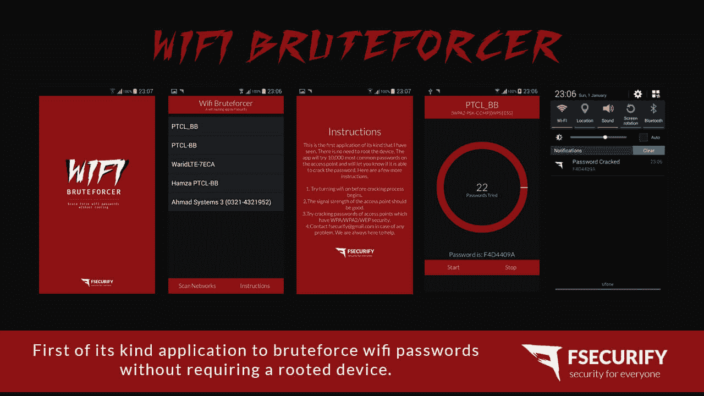

# WiFi 暴力破解——Android 应用程序暴力破解 WiFi 密码

> 原文:# t0]https://kallinuxolixtauthorities . com/wifi-brueforer/

WiFi Bruteforcer 是一个 android 应用程序，可以在不需要根设备的情况下暴力破解 WiFi 密码。

**警告:**该项目仍在开发中，安装该应用程序可能会错误配置您的 Android 操作系统的 Wi-Fi 设置，可能需要系统恢复来修复它。

**也读作[net Attack——扫描并攻击无线网络](http://kalilinuxtutorials.com/netattack/)**

该应用程序不会尝试大量的密码。这将是非常乏味的，并且需要建立设备。应用程序所做的是尝试 10，000 个最常用的密码，并使用一些启发式方法(尝试与 SSID 名称相同的密码等)。它会尝试这些密码中的每一个，并检查它们中的一个是否会有效关联。万一密码出现了，它会在屏幕上显示出来，并自然地与系统交互。

