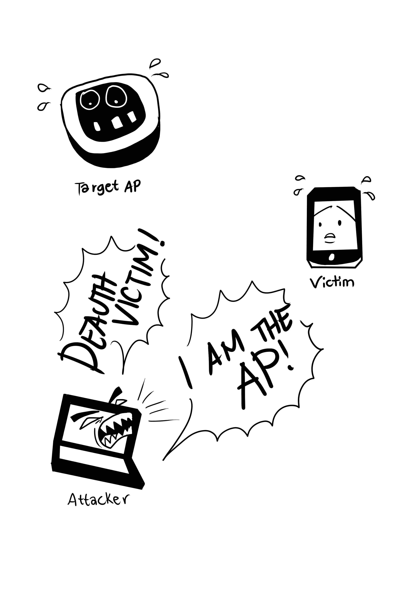
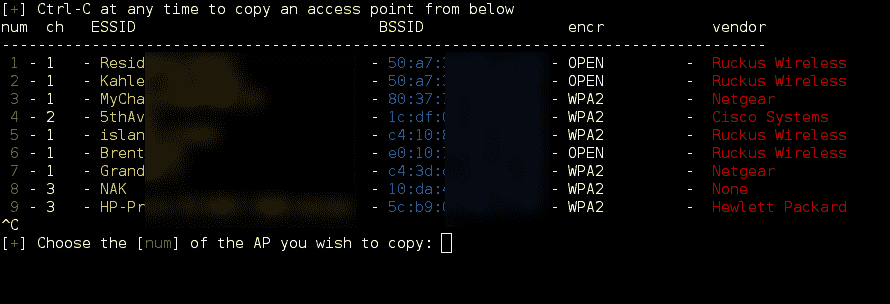
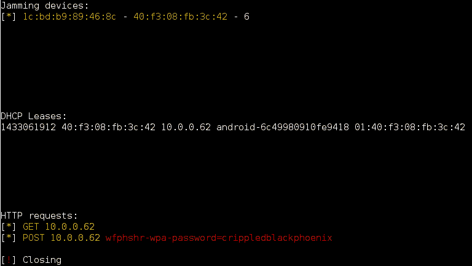
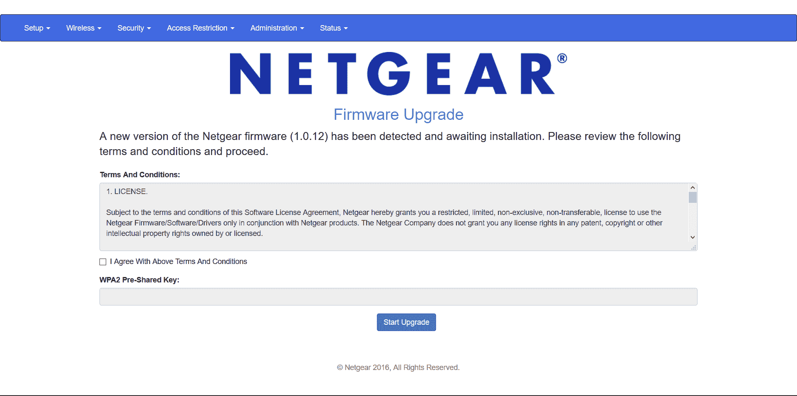
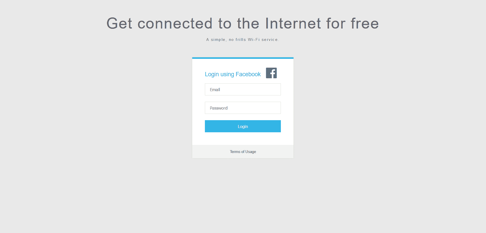
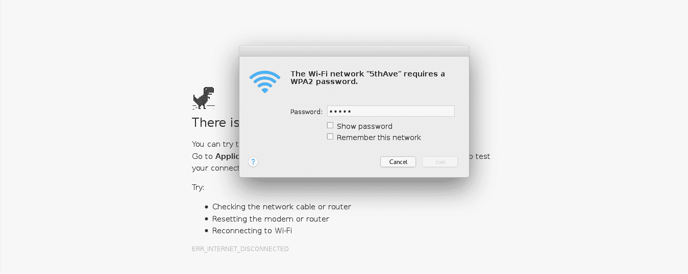

# Wifiphisher 可以通过在不知不觉中连接到攻击者控制的接入点来攻击 Wi-Fi

> 原文：<https://kalilinuxtutorials.com/wifiphisher-attacker-controlled/>

**wifi fisher**是一种安全设备，它执行 Wi-Fi 编程附属攻击，以驱使无线客户在不知情的情况下与攻击者控制的接入点进行交互。这是一个特立独行的接入点系统，可用于对 WiFi 客户发起机器人化的受害者篡改网络钓鱼攻击，记住最终目标是获得资格或用恶意软件感染受害者。

它可以作为社会设计的攻击工具，一点也不喜欢不同的策略，它不排除任何野蛮驾驶。从人质网关和局外人登录页面(例如在非正式社区)或 WPA/WPA2 预共享密钥获得认证以代表 **[WiFi 黑客](https://gbhackers.com/crack-wifi-network-passwords/)** 黑掉 WiFi 密码来实现这一任务是一个简单的途径。

Wifiphisher 芯片远离 Kali Linux，并在 GPL 许可下授权。

**也看 [黑客最佳黑客工具排行榜&安全专业人士 2018](http://kalilinuxtutorials.com/best-hacking-tools-list/)**

## **wifi fisher 如何工作？**

在利用 Wi-Fi 编程的联系系统(计算“KARMA”和“已知信标”攻击)实现中间人位置之后，Wifiphisher 当然会将所有 HTTP 请求转移到攻击者控制的网络钓鱼页面。

从受害者的角度来看，攻击分为三个阶段:

1.  **受害者正在从她的接入点**取消认证。
2.  **受害者加入了一个非法接入点**。
3.  **受害者正被提供一个逼真的特别定制的网络钓鱼页面**。



## **安装 wifi fisher**

要安装最新的开发版本，请键入以下命令:

```
git clone https://github.com/wifiphisher/wifiphisher.git # Download the latest revision
cd wifiphisher # Switch to tool's directory
sudo python setup.py install # Install any dependencies
```

或者，你可以从[发布页面](https://github.com/wifiphisher/wifiphisher/releases)下载最新的稳定版本。

以下是所有选项及其描述(也可通过`wifiphisher -h`获得):

| 

##### **is referred to as**

 | 

##### **Long format**

 | 

##### **Explain**

 |
| :-: | :-: | :-: |
| **-h** | 救命 | 显示此帮助消息并退出 |
| **-eI 扩展接口** | –扩展接口扩展接口 | 手动选择支持运行扩展的监控模式的接口。示例:-eI wlan1 |
| **-aI APINTERFACE** | –接口接口接口 | 手动选择支持 AP 模式的接口以生成 AP。示例:-aI wlan0 |
| **-nJ** | –无延伸 | 不要加载任何扩展。 |
| **是否有论文** | -埃瑟德埃瑟德 | 输入恶意接入点的 ESSID。此选项将跳过接入点选择阶段。示例:–essid“免费 WiFi” |
| **-p 钓鱼场景** | –钓鱼场景钓鱼场景 | 选择要运行的网络钓鱼方案。该选项将跳过场景选择阶段。示例:-p 固件升级 |
| –**pK 预共享密钥** | –预共享密钥预共享密钥 | 在恶意接入点上添加 WPA/WPA2 保护。示例:-pK s3cr3tp4ssw0rd |
| **-qS** | –彻底成功 | 成功检索一对凭据后，停止脚本。 |
| **-lC** | –lure 10-捕获 | 捕获在 AP 选择阶段发现的 AP 的 BSSIDs。此选项是 Lure10 攻击的一部分。 |
| **-lE LURE10_EXPLOIT** | –lure 10-EXPLOIT lure 10 _ EXPLOIT | 欺骗附近 Windows 用户的 Windows 定位服务，使其相信它位于之前使用–lure 10-capture 捕获的区域内。Lure10 攻击的一部分。 |
| **-我是** | –MAC-AP 接口 | 指定 AP 接口的 MAC 地址。例如:-iAM 38:EC:11:00:00:00 |
| **-iEM** | –MAC-扩展-接口 | 指定扩展接口的 MAC 地址。例如:-iEM E8:2A:EA:00:00:00 |
| **-iNM** | –无 mac 随机化 | 不要更改任何 MAC 地址。 |
| **-hC** | –握手-捕捉 | 捕捉 WPA/WPA2 握手以验证密码短语。示例:-hC capture.pcap |
| **-dE** | –deauth-essid | 从 AP 选择中或通过-e 选项给出的 ESSID 中指定具有相同 ESSID 的所有 bssid。 |
|  | –记录 | 启用日志记录。输出将保存到 wifiphisher.log 文件中。 |
| **-厘米** | –通道监视器 | 监控目标接入点是否改变了信道。 |
|  | –有效负载路径 | 启用有效负载路径。旨在用于为有效负载提供服务的场景。 |
| **-wP** | –wps-pbc | 监控 WPS-PBC 注册服务商一侧的按钮是否被按下。 |
| **-围** | –wps PBC-assoc-接口 | 用于关联 WPS 接入点的 WLAN 接口。 |
| **-kb** | –已知信标 | 执行已知的信标 Wi-Fi 自动关联技术。 |
| **-fH** | -部队-hostapd | 强制使用系统中安装的 hostapd。 |

## **截图**



**Targeting an access point**



**A successful attack**



**Fake router configuration page**



**Fake OAuth Login Page**



**Fake web-based network manager**

## **信用点**

该剧本基于 2015 年丹·麦金纳尼的一个想法。

贡献者的完整列表在这里。

## 免责声明 

*   在没有事先相互一致的情况下使用 Wifiphisher 攻击基础设施可被视为非法活动。最终用户有责任遵守所有适用的地方、州和联邦法律。作者不承担任何责任，也不对该程序造成的任何误用或损害负责。

**注意**:要注意伪装成与 Wifiphisher 项目有关的网站。他们可能正在发送恶意软件。

[](https://github.com/wifiphisher/wifiphisher)