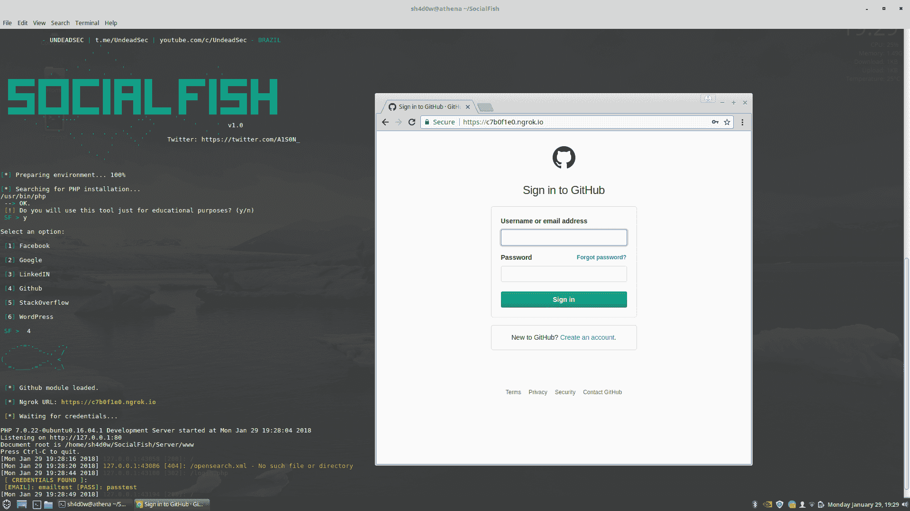

# SocialFish 可以轻松快速地创建钓鱼网站

> 原文：<https://kalilinuxtutorials.com/socialfish-create-phishing-sites/>

集成 Ngrok 的终极网络钓鱼工具。使用这个工具，任何人都可以轻松快速地创建一个钓鱼网站。SocialFish 的使用完全由最终用户负责。工程师预计不会有任何风险，也不对该程序造成的任何滥用或伤害负责。 

**也读[wifi 钓鱼者可以通过在不知情的情况下连接到攻击者控制的接入点](http://kalilinuxtutorials.com/wifiphisher-attacker-controlled/)** 来攻击 Wi-Fi

## **社交先决条件**

*   Python 2.7
*   来自 Python 的 Wget
*   服务器端编程语言（Professional Hypertext Preprocessor 的缩写）
*   须藤

### **考上了** 

*   kali Linux–滚动版
*   Linux as-18.3 西尔维娅
*   Ubuntu–2010 年 4 月 16 日
*   马科斯高塞拉

### **克隆**

```
`git clone https://github.com/UndeadSec/SocialFish.git` 
```

### **跑步**

```
cd SocialFish 
```

```
sudo pip install -r requirements.txt 
```

```
python SocialFish.py 
```

## **可用页面**

*   **脸书:**
    *   传统脸书登录页面。
    *   脸书的高级登录。
*   **谷歌:**
    *   传统的谷歌登录页面。
    *   脸书的高级登录。
*   **领英:**
    *   传统 LinkedIn 登录页面。
*   **Github:**
    *   传统 Github 登录页面。
*   **堆栈溢出:**
    *   传统 Stackoverflow 登录页面。
*   WordPress:T1
    *   类似的 WordPress 登录页面。
*   **推特:**
    *   传统的 Twitter 登录页面。

## **截图**



## **视频演示** 

[https://www.youtube.com/watch?v=mj6nnD5zzaE&feature = youtu . be](https://www.youtube.com/watch?v=mj6nnD5zzaE&feature=youtu.be)

### 免责声明 

“在任何情况下，版权所有者或贡献者不对任何直接、间接、附带、特殊、惩戒性或后果性损害(包括但不限于购买替代商品或服务)负责；用途、数据或利润的损失；或业务中断)以及任何责任理论，无论是合同责任、严格责任还是因使用本软件而产生的侵权行为(包括疏忽或其他)，即使已被告知可能发生此类损害。”取自[牌照](https://github.com/UndeadSec/SocialFish/blob/master/LICENSE)。

[](https://github.com/UndeadSec/SocialFish)