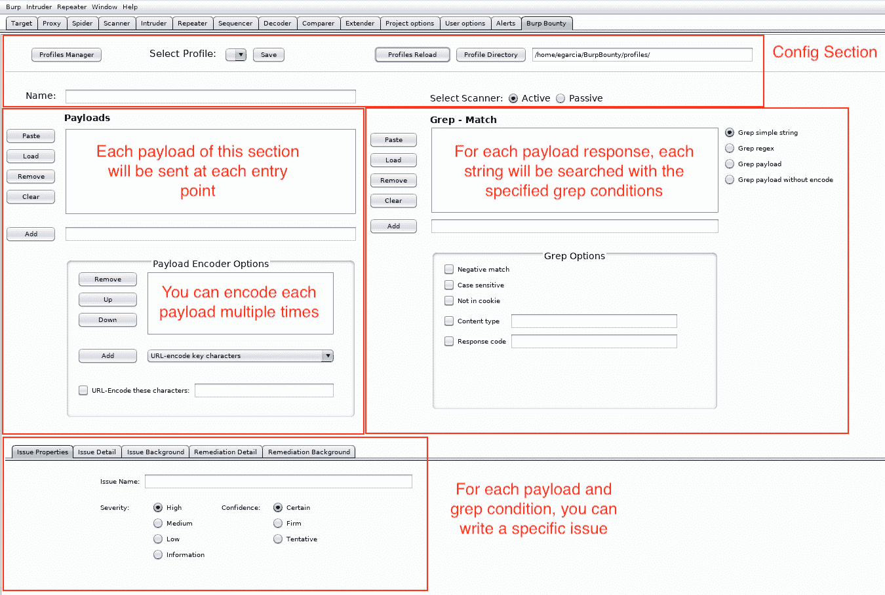
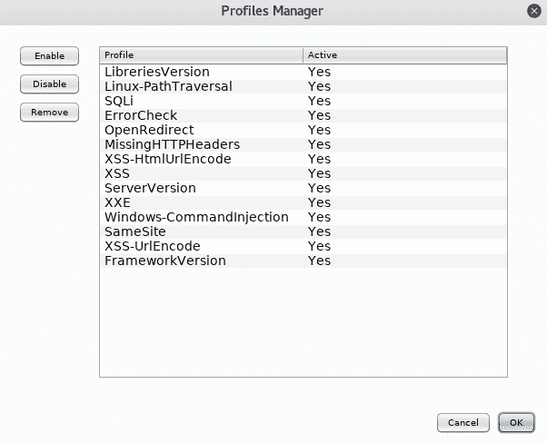

# burp county–主动和被动扫描检查生成器

> 原文：<https://kalilinuxtutorials.com/burpbounty-active-passive-scan/>

BurpBounty 允许您以快速和基本的方式，通过特别自然的图形界面，使用自定义规则的方法来增强主动和被动 burpbounty suite 扫描器。通过对实例的积极追求和发送有效载荷的改变，我们可以在主动扫描器和被动扫描器中制作我们自己的特定问题轮廓。

**还看了 [最好的免费黑客书籍 PDF 与安全相关](http://kalilinuxtutorials.com/best-free-e-books/)**

## **郊区县**的用法

#### **1。配置部分**

*   配置文件管理器:你可以管理配置文件，启用，禁用或删除任何他们。
*   选择配置文件:您可以选择任何配置文件，进行修改和保存。
*   概要文件重新加载:您可以重新加载概要文件目录，例如，当您向目录添加新的外部概要文件时。
*   概要文件目录:您选择概要文件目录路径。

#### **2。有效载荷**

*   您可以根据需要添加许多有效负载。
*   这个部分的每个有效负载将在每个入口点发送(由 burpbounty api 提供的插入点)
*   您可以选择多个电子编码。例如，如果要多次对字符串 alert(1)进行编码(按降序排列):
    *   纯文本:警报(1)
    *   HTML-编码所有字符:a& # x6c；eT2tT41
    *   对所有字符进行 URL 编码:% 26% 23% 78% 36% 31% 3b % 26% 23% 78% 36% 63% 3b % 26% 23% 78% 36% 35% 3b % 26% 23% 78% 37% 32% 3b % 26% 23% 78% 37% 37% 37% 34% 3b % 26% 23% 78% 78% 38% 3b % 26% 23% 78% 33% 31% 3b %
    *   base 64-enco:jtti 2 jtti 4 jtti 2 jtti 2 jtti 4 jtti 2 jtti 2 jtti 4 jtti 2 jtti 2 jtti 2 jtti 4 jtti 4 jtti 3 jtti 2 jtti 4 jtti 3 jtti 4 jtti 3 jtti 0 jtti 2 jtti 2 jtti 4 jtti 4 jtti 4 jtti 2 jtti 4 jtti 4 jtmjtmjtmjxjjtti 2 jtti 4
*   如果您选择“URL 编码这些字符”选项，您可以将所有您想要编码的字符与 URL 放在一起。

#### **3。grep–Match**

*   对于每个有效负载响应，将使用特定的 Grep 选项搜索每个字符串、正则表达式或有效负载(取决于您的选择)。
*   **Grep Type:**
    *   简单字符串:搜索一个或多个简单字符串
    *   正则表达式:搜索正则表达式
    *   有效负载:搜索已发送的有效负载
    *   不带编码的有效负载:如果您对有效负载进行编码，并且您想要查找原始有效负载，您应该选择此选项
*   **Grep Options:**
    *   负匹配:如果您希望查找响应中是否没有字符串、正则表达式或有效负载
    *   区分大小写:只有区分大小写时才匹配
    *   不在 cookie 中:如果您想要查找是否有任何 cookie 属性不存在
    *   内容类型:您可以指定一个或多个(用逗号分隔)内容类型来搜索字符串、正则表达式或有效负载。例如:text/plain，text/html，…
    *   响应代码:您可以指定一个或多个(用 coma 分隔)HTTP 响应代码来查找字符串、正则表达式或有效负载。比如说。300, 302, 400, …

#### **4。写一期**

*   在此部分中，您可以指定当条件与指定的选项匹配时将显示的问题。
*   问题名称
*   严重
*   信心
*   以及其他细节，如描述、背景等。

## **例句**

因此，到目前为止，您可以从已识别的漏洞中进行个性化改进:

#### **1-主动扫描**

*   XSS 反思并储存
*   基于 SQL 注入错误
*   XXE
*   命令注入
*   打开重定向
*   本地文件包含
*   远程文件包含
*   路径遍历
*   LDAP 注入
*   ORM 注射
*   XML 注入
*   SSI 注射
*   XPath 注入
*   等等

#### **2-被动扫描**

*   安全标题
*   Cookies 属性
*   软件版本
*   错误字符串
*   一般来说，任何字符串或正则表达式。

#### 如需视频，请访问我们的 youtube 频道:

*   [YouTube](https://www.youtube.com/channel/UCSq4R2o9_nGIMHWZ4H98GkQ/videos)

