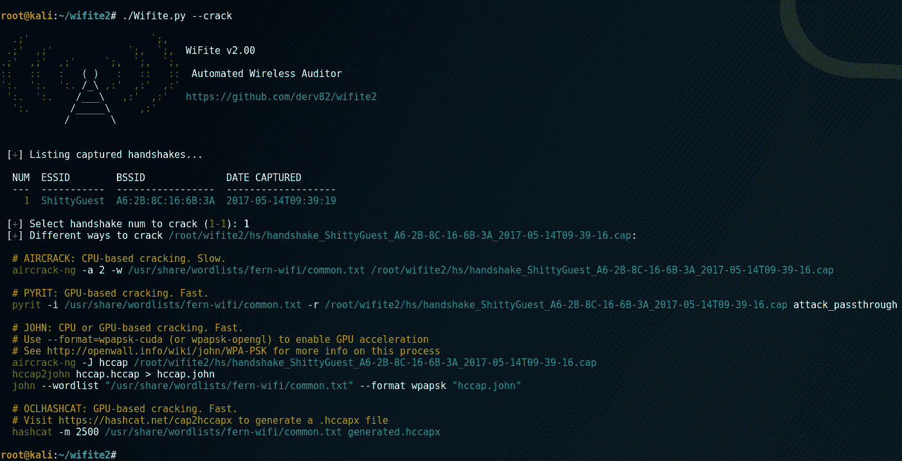

# wifi te 2 . 1 . 0–自动化无线攻击工具

> 原文：<https://kalilinuxtutorials.com/wifite-wireless-attack-tool/>

wifite 的完全重写，这是一个用于审计无线网络的 Python 脚本。

Wifite 为您运行现有的无线审计工具。停止记忆命令参数和开关！

## **wifi te 2 . 1 . 0 有什么新功能？**

*   **bug 少**
    *   更清洁的流程管理。不要让进程在后台运行(旧的`wifite`在这一点上很糟糕)。
    *   不再是“一个单一的脚本”。有工作单元测试。拉请求不那么痛苦！
*   **速度**
    *   目标访问点每秒刷新一次，而不是每 5 秒刷新一次。
*   **精度**
    *   显示当前被攻击目标的实时能量水平。
    *   在攻击期间显示更多信息(例如，在 WEP chopchop 攻击期间的百分比、Pixie-Dust 步指数等)
*   **教育**
    *   `--verbose`选项(可扩展至`-vv`或`-vvv`)显示哪些命令被执行&这些命令的输出。
    *   这有助于调试为什么 Wifite 不适合您。或者你可以学习如何使用这些工具。
*   积极开发(截至 2018 年 3 月)。
*   Python 3 支持。
*   甜蜜的新 ASCII 横幅。

**也可理解为[burp county——主动和被动扫描检查生成器](http://kalilinuxtutorials.com/burpbounty-active-passive-scan/)**

## **wifi te 2 . 1 . 0 里都去了什么？**

*   没有更多的 WPS PIN 攻击，因为它可能需要平均天。
    *   然而，精灵尘攻击仍然是一种选择。
*   一些命令行参数(`--wept`、`--wpst`和其他容易混淆的开关)。
    *   您仍然可以访问其中一些，请尝试`./Wifite.py -h -v`

## **简要功能列表**

*   掠夺者(或`-bully`)仙尘攻击(默认启用，强制:`--wps-only`)
*   WPA 握手捕获(默认启用，强制使用:`--no-wps`)
*   验证与`pyrit`、`tshark`、`cowpatty`和`aircrack-ng`(可用时)的握手
*   各种 WEP 攻击(重播、chopchop、碎片、hirte、p0841、caffe-latte)
*   扫描或攻击时自动打开隐藏的接入点。
    *   注意:仅在频道固定时有效。使用`-c <channel>`开关。
    *   通过`--no-deauths`开关禁用此功能
*   对某些无线网卡的 5Ghz 支持(通过`-5`开关)。
    *   注意:有些工具在 5GHz 频道上播放效果不好(例如`aireplay-ng`)
*   将破解的密码和握手存储到当前目录(`--cracked`)
    *   包括关于接入点的元数据。
*   提供破解捕获的 WPA 握手的命令(`--crack`)
    *   包括使用`aircrack-ng`、`john`、`hashcat`或`pyrit`破解所需的所有命令。

## **所需工具**

仅支持这些程序的最新版本:

**必填:**

*   `iwconfig`:用于识别已经处于监控模式的无线设备。
*   `ifconfig`:用于启动/停止无线设备。
*   `Aircrack-ng`套件包括:
    *   `aircrack-ng`:用于破解 WEP。cap 文件和 WPA 握手捕获。
    *   `aireplay-ng`:用于解除接入点授权、重放捕获文件、各种 WEP 攻击。
    *   `airmon-ng`:用于在无线设备上枚举和启用监控模式。
    *   `airodump-ng`:目标扫描&捕获文件生成。
    *   `packetforge-ng`:用于伪造抓图文件。

**可选，但推荐:**

*   `tshark`:用于检测 WPS 网络和检查握手捕获文件。
*   `reaver`:针对 WPS 的仙尘攻击。
    *   注意:如果没有找到`tshark`的话，Reaver 的`wash`工具可以用来检测 WPS 网络。
*   `bully`:针对 WPS 的仙尘攻击。
    *   金甲虫的替代品。指定`--bully`使用恶霸而不是金甲虫。
    *   破解 WPS 密码后，如果`reaver`找不到 PSK，恶霸也会被使用。
*   `cowpatty`:用于检测握手捕捉。
*   `pyrit`:用于检测握手捕捉。

## **安装&运行**

```
git clone https://github.com/derv82/wifite2.git
cd wifite2
./Wifite.py
```

## **截图**


**Cracking WPS PIN using reaver’s Pixie-Dust attack, then retrieving WPA PSK using bully**


**Decloaking & cracking a hidden access point (via the WPA Handshake attack)**



**Various cracking options (using –crack option)**

[](https://github.com/derv82/wifite2)