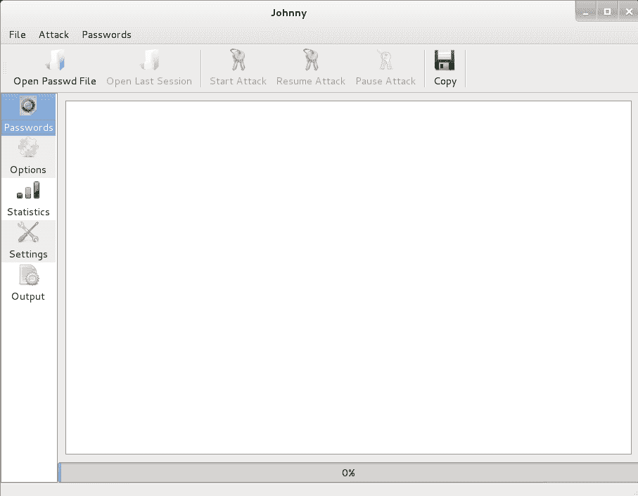
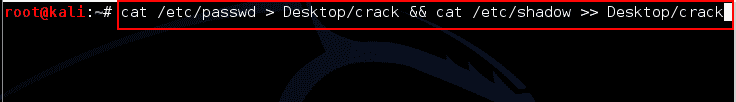
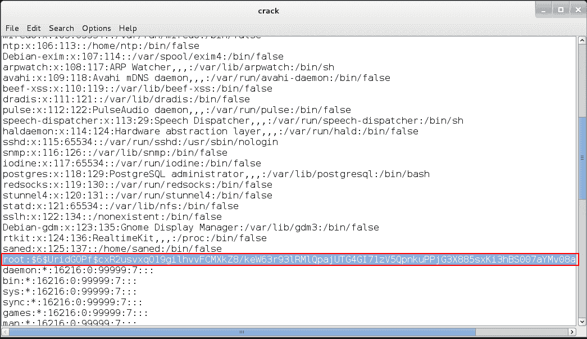
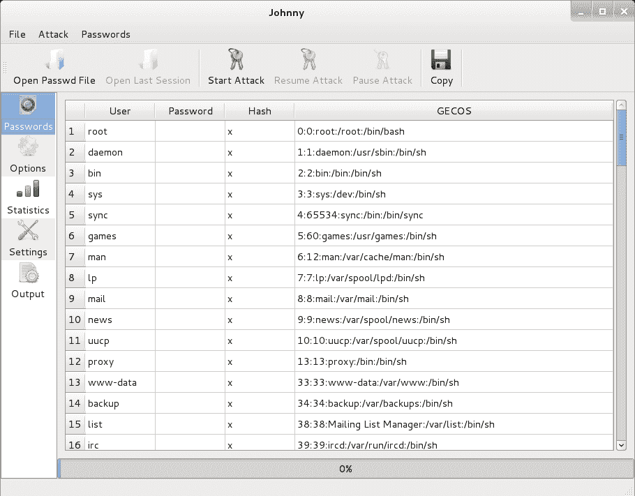
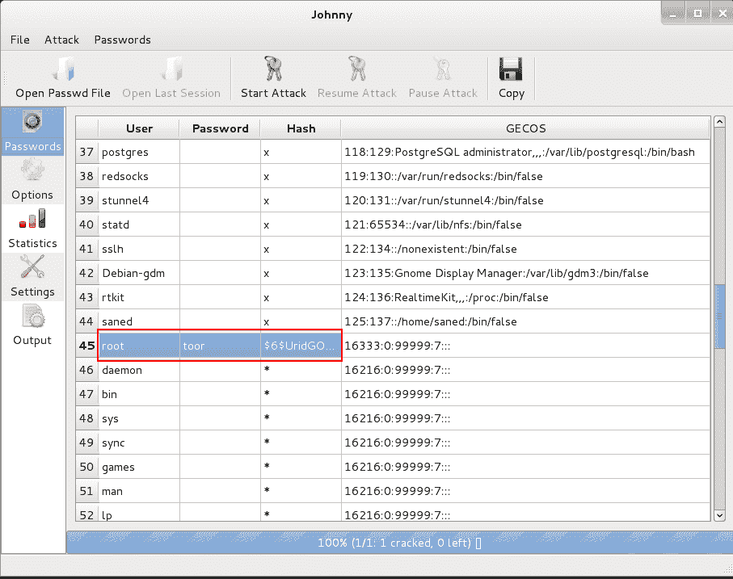

# 开膛手约翰-一站式密码审计工具

> 原文：<https://kalilinuxtutorials.com/johnny/>

## **【开膛手约翰】—** 各种格式的一站式密码审计工具

约翰是一个最先进的离线密码破解工具。约翰以开膛手约翰(JTR)而闻名，他将多种形式的密码破解工具组合成一个工具。它会自动检测密码的类型，并尝试用暴力破解加密的散列值，或者用字典攻击来破解。

JTR 支持它可以针对各种加密密码格式运行，包括在各种 Unix 版本中最常见的几种加密密码哈希类型(基于 DES、MD5 或 Blowfish)、Kerberos AFS 和 Windows NT/2000/XP/2003 LM 哈希。

额外的模块扩展了它的功能，包括基于 MD4 的密码散列和存储在 LDAP、MySQL 和其他中的密码。

Pentesters 使用 JTR 来检查密码的复杂性，确保字典攻击不可能在被测系统上发生。由于 JTR 是一个离线工具，人们必须从目标系统获取(窃取)包含文件的密码。约翰尼是 JTR 的 GUI 模式。

### **选项**

文件菜单用于打开哈希转储或加密的密码文件&以更改会话。

攻击菜单处理攻击选项(开始/停止/暂停)

[](http://kalilinuxtutorials.com/wp-content/uploads/2015/05/johnny1.png)

Johnny Main Window

在左侧窗格中，有 4 个选项。

*   “密码”选项卡显示当前加载的用户及其在加载文件中的加密详细信息。
*   选项选项卡帮助您调整 john 破解密码的方式。(默认、增量、单词列表模式等)
*   统计选项卡显示攻击开始后的当前统计数据。
*   设置允许你编辑约翰引擎的主要设置，如二进制文件的路径，计时等。
*   输出选项卡显示密码被破解后的攻击结果。

约翰主页:[http://www.openwall.com/john/](http://www.openwall.com/john/)

### **实验 1:破解脆弱的 Unix 密码**

在本实验中，我们将了解如何破解一周 Unix 密码。首先，我们必须理解包含认证信息的文件。在 unix/linux 中，位于/etc/passwd 的“passwd”文件包含所有用户信息。位于/etc/shadow 的“shadow”文件包含在 passwd 文件中找到的每个用户的 SHA 加密密码。

在本实验中，我们有一个 passwd & shadow 文件，它是使用其他工具(在本系列中解释)从位于桌面文件夹的远程系统中窃取的。

步骤 1:将 passwd & shadow 文件合并成一个名为 crack 的文件

```
Command : cat /etc/passwd > Desktop/crack && cat /etc/shadow >> Desktop/crack
```

[](http://kalilinuxtutorials.com/wp-content/uploads/2015/05/johnny2.png)

Combining Passwd & Shadow

然后尝试用你喜欢的任何文本编辑器(leafpad、nano、vim 或简单的 cat it)单独阅读这些文件。上面的命令将 passwd 文件的内容读入一个名为 crack 的新文件，然后将影子文件的内容读入并附加到 crack 文件中。

[](http://kalilinuxtutorials.com/wp-content/uploads/2015/05/johnny3.png)

John Attacks!

在上图中，突出显示的部分表示 passwd 文件的结尾和 shadow 文件的开头。

第三步:给约翰尼装上

[](http://kalilinuxtutorials.com/wp-content/uploads/2015/05/johnny4.png)

User Accounts & Details listed from a file loaded

第四步:点击开始攻击，开始攻击！

第五步:返回密码标签，查看密码

[](http://kalilinuxtutorials.com/wp-content/uploads/2015/05/johnny5.png)

Results appear as they get cracked

注意:有时“选项”选项卡中的“自动检测”选项不起作用。如果是这样，请使用确切的格式类型。在 Unix 中，它是 SHA512 crypt。所以用 Crypt 格式。此外，破解密码哈希所需的时间取决于其复杂性。

所以不要犹豫，让你的密码尽可能复杂！

Windows NTLM 即将推出！

[阅读更多关于影子文件的信息](http://www.slashroot.in/how-are-passwords-stored-linux-understanding-hashing-shadow-utils)