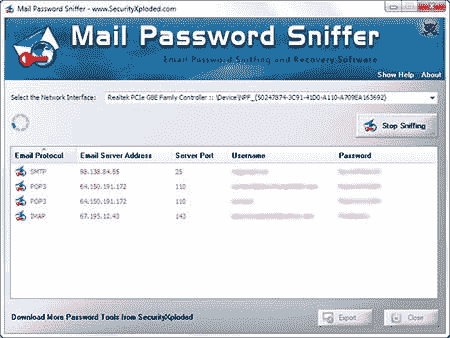
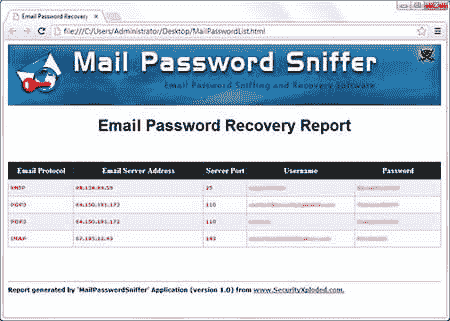

# 邮件密码嗅探器–恢复通过网络的邮件密码的工具

> 原文：<https://kalilinuxtutorials.com/mail-password-sniffer/>

邮件密码嗅探器是免费的电子邮件密码嗅探和恢复软件，通过网络恢复邮件帐户密码。它会自动识别通过网络的电子邮件身份验证数据包，并解释所有邮件协议的密码，包括 POP3、IMAP 和 SMTP。

它可以恢复所有电子邮件应用程序的邮件帐户密码，例如，Outlook，Thunderbird，Foxmail 等。对于每个恢复的电子邮件帐户，它显示电子邮件协议，服务器 IP 地址，端口，用户名和密码。

该软件将在以下情况下提供最佳结果:

*   在**网关**系统上运行它，所有的网络流量都会通过这个系统。
*   在 **MITM 攻击**中，在中间系统上运行它，从目标系统中捕获电子邮件密码。
*   在多用户系统上，在管理员帐户下运行它，以静默方式捕获所有用户的电子邮件密码。

**也读作[air bash——一个用于自动 WPA PSK 握手捕捉的 Shell 脚本](https://kalilinuxtutorials.com/airbash-shell-script/)**

## **免费下载邮件密码嗅探器 v4.0**

**许可证:**免费软件

**平台:** Windows XP，2003，Vista，Windows 7，Windows 8，Windows 10

**下载:** [点击这里](https://securityxploded.com/download.php#mailpasswordsniffer)

## **如何使用邮件密码嗅探器？【T2** 

下面是关于如何有效地使用邮件密码嗅探器来捕获流经网络的邮件密码的详细信息。

1.  从安装位置启动“邮件密码嗅探器”。
2.  选择正确的“网络接口”来嗅探网络数据包。如果你不知道，那么你可以用它们中的每一个做实验，看看哪一个有效！
3.  然后点击“开始嗅探”按钮，它将开始嗅探操作
    您将看到显示的电子邮件帐户密码，因为它们是从网络流量中捕获的，如下面的截图所示。
4.  您现在可以停止恢复操作并将恢复的密码列表保存到 HTML/XML/Text/CSV 文件，方法是单击“导出”按钮，然后从“保存文件对话框”的下拉框中选择文件类型。

该软件需要 WinPcap 驱动程序来捕获网络数据包。

## **截图**

**MailPasswordSniffer is showing the recovered Mail account passwords.**

**Email Password Recovery Report in HTML format**

