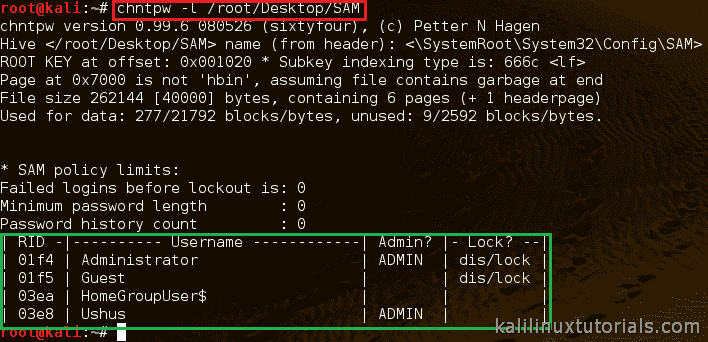
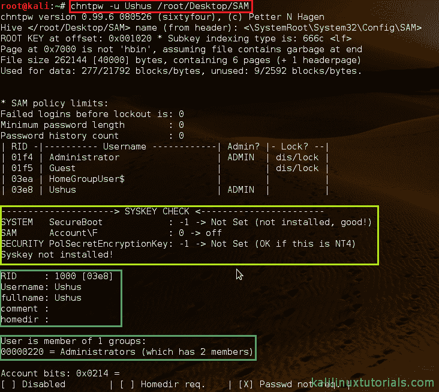
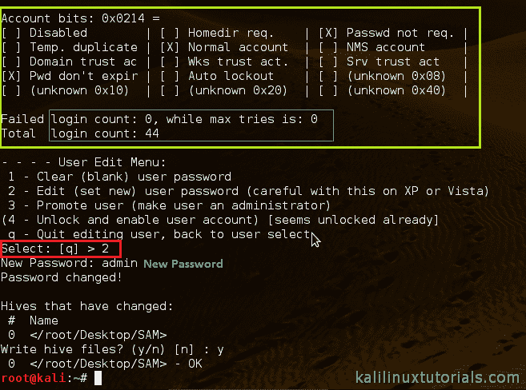

# chntpw–Windows 密码、帐户取证和更改用户密码

> 原文：<https://kalilinuxtutorials.com/chntpw/>

chntpw 是一个 Kali Linux 工具，可用于编辑 windows 注册表、重置用户密码、将用户提升为管理员，以及其他一些有用的选项。当您不知道密码是什么时，使用 chntpw 是重置 Windows 密码或以其他方式访问 Windows 机器的一个好方法

chntpw 是一个实用程序，用于查看 Windows NT/2000、XP、Vista、7 SAM 用户数据库文件中的一些信息并更改用户密码，该文件通常位于 Windows 文件系统的\WINDOWS\system32\config\SAM 下。

此外，它还包含一个简单的注册表编辑器(相同大小的数据写入)和十六进制编辑器，使用它们可以浏览和修改注册表文件中包含的信息。由于 chntpw 用于访问和更改密码，因此该工具用于密码取证。

chntpw 从 SAM 中检索帐户、帐户类型、密码散列等信息。该工具可以更改 SAM 中的值，以重置或更改密码。它还可以添加/删除帐户锁定。

[首页](http://pogostick.net/~pnh/ntpasswd)

## **选项**

```
Syntax: chntpw [OPTIONS] <samfile> [systemfile] [securityfile] [otherreghive]
```

```
 -h    This message
 -u    <user> Username to change, Administrator is default
 -l    list all users in SAM file
 -i    Interactive. List users (as -l) then ask for username to change
 -e    Registry editor. Now with full write support!
 -d    Enter buffer debugger instead (hex editor),
 -t    Trace. Show hexdump of structs/segments. (deprecated debug function)
 -v    Be a little more verbose (for debuging)
 -L    Write names of changed files to /tmp/changed
 -N    No allocation mode. Only (old style) same length overwrites possible
```

## 实验 1:使用 CHNTPW 更改 WINDOWS 密码

**场景**:

安装了 Kali Linux 的 8GB USB 驱动器

Windows 7 机器

**解释**

这是法医分析。所以我们应该尽可能不改变目标的文件系统。但是，我们将尝试更改复制到 Kali Linux 桌面的原始 SAM 副本的密码。如果您想重置或更改忘记的密码，可以将它复制到原始位置。

在 windows 中，密码存储在 SAM 文件中。安全账户管理器( **SAM** )是 Windows XP、Windows Vista 和 Windows 7 中存储用户密码的数据库**文件**。它可用于验证本地和远程用户。通常，SAM 文件位于 C/Windows/system32/config/SAM 中。

在本实验中，我们创建了一个安装了 kali Linux 的可引导 USB。然后是在引导进入取证模式后描述的以下内容。为此，你必须改变机器的启动顺序&首先设置 USB 启动。点击 [此处](http://docs.kali.org/general-use/kali-linux-forensics-mode) 查看如何操作的详细文档。

然后，我们将 Sam 文件复制到 kali 桌面，用于本实验。在现实世界中，你可能不会这样做。

之后，我们将在 SAM 文件中列出所有用户。为此

```
command: chntpw –l <sam file>
```

[](http://kalilinuxtutorials.com/f/chntpw/attachment/chntpw1/#main)

Executing CHNTPW on copied SAM

接下来，我们必须选择需要更改密码的用户名。为此，语法是

```
command: chntpw –u <user> <sam file>
```

[](http://kalilinuxtutorials.com/f/chntpw/attachment/chntpw2/#main)

Executing CHNTPW

现在该工具将进入用户编辑菜单。然后我们必须选择我们想做的事情。只需键入与我们要求的任务相对应的编号。我们在这里更改密码。所以输入“2”。

[](http://kalilinuxtutorials.com/f/chntpw/attachment/chntpw3/#main)

Account Information & Interactive Menu.

然后，该工具将要求输入新密码。只需键入并按回车键。然后它会问我们是否要保存密码。按 y 键保存新密码。现在我们已经更改了 SAM 文件中的密码。

在实际场景中，这是通过将 Kali Linux forensic cd 实时引导到 windows 系统中来实现的，而无需更改 SAM 文件的位置。