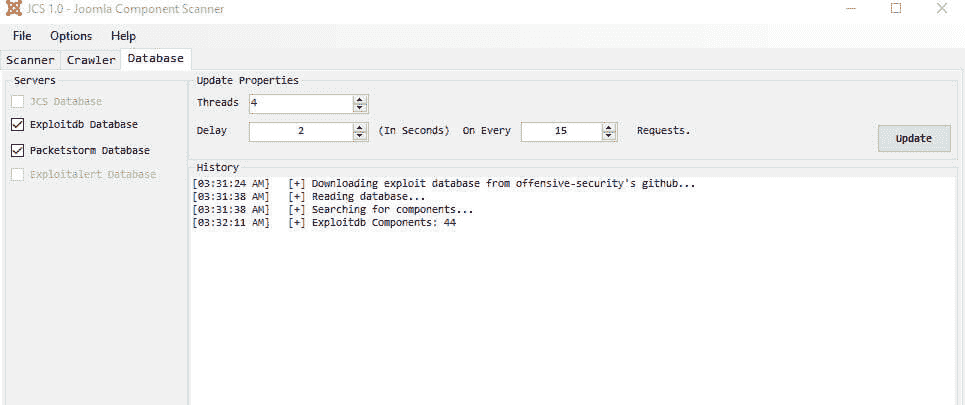
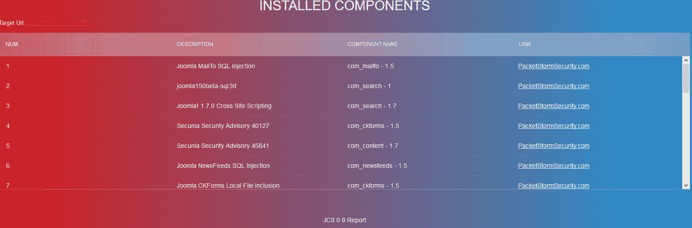

# JCS–渗透测试组件扫描程序的 Joomla 漏洞

> 原文：<https://kalilinuxtutorials.com/jcs-joomla-vulnerability/>

JCS (Joomla 组件扫描程序)是专为 Joomla CMS 上的渗透测试而设计的，可以帮助您处理最新的组件漏洞和利用。数据库可以从几个资源中更新，并且已经实现了一个爬虫来查找组件和组件的链接。

这个版本支持 Exploitdb 和 Packetstorm 漏洞，为 joomla 组件创建一个数据库，它还可以为您创建一个 HTML 格式的报告。

## **JCS 的特点**

*   多线程
*   请求之间的延迟
*   自定义 Http 标头
*   支持 Http 代理
*   支持 Http 身份验证:
    *   基本的
    *   摘要
*   基于正则表达式模式组件爬虫
*   组件的页面标识方式:
    *   页面比较
    *   正则表达式模式
    *   在 HTML 标签中搜索示例:<title>未找到</title>
    *   正在检查 Http 状态代码

## **编译**

在 Visual Studio 中打开项目，然后单击“生成”

## **报表样本**

