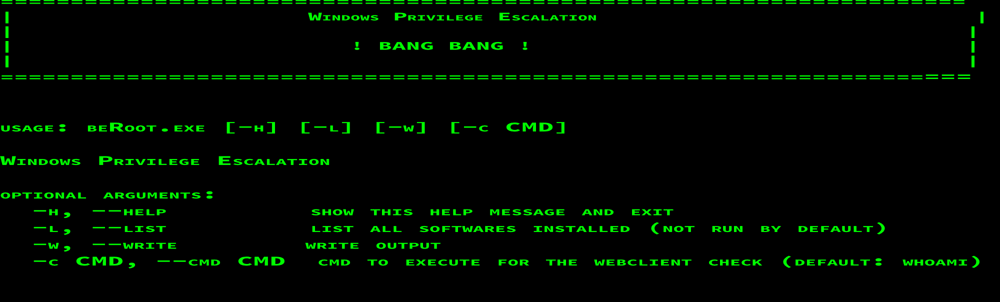

# BeRoot–检查常见 Windows 错误配置的工具

> 原文：<https://kalilinuxtutorials.com/beroot-tool-windows-misconfigurations/>

BeRoot 是一个漏洞利用后工具，用于检查常见的 Windows 错误配置，以找到提升我们权限的方法。它将作为后期开发模块添加到 pupy 项目中(因此它将在内存中执行，而不需要接触磁盘)。

除了一种方法，这个工具只用于检测，不用于利用。如果发现了什么，模板可以用来利用它。要使用它，只需在所使用的服务/ DLL 旁边创建一个 **test.bat** 文件。一旦被调用，它就应该执行它。根据目标主机上安装的可再发行软件包，这些二进制文件可能无法工作。

点击[此处](https://github.com/AlessandroZ/BeRoot/releases)下载编译版本。

**也读作[chntpw–Windows 密码，账号取证&修改用户密码](https://kalilinuxtutorials.com/chntpw/)**

## **跑贝鲁特**



以下文件描述了所有检测方法。

## **路径包含空格不加引号**

考虑以下文件路径:

```
**C:\Program Files\Some Test\binary.exe**
```

如果路径包含空格且没有引号，Windows 将尝试按以下顺序查找并执行程序:

```
**C:\Program.exe
C:\Program Files\Some.exe
C:\Program Files\Some Folder\binary.exe**
```

按照这个例子，如果“ *C:\* ”文件夹是可写的，就有可能创建一个名为“【Program.exe】”的恶意可执行二进制文件。如果“*binary.exe*”以高特权运行，这可能是一个提升我们特权的好方法。

注意:BeRoot 在位于 HKLM 的每个服务路径、计划任务和启动密钥上实现了这些检查。

#### **如何利用**:

易受攻击的路径如下:

*   服务:创建恶意服务(或编译服务模板)
*   一个经典的可执行文件:创建你自己的可执行文件。

## **可写目录**

考虑以下文件路径:

```
`C:\Program Files\Some Test\binary.exe` 
```

如果“*”的根目录是可写的(*“C:\ Program Files \ Some Test”*)并以高权限运行，就可以用来提升我们的权限。*

 ***注** : BeRoot 实现了对位于 HKLM 的每一条服务路径、预定任务和启动密钥的检查。

**如何利用**:

*   服务没有运行:
    *   用我们自己的服务替换合法的服务，重新启动它或者检查它是如何被触发的(在重新启动时，当另一个进程被启动时，等等)。).
*   服务正在运行，无法停止:
    *   大多数攻击都是这样，检查 dll 劫持，并尝试使用以前的技术重新启动服务。

## **% PATH %上的可写目录**% 

这种技术会影响以下 Windows 版本:

```
**6.0 	=> 	Windows Vista / Windows Server 2008
6.1 	=> 	Windows 7 / Windows Server 2008 R2
6.2 	=> 	Windows 8 / Windows Server 2012** 
```

在传统的 Windows 安装中，当二进制文件加载 dll 时，Windows 会尝试使用以下步骤来定位它:

```
**- Directory where the binary is located
- C:\Windows\System32
- C:\Windows\System
- C:\Windows\
- Current directory where the binary has been launched
- Directory present in %PATH% environment variable** 
```

如果 **%PATH%** 变量上的目录可写，就有可能实现 DLL 劫持攻击。然后，我们的目标是找到一个服务来加载一个不存在于这些路径中的 DLL。这是默认的“ **IKEEXT** ”服务的情况，该服务加载不存在的“**wlbsctrl.dll**”。

**如何利用**:创建一个名为“【wlbsctrl.dll】T2”的恶意 DLL(使用 [DLL 模板](https://github.com/AlessandroZ/BeRoot/tree/master/templates/DLL_Hijacking))，并将其添加到%PATH%变量上列出的可写路径中。启动服务“ *IKEEXT* ”。为了在没有高特权的情况下启动 IKEEXT 服务，法国杂志 MISC 90 上的技术描述解释了以下方法:

**创建如下文件:**

```
**`C:\Users\bob\Desktop>type test.txt
[IKEEXTPOC]
MEDIA=rastapi
Port=VPN2-0
Device=Wan Miniport (IKEv2)
DEVICE=vpn
PhoneNumber=127.0.0.1`** 
```

使用“ *rasdial* ”二进制文件启动 IKEEXT 服务。即使连接失败，服务也应该已经启动。

```
**C:\Users\bob\Desktop>rasdial IKEEXTPOC test test /PHONEBOOK:test.txt** 
```

## **MS16-075**

对于法国用户，我推荐写在 MISC 90 上的文章，它详细解释了它是如何工作的。

微软已经用 MS16-075 修正了这个漏洞，但是许多服务器仍然容易受到这种攻击。

**以下是一些解释(不详细):**

*   使用一些魔术(使用其 UUID)启动 Webclient 服务(用于连接到一些共享)
*   在本地启动 HTTP 服务器
*   找到一个将用于触发*系统 NTLM 散列*的服务。
*   在此服务上启用文件跟踪，修改其注册表项以指向我们的 web 服务器( *\\127.0.0.1@port\tracing* )
*   启动此服务
*   我们的 HTTP 服务器开始协商以获得*系统 NTLM 散列*
*   在 SMB 中使用这个散列来执行我们定制负载(SMBrelayx 已经被修改来实现这个动作)
*   清理一切(停止服务，清理注册表等)。).

**如何利用** : BeRoot 实现这种利用，更改“ *-c* ”选项在易受攻击的主机上执行自定义命令。

```
**`beRoot.exe -c "net user Zapata LaLuchaSigue /add"
beRoot.exe -c "net localgroup Administrators Zapata /add"`** 
```

## **AlwaysInstallElevated 注册表项**

**AlwaysInstallElevated** 是一项设置，允许非特权用户使用提升的(*系统*)权限运行 Microsoft Windows Installer 软件包文件( *MSI* )。要允许它，必须将两个注册表项设置为 **1** :

```
**HKEY_CURRENT_USER\SOFTWARE\Policies\Microsoft\Windows\Installer\AlwaysInstallElevated
HKEY_LOCAL_MACHINE\SOFTWARE\Policies\Microsoft\Windows\Installer\AlwaysInstallElevated** 
```

**如何利用**:创建恶意 msi 二进制并执行。

## **无人值守安装文件**

该文件包含安装过程中设置的所有配置设置，其中一些设置可能包含本地帐户的配置，包括管理员帐户。这些文件位于以下路径:

```
**C:\Windows\Panther\Unattend.xml
C:\Windows\Panther\Unattended.xml
C:\Windows\Panther\Unattend\Unattended.xml
C:\Windows\Panther\Unattend\Unattend.xml
C:\Windows\System32\Sysprep\unattend.xml 
C:\Windows\System32\Sysprep\Panther\unattend.xml** 
```

**如何利用**:打开 unattend.xml 文件，检查上面是否有密码。应该看起来像:

```
`<UserAccounts>
    <LocalAccounts>
        <LocalAccount>
            <Password>
                <Value>RmFrZVBhc3N3MHJk</Value>
                <PlainText>false</PlainText>
            </Password>
            <Description>Local Administrator</Description>
            <DisplayName>Administrator</DisplayName>
            <Group>Administrators</Group>
            <Name>Administrator</Name>
        </LocalAccount>
    </LocalAccounts>
</UserAccounts>` 
```

演职员表:亚历山德罗·倪瓒

[](https://github.com/AlessandroZ/BeRoot/tree/master/Windows)*