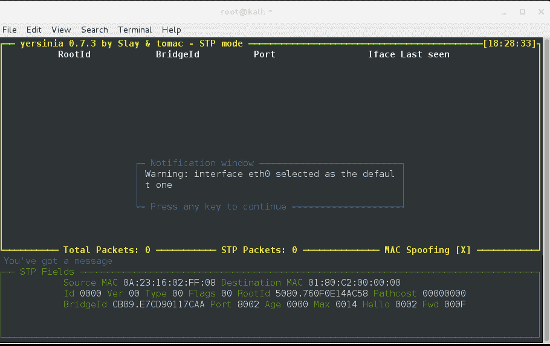
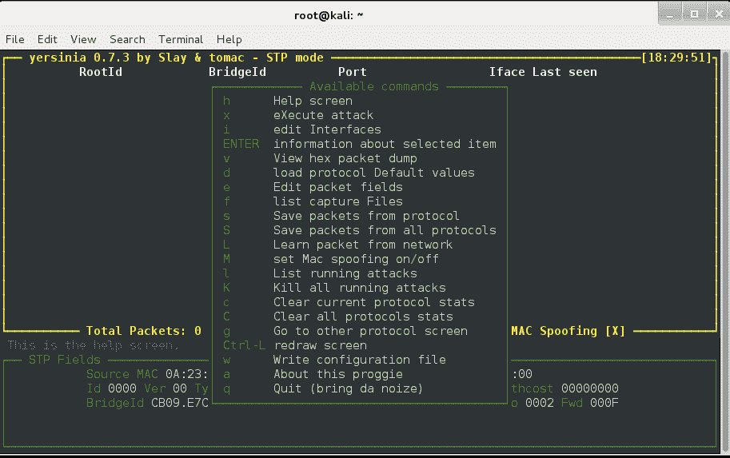
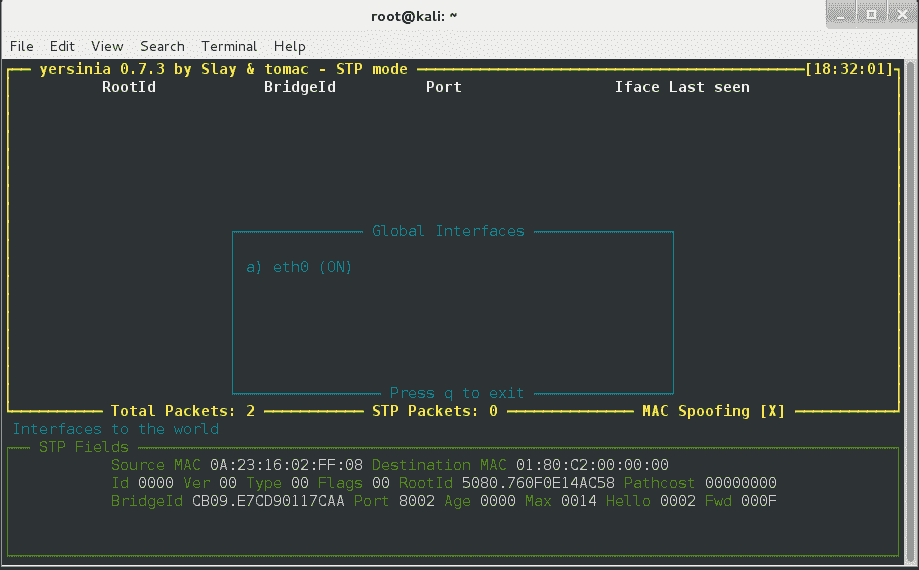
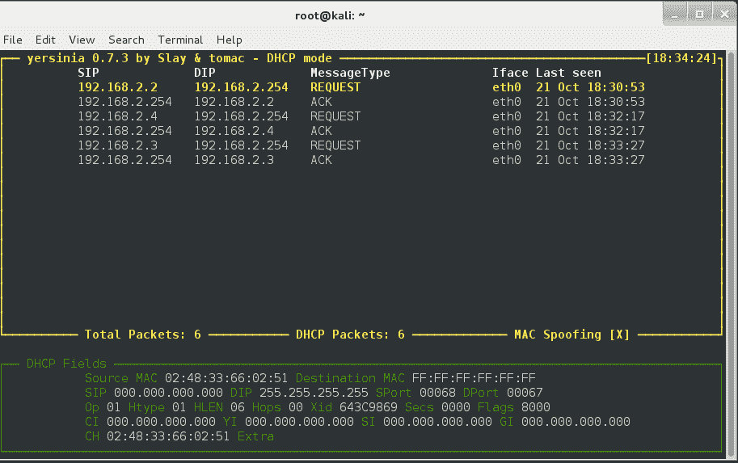
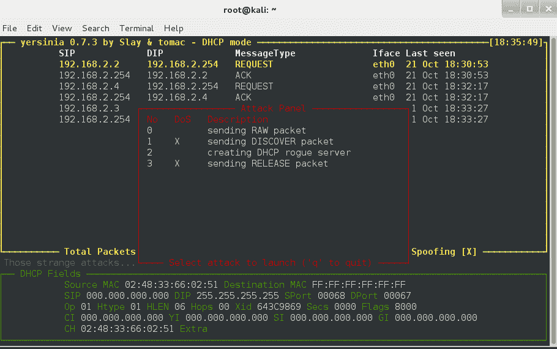
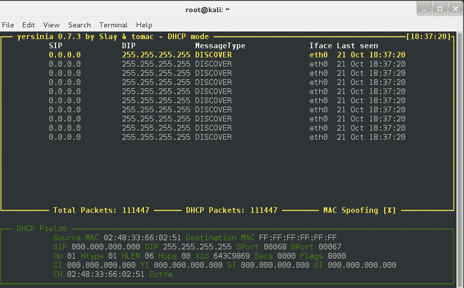
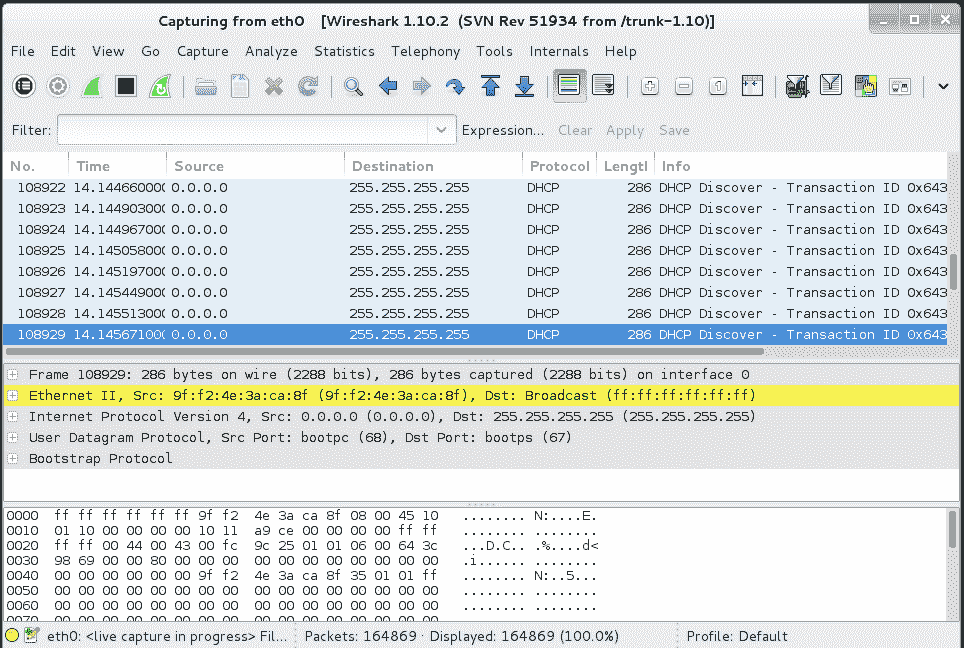
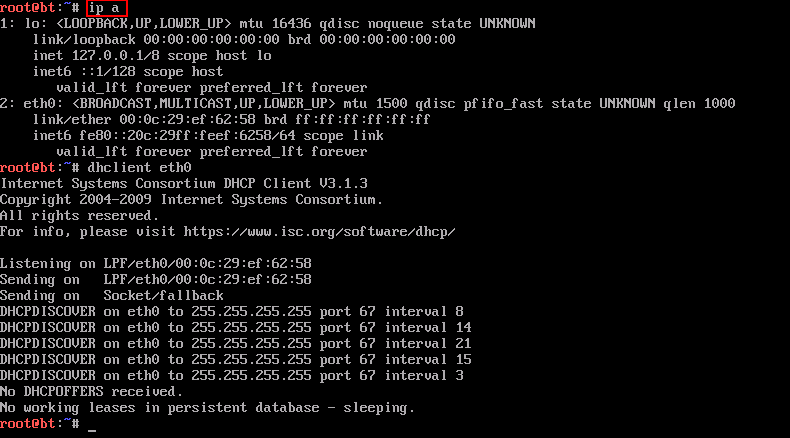

# 第 2 层耶尔森氏菌——漏洞分析和 DHCP 饥饿攻击

> 原文：<https://kalilinuxtutorials.com/yersinia/>

Yersinia 是一个网络工具，旨在利用不同网络协议中的一些弱点。它自称是用于分析和测试部署的网络和系统的可靠框架。

它由各种利用不同第 2 层协议弱点的第 2 层攻击组成。因此，pentester 可以识别网络深层 2 中的漏洞。在 pentests 期间，耶尔森氏菌被用来对第 2 层设备发起攻击，如交换机、dhcp 服务器生成树协议等。目前耶尔森氏菌支持:

*   生成树协议(STP)
*   思科发现协议(CDP)
*   动态中继协议(DTP)
*   动态主机配置协议(DHCP)
*   热备用路由器协议(HSRP)
*   IEEE 802.1Q
*   IEEE 802.1X
*   交换机间链路协议(ISL)
*   VLAN 中继协议(VTP)

耶尔森菌主页:[http://www.yersinia.net/](http://www.yersinia.net/)

**警告！！！耶尔森氏菌中的一些模式会造成拒绝服务(DOS)。小心点！仅在测试网络上使用或事先获得许可。**

### **选项**

```
-h, --help             Help screen.
-V, --Version          Program version.
-G                     Start a graphical GTK session.
-I, --interactive      Start an interactive ncurses session.
-D, --daemon           Start the network listener for remote admin  (Cisco  CLI  emulation).
-d                     Enable debug messages.
-l logfile             Save the current session to the file logfile. If logfile exists, the data will be appended at the end.

-c conffile            Read/write configuration variables from/to conffile.
-M                     Disable MAC spoofing.
```

```
GTK GUI       The  GTK GUI (-G) is a GTK graphical interface with all of the yersinia powerful features and a professional 'look and feel'.
```

```
NCURSES GUI        The ncurses GUI (-I) is a ncurses (or curses) based console  where  the user can take advantage of yersinia powerful features.
 Press 'h' to display the Help Screen and enjoy your session :)
```

```
NETWORK DAEMON        The  Network Daemon (-D) is a telnet based server (ala Cisco mode) that listens by default in port 12000/tcp waiting for incoming  telnet  connections. It supports  a  CLI  similar  to  a  Cisco device where the user (once authenticated) can display different settings and  can  launch  attacks without  having yersinia  running in her own machine (especially useful Windows users).

```

耶尔森菌主页:[http://www.yersinia.net/](http://www.yersinia.net/)

### **实验 1:使用耶尔森菌 NCurses 模式的 DHCP 拯救**

在本实验中，我们使用带有假冒 mac 地址的 dhcp discover 数据包来淹没 dhcp 服务器。因此，dhcp 服务器为所有请求授予不同的 ip 地址，并填满 dhcp 地址池。此后，请求 ip 地址的新合法客户端将不会收到它。这就是所谓的 DHCP 拯救。

在这个演示中，我们在网络范围 192.168.2.0/24 上有一台 kali linux 机器(攻击者)和一台回溯机器(目标)。dhcp 服务器运行在 192.168.2.1 上，有一个 192.168.2.1-254 的 254 个 IP 池。

步骤 1 :以交互模式启动耶尔森菌。

```
Command: yersinia –I
```

[](http://kalilinuxtutorials.com/wp-content/uploads/2015/05/yersinia1.png)

Yersinia NCurses mode

第二步:按 h 求助。然后将接口更改为 eth0(或您的默认接口)

[](http://kalilinuxtutorials.com/wp-content/uploads/2015/05/yersinia2.png)

Yersinia Options

按“I”选择编辑接口选项

[](http://kalilinuxtutorials.com/wp-content/uploads/2015/05/yersinia3.png)

Selecting Interface

第三步:按 F2 键选择 DHCP 模式。

[](http://kalilinuxtutorials.com/wp-content/uploads/2015/05/yersinia4.png)

Yersinia in DHCP Mode

第四步:按 x 键执行攻击，然后选择相应的子攻击。

[](http://kalilinuxtutorials.com/wp-content/uploads/2015/05/yersinia5.png)

Selecting the type of DHCP attack

现在按 1 键发起 DHCP 发现攻击。

[](http://kalilinuxtutorials.com/wp-content/uploads/2015/05/yersinia6.png)

Numerous DHCP Discover Packets being sent.

在这里，您可以看到所有 dhcp discover 数据包都是从我们的攻击者系统发出的。也可以在 wireshark 上查看。

[](http://kalilinuxtutorials.com/wp-content/uploads/2015/05/yersinia7.png)

DHCP Discover requests being sent seen in Wireshark.

现在等待 1 分钟，并尝试连接一个新的客户端到网络(这里是一个回溯机)。任何连接到同一网络的机器(VM 或 Real ),只要处于攻击者所选择的攻击接口所在的网络中(此处 Kali linux 机器带有 eth0 接口),都可以。

[](http://kalilinuxtutorials.com/wp-content/uploads/2015/05/yersinia8.png)

Client Machines denied of IP address.

您可以看到这里没有默认 ip。然后运行了 dhclient(从 DHCP 服务器获取 ip 的工具)，但是没有找到租约。这意味着 dhcp 地址池中的所有 IP 地址都已填满。

实际上，这是一些设备(旧路由器和交换机)的漏洞。).一些新的企业路由器/交换机解决了这个问题。启用 dhcp 侦听、端口安全、ACL 来防止此类攻击。

* * *

浏览以下链接，了解更多关于缓解和对策的信息。

[思科](https://www.cisco.com/web/ME/exposaudi2009/assets/docs/layer2_attacks_and_mitigation_t.pdf)

[杜松](https://www.juniper.net/techpubs/en_US/junos14.1/topics/example/port-security-protect-from-dhcp-starvation-attack.html)