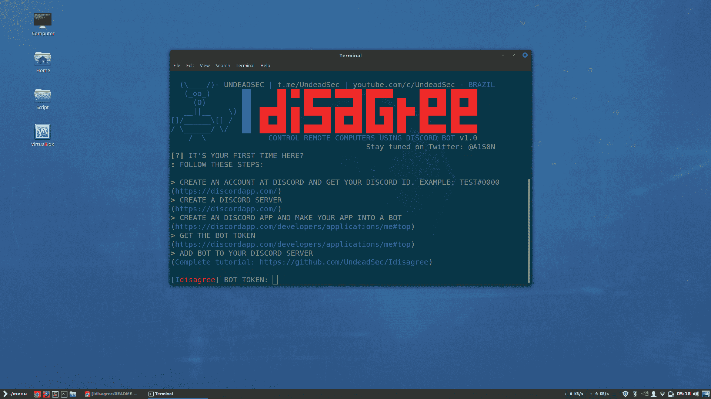

# idisagree–使用 Discord Bot 和 Python 3 控制远程计算机

> 原文：<https://kalilinuxtutorials.com/idisagree-control-remote-computers/>

Idisagree 是一款使用 discord bot 和 python 3 来控制远程电脑的工具。如果您的目标是 windows 系统，您可能需要编译您的有效负载。使用 py2exe 或 pyinstaller 完成此操作。

## **Idisagree**的先决条件

*   Python 3.x
*   pip3
*   python3 的子流程
*   来自 python3 的不和

**也看[CTF——安全研究工具的一些设置脚本](https://kalilinuxtutorials.com/ctf-scripts-security-tools/)**

## **在**上测试

*   kali Linux–滚动版
*   Linux as-18.3 西尔维娅
*   Ubuntu–2010 年 4 月 16 日
*   马科斯高塞拉

## **克隆**

```
git clone https://github.com/UndeadSec/Idisagree.git
```

## **跑步**

```
cd Idisagree
```

```
sudo pip3 install -r requirements.txt
```

```
python3``Idisagree.py
```

## **截图**  **视频演示** 

[https://youtu.be/aXYaR-eEKzg](https://youtu.be/aXYaR-eEKzg)

**注意:**该工具的使用完全由最终用户负责。开发人员不承担任何责任，也不对本程序造成的任何误用或损坏负责。

[](https://github.com/UndeadSec/Idisagree)