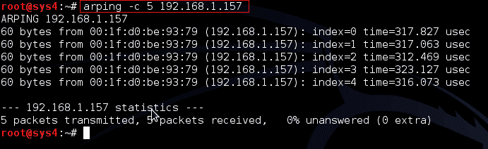

# ARP ing–发现计算机网络上的主机

> 原文：<https://kalilinuxtutorials.com/arping/>

Arping 是一种计算机软件工具，用于发现计算机网络上的主机。该程序测试一个给定的 IP 地址是否在本地网络中使用，并可以获得使用该地址的设备的附加信息。

ARP 在第 2 层(或 OSI 模型的链路层)工作，使用地址解析协议(ARP)探测主机。因为 ARP 是不可路由的，所以这只适用于本地网络。

但是，在采用使用代理 ARP 的中继器的网络中，ARP 响应可能来自此类代理主机，而不是来自被探测的目标

## **解析选项**

```
-help     Show extended help. Not quite as extensive as this manpage, but
more than -h.

-0       Use this option to ping with source IP address 0.0.0.0\. Use thiswhen you haven't configured your interface yet. Note that this may get the MAC-ping unanswered. This is an alias for -S 0.0.0.0.

-a         Audible ping.

-A        Only count addresses matching requested address (This *WILL* break most things you do. Only useful if you are arpinging many hosts at once. See arping-scan-net.sh for an example).

-b        Like -0 but source broadcast source address (255.255.255.255). Note that this may get the arping unanswered since it's not normal behavior for a host.

-B        Use instead of host if you want to address 255.255.255.255.

-c        count Only send count requests.

-d       Find duplicate replies. Exit with 1 if there are answers from two different MAC addresses.

-D      Display answers as dots and missing packets as exclamation points. Like flood ping on a Cisco.

-e      Like -a but beep when there is no reply.

-F      Don't try to be smart about the interface name. Even if this switch is not given, -i disables this smartness.

-h      Displays a help message and exits.

-i       interface Don't guess, use the specified interface.

-p      Turn on promiscious mode on interface, use this if you don't "own" the MAC address you are using.

-q      Does not display messages, except error messages.

-r      Raw output: only the MAC/IP address is displayed for each reply.

-R      Raw output: Like -r but shows "the other one", can be combined with -r.

-s       MAC Set source MAC address. You may need to use -p with this.

-S       IP Like -b and -0 but with set source address. Note that this may get the arping unanswered if the target does not have routing to the IP. If you don't own the IP you are using, you may need to turn on promiscious mode on the  interface (with -p). With this switch you can find out what IP-address a host has without taking an IP-address  yourself.

-t       MAC Set target MAC address to use when pinging IP address.

-T     IP Use -T as target address when pinging MACs that won't respond to a broadcast ping but perhaps to a directed broadcast.

-u     Show index=received/sent instead of just index=received when pinging MACs.

-v      Verbose output. Use twice for more messages.

-w     Time to wait between pings, in microseconds.
```

手册页:[http://www.unix.com/man-page/all/8/arping/](http://www.unix.com/man-page/all/8/arping/)

### 实验 1 使用受害者 IP 地址找出 MAC 地址

这演示了如何简单地使用 ARP 来确定远程 MAC 地址。

```
Syntax:  arping –c ‘no. of request’ Ip Address
```

```
Command:  arping –c 4 192.168.0.157
```

[](http://kalilinuxtutorials.com/wp-content/uploads/2015/05/arping1.png)

Detecting MAC of remote machine using arping