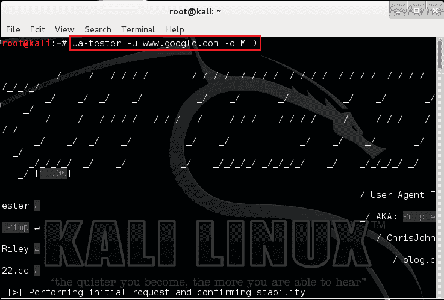
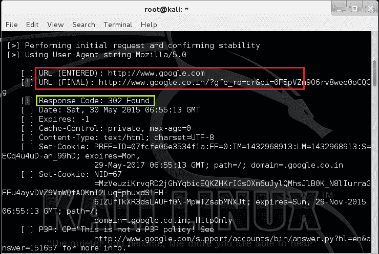

# ua-tester——用于用户代理 WAF、IDS/IPS、重定向测试的工具

> 原文：<https://kalilinuxtutorials.com/ua-tester/>

UA-tester 是一个工具，用于检查一个网站是否为不同的用户代理提供不同的页面，如手机、桌面机器人等。嗯，这个工具也传递了很多信息。它基本上是一个 python 脚本，通过指定站点上的各种用户代理运行。

它还尝试各种选项，如设置 cookie、重定向、URL 稳定性(无论 URL 是否过期)等等。现在我不确定这如何被用作晶片测试器。但我认为，所有这些选项和测试都类似于 Nmap 扫描。

你会得到很多关于响应代码、重定向、静态/动态 URL、XSS 保护、服务器头等信息。从这些，你可以知道是否有一个 WAF，或者 WAF 正在做什么来阻止扫描他们的网站。一件很酷的事情是，这个工具可以让你从对网站的请求中得到数据的 MD5。不同用户代理的散列变化表明有单独的页面。

## **选项–UA-tester**

```
Syntax: uatester –u url –d <agent1> <agent2>
```

```
-u / --url Complete URL
-f / --file <Path to User Agent file> / If no file is provided, -d options must be present
-s / --single provide single user-agent string (may need to be contained within quotes)
-d / --default Select the UA String type(s) to check. Select 1 or more of the following ↵
catagories. (M)obile, (D)esktop, mis(C), (T)ools, (B)ots, e(X)treme [!])
-o / --output <Path to output file> CSV formated output (FILE WILL BE OVERWRITTEN[!])
-v / --verbose results (Displays full headers for each check) >> Recommended
--debug See debug messages (This isn't the switch you're looking for)
```

UA-Tester 主页:[https://code.google.com/p/ua-tester/](https://code.google.com/p/ua-tester/)

### **实验 1:简单的谷歌查询**

在本实验中，我们将使用 google 检查桌面和移动用户代理。

```
Command: ua-tester -u www.google.com -d M D
```

[](http://kalilinuxtutorials.com/wa/ua-tester/attachment/ua-tester1/#main)

Querying Google

在这里，我们可以看到不同的用户代理。对于这些用户代理中的每一个，都进行了重定向。另外，检查显示的详细信息。

[](http://kalilinuxtutorials.com/wa/ua-tester/attachment/ua-tester2/#main)

Info on URL redirection Response codes etc