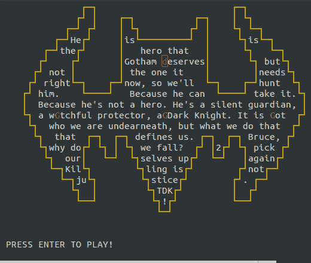

# PacVim 一个教你 Vim 命令的游戏

> 原文：<https://kalilinuxtutorials.com/pacvim-game/>

PacVim 是一款基于文本的免费开源游戏，它以简单有趣的方式教你 Vim 命令。尽管事实上 Vim 是 Linux 系统上的一个突出的内容编辑器，个人仍然认为它很难学习，它有一个不稳定的期望来学习和适应特别是推进的亮点，相当多的 Linux 业余爱好者实际上对接受这个强大的和强烈推荐的文本编辑器感到忧虑。

话说回来，Tecmint 和 Linux 社区已经为使 Vim 易于学习做出了很多努力；从制作 Vim 教学练习、分享有价值的 Vim 使用技巧和提示，到创建智能学习网络应用程序和命令行游戏，例如 PacVim。

PacVim 受到著名的 PacMan 游戏的启发，并在 Linux 和 MacOSX 上运行。它使你以一种愉快的方式广泛地学习 vim 召唤。它的目标很像吃豆人——你应该将吃豆人移到屏幕上的每个角色上，同时远离幽灵。

**也可阅读 [Metasploit 框架——渗透测试、漏洞利用开发和漏洞研究初学者指南](https://kalilinuxtutorials.com/metasploit-framework/)**

## **如何安装 PacVim**

要安装 **PacVim** 游戏，你需要首先使用默认的软件包管理器在你的 Linux 发行版上安装所需的**诅咒**(图形库)软件包，如图所示。

```
**$ sudo apt install libncurses5-dev libncursesw5-dev  [On Ubuntu/Debian]
# yum install ncurses-devel                          [On CentOS/RHEL]
# dnf install ncurses-devel                          [On Fedora =22]** 
```

接下来，通过克隆其存储库来下载 **PacVim** 源文件，并如图所示进行安装。

```
$ cd ~/Downloads
$ git clone https://github.com/jmoon018/PacVim.git
$ cd PacVim
$ sudo make install 
```

安装 **PacVim** 后，从**0 级**运行即可开始学习 **vim 命令**，默认模式为**硬**。

```
$ pacvim 
```

这里有几个移动光标的键:



**执行命令列表**

| 

##### **键**

 | 

##### **Use**

 |
| --- | --- |
| q | 退出游戏 |
| h | 向左移动 |
| j | 下移 |
| k | 提升 |
| l | 向右移动 |
| w | 向前移动到下一个单词开头 |
| W | 向前移动到下一个单词开头 |
| e | 向前移动到下一个单词结尾 |
| E | 向前移动到下一个单词结尾 |
| b | 向后移动到下一个单词开头 |
| B | 向后移动到下一个单词开头 |
| $ | 移动到行尾 |
| Zero | 移动到行首 |
| gg/1G | 移动到第一行的开头 |
| *号*克 | 移动到由*号*给出的行的开头 |
| G | 移动到最后一行的开头 |
| ^ | 移动到当前行的第一个单词 |
| & | 1337 cheatz(击败当前水平) |

[](https://www.tecmint.com/learn-vi-commands-with-pacvim-game/)