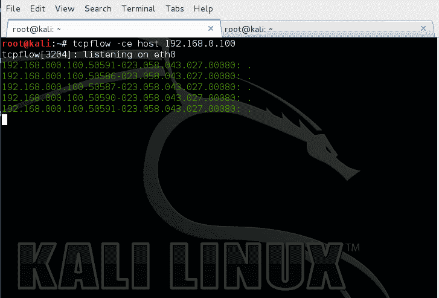
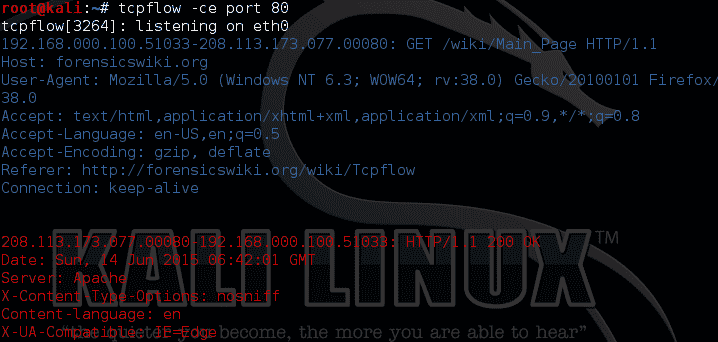
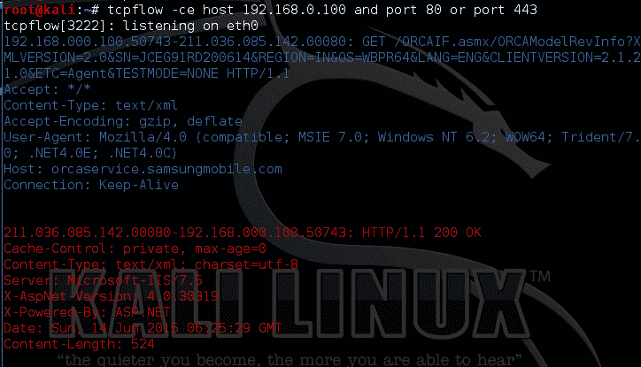
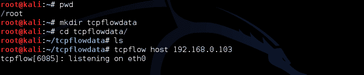
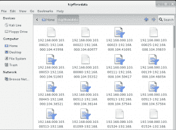

# TCP flow–监控、捕获和转储数据包

> 原文：<https://kalilinuxtutorials.com/tcpflow/>

**Tcpflow** 是一个 TCP/IP 解复用器。Tcpflow 主要用于记录两台主机之间的流量，但也可用于监控成千上万的连接。Tcpflow 与其他工具的不同之处在于，它实际捕获真实数据并将其转储到我们指定的文件中。

然后，它可以进一步用于其他分析目的。tcpflow 的另一个优点是它可以有效地重建损坏的数据包。此外，tcpflow 有多种过滤器选项。我们可以用很多不同的方法过滤掉捕捉，这非常容易。

通常，大多数嗅探攻击的第一阶段都包括 arp 中毒。但是，tcpflow 几乎可以捕获所有数据，而不会主动毒害子网或网络。

### **选项**

```
Syntax: tcpflow [options] [expression] [host]
```

```
-b: max number of bytes per flow to save

-c: console print only (don't create files)

-C: console print only, but without the display of source/dest header

-d: debug level; default is 1

-e: output each flow in alternating colors(Blue=client to server;Red=server to client;Green=Unknown)

-f: maximum number of file descriptors to use

-h: print this help message

-i: network interface on which to listen

-p: don't use promiscuous mode

-r: read packets from tcpdump output file

-s: strip non-printable characters (change to '.')

-v: verbose operation equivalent to -d 10
```

来源:https://github.com/simsong/tcpflow

参考:[http://forensicswiki.org/wiki/Tcpflow](http://forensicswiki.org/wiki/Tcpflow)

### 实验 1:基础知识

本实验演示基本的控制台数据记录，包括进出目标的数据。这里我们的目标 IP 是 192.168.0.100。此外，域名/主机名也是可以接受的。

```
command tcpflow -ce host 192.168.0.100<your target here>
```

注意:如果您使用任何其他接口，请确保给出-i 选项和相应的接口。

[](http://kalilinuxtutorials.com/ss/tcpflow/attachment/tcpflow1/)

TCP flow starting capture

假设我们需要网络中的所有 HTTP 流量，

```
command: tcpflow -ce port 80
```

[](http://kalilinuxtutorials.com/ss/tcpflow/attachment/tcpflow6/)

All HTTP traffic in the network in alternating colors

我们也可以在捕获过程中使用逻辑比较。例如，我们希望看到从&到主机的所有 HTTP & https 流量，我们发出:

```
Command: tcpflow -ce host 192.168.0.100<your target> and port 80 or port 443.
```

这里，该命令选择主机“192.168.0.100”，对条件“端口 80”或“端口 443”执行“与”运算。具体来说，会捕获并显示从&到主机(192.168.0.100)的 HTTP 或 https 流量。记住 HTTP 在端口 80 上运行，https 在端口 443 上运行。

[](http://kalilinuxtutorials.com/ss/tcpflow/attachment/tcpflow2/)

Selecting all HTTP & https traffic from and to the specified host.

### **实验 2:将数据转储到本地文件夹**

本实验演示在目标之间转储所有数据。Tcpflow 将所有数据 dumbs 到当前工作文件夹中(执行命令:pwd 以了解您当前的工作目录)。因此，让我们创建一个用于转储数据的文件夹，然后执行 tcpflow。

**第一步**:新建一个目录

```
Command: mkdir tcpflowdata<your name here>
```

**第二步**:切换到新目录

```
Command: cd tcpflowdata<yourname>
```

**第三步**:执行 tcpflow

```
Command: tcpflow host 192.168.0.103<your target here>
```

[](http://kalilinuxtutorials.com/ss/tcpflow/attachment/tcpflow4/)

Making the directory for tcpflow output.

您可以看到所有文件都被转储到以我们给定的主机作为文件名开头的目录中。

[](http://kalilinuxtutorials.com/ss/tcpflow/attachment/tcpflow5/)

Capture files in the specified folder

该工具的优势在于，任何明文数据，如 HTTP 认证或 telnet 连接或 smb 认证等，都将对您可见。一旦你转储所有的流量，你可以查看它，并在以后的时间点进行分析等等？您可以将它加载到 Wireshark 或任何工具，如 xplico，用于取证分析等。

自己试试，启动 tcpflow，去任何 HTTP 站点(不是 facebook 或者 twitter)也许是你本地的路由器登录页面。给出密码并分析 tcpflow 输出。

别忘了订阅，在 FB 上和我们一样，在 Twitter，G+上关注我们，在这里评论。