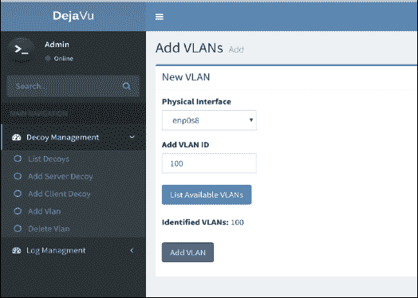
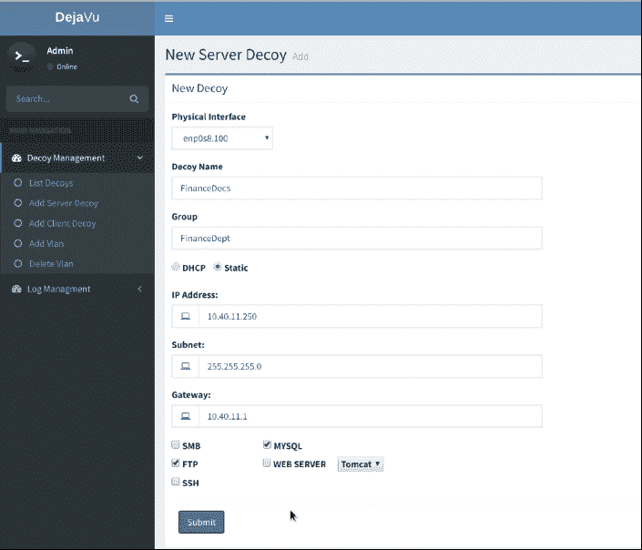
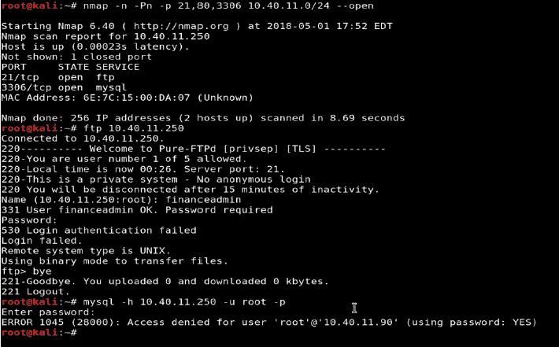
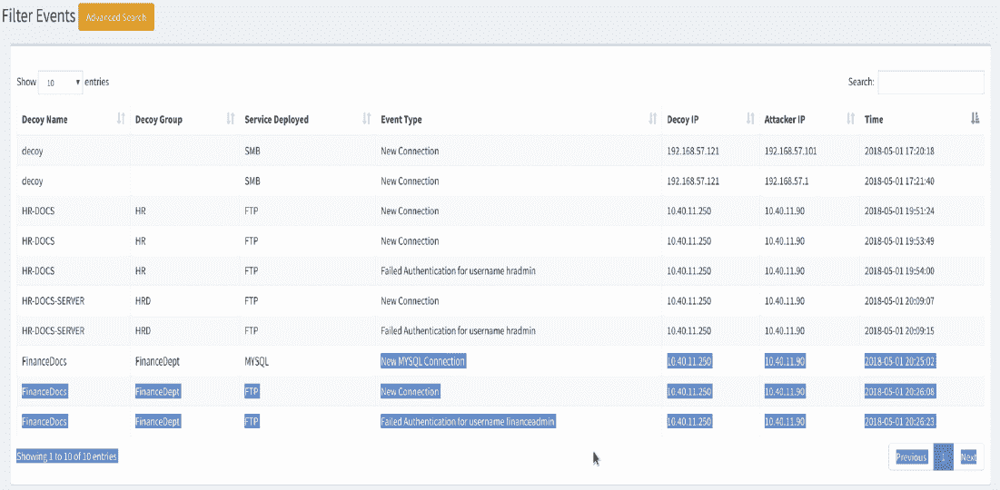
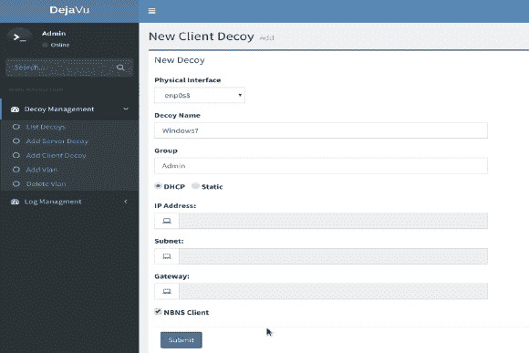
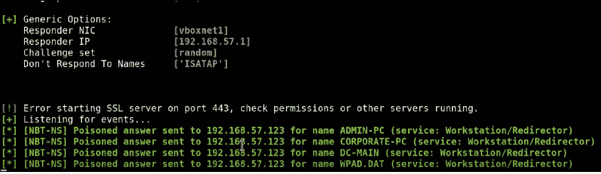
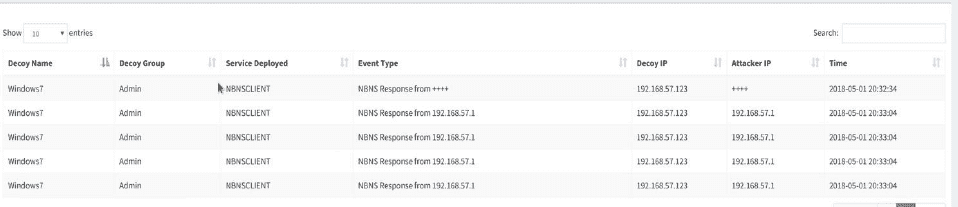

# dejavu——开源欺骗框架

> 原文：<https://kalilinuxtutorials.com/dejavu-open-source-framework/>

DejaVU 是一个开源的欺骗框架。如果部署得当，欺骗技术可以非常有效地帮助组织改善网络防御，并且可以成为蓝队在网络杀伤链的早期阶段检测攻击的有用武器库。但我们看到的挑战是，在大型网络中部署、管理和控制诱饵仍然不容易，而且随着时间的推移，对防御者来说管理起来变得复杂。虽然在这个领域有很多商业工具，但是我们还没有遇到可以实现这一点的开源工具。归功于 Bhadresh Patel 和 Harish Ramadoss。

此处发布了工具的视频演示

**也读作[Delta–SDN 安全评估&渗透测试框架](https://kalilinuxtutorials.com/delta-framework/)**

## **遗留下来的用法指南**

##### **初始设置**

*   快速设置视频指南—[https://youtu.be/NOuEGa0241U](https://youtu.be/NOuEGa0241U)
*   命令行界面凭据–管理员:更改密码

##### **添加服务器诱饵**

*   要添加诱饵，我们首先需要添加一个 VLAN，我们希望以后在上面部署诱饵。
    *   选择诱饵管理->添加 VLAN
    *   输入 VLAN ID。使用“列出可用 VLAN”选项列出接口上标记的 VLAN。

*   要添加服务器诱饵:
    *   选择诱饵管理->添加服务器诱饵
    *   提供新诱饵的详细信息，如下所示。选择要部署的服务(SMB/FTP/MySQL/FTP/Web Server/SSH)，使用动态或提供静态 IP 地址。

*   让我们从 VLAN 服务器上的攻击者机器进行一些端口扫描+验证尝试，并分析警报。

*   查看攻击者扫描我们的诱饵并试图验证时触发的警报。
    *   选择日志管理->列出事件

### **添加客户端诱饵**

*   添加客户诱饵
    *   选择诱饵管理->添加客户端诱饵
    *   提供新诱饵的详细信息，如下所示。建议在用户 VLANs 上放置客户端诱饵来检测响应者/LLMNR 攻击。

*   让我们从最终用户 VLAN 的攻击者机器上运行 responder 并分析警报。

*   查看攻击者扫描我们的诱饵并试图验证时触发的警报。
    *   日志管理->列出事件

**过滤警报**

*   可以基于各种参数配置警报。示例–不要从 IP–10 . 1 . 10 . 101 发送警报。如果某些 IP 像内部漏洞扫描器，SCCM 等。需要加入白名单。

