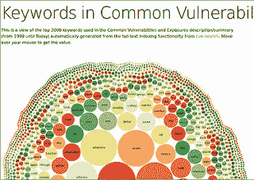

# CVE 搜索:对已知漏洞进行本地搜索的工具

> 原文：<https://kalilinuxtutorials.com/cve-search-tool/>

**CVE 搜索**是一个将 CVE(公共漏洞和暴露)和 CPE(公共平台枚举)导入到 MongoDB 中的工具，以便于搜索和处理 CVE。

该软件的主要目的是避免直接和公开查询公共 CVE 数据库。本地查找通常更快，并且您可以通过互联网限制您的敏感查询。

CVE 搜索包括一个存储漏洞和相关信息的后端，一个用于搜索和管理漏洞的直观 web 界面，一系列查询系统的工具和一个 web API 接口。

## **安装 MongoDB**

首先，您需要安装 Python 3(3.3 或更高版本)。然后，您需要从源代码安装 MongoDB (2.2)(这应该也适用于您喜欢的发行版中的任何标准包)。在安装 MongoDB 时，不要忘记安装用于开发的头文件。你可以去[http://docs.mongodb.org/manual/installation/](http://docs.mongodb.org/manual/installation/)获取你的发行包，或者去[http://www.mongodb.org/downloads](http://www.mongodb.org/downloads)获取源代码。

**也可理解为 [军械库——获取大量外部&发现数据](https://kalilinuxtutorials.com/armory/)** 的工具

## **填充数据库**

对于首次运行，您需要通过运行以下命令来填充 CVE 数据库:

```
**./sbin/db_mgmt.py -p
./sbin/db_mgmt_cpe_dictionary.py
./sbin/db_updater.py -c** 
```

它将从公共漏洞和暴露数据库以及公共平台枚举中获取所有现有的 XML 文件。初始公共平台枚举(CPE)导入可能需要一些时间，具体取决于您的配置。

如果您想添加来自 NIST、Red Hat 和其他供应商的交叉引用:

```
**./sbin/db_mgmt_ref.py** 
```

## **更新数据库**

更新程序脚本有助于启动 db_mgmt_*

```
**`./sbin/db_updater.py -v`** 
```

您可以在 crontab 中运行它，默认情况下，日志记录在 syslog 中完成。

## **重新填充数据库**

轻松删除和重新填充所有数据库

```
**./sbin/db_updater.py -v -f** 
```

这将删除所有现有的外部源并重新导入所有内容。这个操作需要一些时间，通常只有在 cve-search 中添加了新的属性解析时才需要。

## **用途**

您可以使用 search.py 搜索数据库

```
**./bin/search.py -p cisco:ios:12.4
./bin/search.py -p cisco:ios:12.4 -o json
./bin/search.py -f nagios -n
./bin/search.py -p microsoft:windows_7 -o html** 
```

如果你想搜索所有的 WebEx 漏洞，只打印供应商的官方参考。

```
**./bin/search.py -p webex: -o csv  -v "cisco"** 
```

您还可以转储特定 CVE ID 的 JSON。

```
**./bin/search.py -c CVE-2010-3333** 
```

或者您可以使用 XMPP bot

```
**./bin/search_xmpp.py -j mybot@jabber.org -p strongpassword** 
```

或者以 RSS 或 Atom 格式转储最后两个 CVE 条目

```
**`./bin/dump_last.py -f atom -l 2`** 
```

或者你可以使用网络界面。

```
**./web/index.py** 
```

## **排名数据库的使用**

有一个排名数据库，允许根据软件漏洞的公共平台枚举名称对其进行排名。排名可以按组织或组织内的部门或任何对您有意义的名称进行。

例如，您可以添加部分 CPE 名称，如“sap:netweaver ”,这对您的会计部门非常重要。

```
**./sbin/db_ranking.py  -c "sap:netweaver" -g "accounting" -r 3** 
```

然后您可以查找特定 CVE ID 的排名(-r 选项):

```
**./bin/search.py -c CVE-2012-4341  -r  -n** 
```

## **高级用法**

由于 cve-search 是基于一组工具的，所以它可以与标准的 Unix 工具结合使用。如果您想知道哪些顶级供应商对他们的漏洞使用“未知”一词:

```
**`python3 bin/search_fulltext.py -q unknown -f | jq -c '. | .vulnerable_configuration[0]' | cut -f5 -d: | sort  | uniq -c  | sort -nr | head -10

1500 oracle
381 sun
372 hp
232 google
208 ibm
126 mozilla
103 microsoft
100 adobe
 78 apple
 68 linux`** 
```

可以根据某些产品的 CPE 名称来比较它们的 C VSS(通用漏洞评分系统)值。比如比较 oracle:java 和 sun:jre，并使用 R 来统计它们的 CVSS 值:

```
**python3 bin/search.py -p oracle:java -o json  | jq -r '.cvss' | Rscript -e 'summary(as.numeric(read.table(file("stdin"))[,1]))'
Min. 1st Qu.  Median    Mean 3rd Qu.    Max.
1.800   5.350   9.300   7.832  10.000  10.000**

**python3 bin/search.py -p sun:jre -o json  | jq -r '.cvss' | Rscript -e 'summary(as.numeric(read.table(file("stdin"))[,1]))'
Min. 1st Qu.  Median    Mean 3rd Qu.    Max.
0.000   5.000   7.500   7.333  10.000  10.000** 
```

## **全文索引**

如果您想索引当前 MongoDB 集合中的所有 CVE:

```
**`./sbin/db_fulltext.py`** 
```

然后查询全文索引(以获得匹配的 CVE ID 列表):

```
**./bin/search_fulltext.py -q NFS -q Linux** 
```

或者查询全文索引并输出每个 CVE ID 的 JSON 对象:

```
**`./bin/search_fulltext.py -q NFS -q Linux -f`** 
```

## **全文可视化**

全文索引器可视化使用全文索引来构建 CVE 中最常用的关键字列表。NLTK 需要用最常见的英语停用词生成关键字，并对输出进行词汇化。Python 3 的 NTLK 已经存在，但是您需要使用 NLTK 的 alpha 版本。

```
**./bin/search_fulltext.py  -g -s >cve.json** 
```



## **网页界面 CVE-搜索** 

web 界面是查看最后的 CVE 条目和查询特定 CVE 的最小界面。你需要 flask 来运行网站和 Flask-PyMongo。要启动 web 界面:

```
**cd ./web
./index.py** 
```

然后就可以在 [http://127.0.0.1:5000/](http://127.0.0.1:5000/) 上连接，浏览最后一个 CVE。

## **Web API 接口**

web 界面包括一个最小的 JSON API，可以通过 ID、供应商或产品获取 CVE。在 cve.circl.lu 上也可以访问到 [API](https://cve.circl.lu/) 的公共版本。

在 JSON 中列出已知的供应商

```
**curl http://127.0.0.1:5000/api/browse/** 
```

在 JSON 中转储特定供应商的产品

```
**curl  http://127.0.0.1:5000/api/browse/zyxel 
{
  "product": [
    "n300_netusb_nbg-419n",
    "n300_netusb_nbg-419n_firmware",
    "p-660h-61",
    "p-660h-63",
    "p-660h-67",
    "p-660h-d1",
    "p-660h-d3",
    "p-660h-t1",
    "p-660h-t3",
    "p-660hw",
    "p-660hw_d1",
    "p-660hw_d3",
    "p-660hw_t3"
  ],
  "vendor": "zyxel"
}** 
```

找到供应商和产品的相关漏洞

```
**curl  http://127.0.0.1:5000/api/search/zyxel/p-660hw
[{"cwe": "CWE-352", "references": ["http://www.exploit-db.com/exploits/33518", "http://secunia.com/advisories/58513", "h**
```

## **使用 cve 搜索的软件**

*   cve-portal 是 cve 通知门户
*   这是一套用于 cve 搜索的管理工具
*   cve-scan 是一款 NMap CVE 系统扫描仪

[](https://github.com/cve-search/cve-search#usage-of-the-ranking-database)