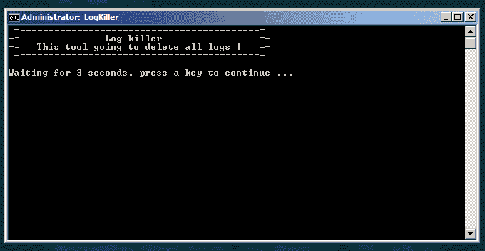
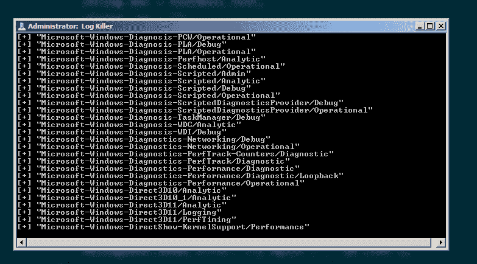
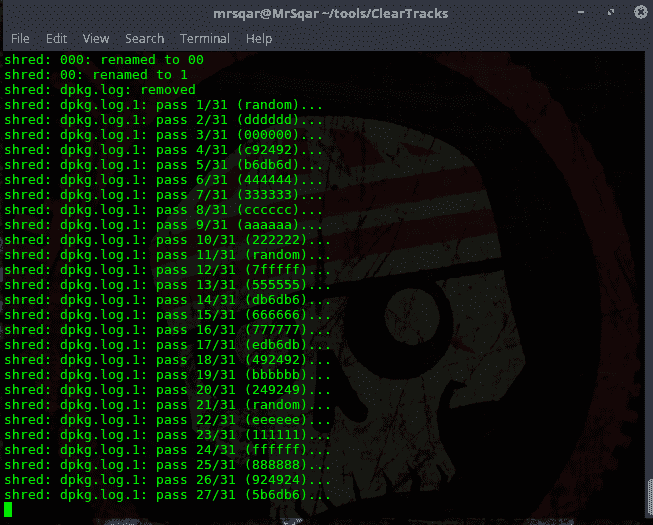

# 日志杀手:清除你在 Linux 和 Windows 服务器上的所有日志

> 原文：<https://kalilinuxtutorials.com/log-killer-linux-windows-servers/>

清除你在 linux 和 windows 服务器上的所有日志。只需下载该工具并在服务器上运行它。如果您的服务器操作系统是 Windows，则下载批处理文件并以管理员身份运行它。但是如果你的服务器是 Linux，那么你应该运行 php 脚本。

**也读作 [独角兽——降级攻击&将外壳代码直接注入内存](https://kalilinuxtutorials.com/unicorn-attack-inject-shellcode/)**

## **日志杀手截图**

#### **视窗:**

#### **Linux :**

#### **视频**

[https://www.youtube.com/watch?v=_5wpKYaJQko&feature = youtu . be](https://www.youtube.com/watch?v=_5wpKYaJQko&feature=youtu.be)

