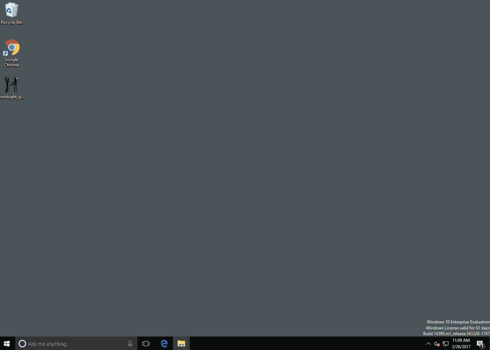

# 事后诸葛亮——分析 Web 工件的工具 Chrome 浏览器和基于 Chrome 的应用程序

> 原文：<https://kalilinuxtutorials.com/hindsight-chrome-chromium-applications/>

**马后炮**是一个分析 web 工件的免费工具。它从 Google Chrome web 浏览器的浏览历史开始，已经扩展到支持其他基于 Chromium 的应用程序(还会有更多！).马后炮可以解析许多不同类型的 web 工件，包括 URL、下载历史、缓存记录、书签、自动填充记录、保存的密码、首选项、浏览器扩展、HTTP cookies 和本地存储记录(HTML5 cookies)。从每个文件中提取数据后，它将与其他历史文件中的数据相关联，并放置在时间轴中。

**也读作[CuckooDroid——用布谷鸟沙箱](https://kalilinuxtutorials.com/cuckoodroid-android-malware/)** 进行自动化安卓恶意软件分析

它有一个简单的网络用户界面——要启动它，运行“马后炮 _gui.py”(或者在 Windows 上，打包的“马后炮 _gui.exe”)，并在浏览器中访问 [http://localhost:8080](http://localhost:8080) :

您需要填写的唯一字段是“配置文件路径”。这是您想要分析的 Chrome 配置文件的位置(不同操作系统的默认配置文件路径列在本页底部)。点击“运行”,您将被带到结果页面，在那里您可以将结果保存到电子表格(或其他格式)中。

## **命令行后见之明**

还有马后炮的命令行版本——马后炮. py 或 hindsight.py。文档文件夹中的用户指南涵盖了许多主题，但是下面的信息应该可以帮助您开始使用命令行版本:

示例用法:> C:\马后炮. py-I " C:\ Users \ Ryan \ AppData \ Local \ Google \ Chrome \ User Data \ Default "-o test _ case

**命令行选项:**

| [计]选项 | 描述 |
| --- | --- |
| **-i 或-输入** | Chrome(ium)“默认”目录的路径 |
| **-o 或-输出** | 输出文件的名称(不带扩展名) |
| **-f 或–格式** | 输出格式(默认为 XLSX，其他选项为 SQLite) |
| **-c 或-缓存** | 缓存目录的路径；仅当目录在给定的“输入”目录之外时才需要。默认情况下，Mac 系统是这样设置的。 |
| **-b 或–浏览器类型** | 输入文件所属的浏览器类型。支持的选项有 Chrome(默认)和 Brave。 |
| **-l 或-log** | 后见之明应记录的位置(如果存在，将追加) |
| **-h 或–help** | 显示了这些选项和默认的 Chrome 数据位置 |
| **-t 或–时区** | 显示 XLSX 输出中时间戳的时区 |

## **默认配置文件路径**

Chrome 默认配置文件文件夹的默认位置是:

*   **win XP:**[userdir]\本地设置\应用程序数据\ Google \ Chrome \用户数据\默认
*   **Vista/7/8:**[userdir]\ AppData \ Local \ Google \ Chrome \ User Data \ Default
*   **Linux:**【userdir】/。配置/谷歌浏览器/默认
*   **OS X:**[用户目录]/库/应用支持/谷歌/Chrome/默认
*   **iOS:**\ Applications \ com . Google . Chrome . iOS \ Library \ Application Support \ Google \ Chrome \ Default
*   **Android:**/user data/data/com . Android . chrome/app _ chrome/Default

