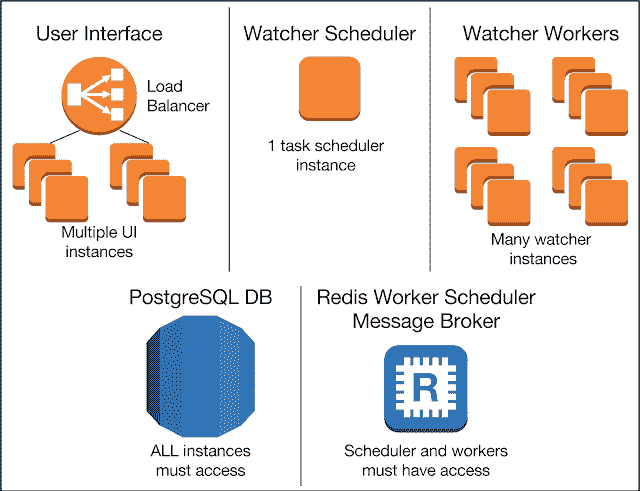
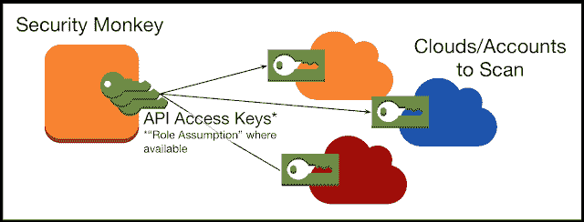

# 安全猴子——AWS 和 GCP 负责不安全配置的警报

> 原文：<https://kalilinuxtutorials.com/security-monkey/>

**Security Monkey** monitors your AWS and GCP accounts for policy changes and alerts on insecure configurations. Support is available for OpenStack public and private clouds. It can also watch and monitor your GitHub organizations, teams, and repositories.It provides a single UI to browse and search through all of your accounts, regions, and cloud services. The monkey remembers previous states and can show you exactly what changed, and when.It can be extended with custom account types, custom watchers, custom auditors, and custom alerters. It works on CPython 2.7\. It is known to work on Ubuntu Linux and OS X.**Also Read [Joomscan – OWASP Joomla Vulnerability Scanner Project](https://kalilinuxtutorials.com/joomscan-owasp/)**

## **安全猴子实例图**

组成安全 Monkey 的组件如下(非特定于 AWS):

## **访问图**

它可以通过提供给它的凭据(如果可用，则为“角色假设”)访问要扫描的帐户。

