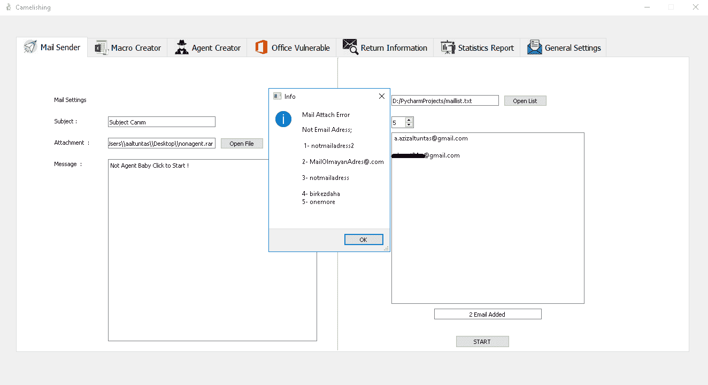
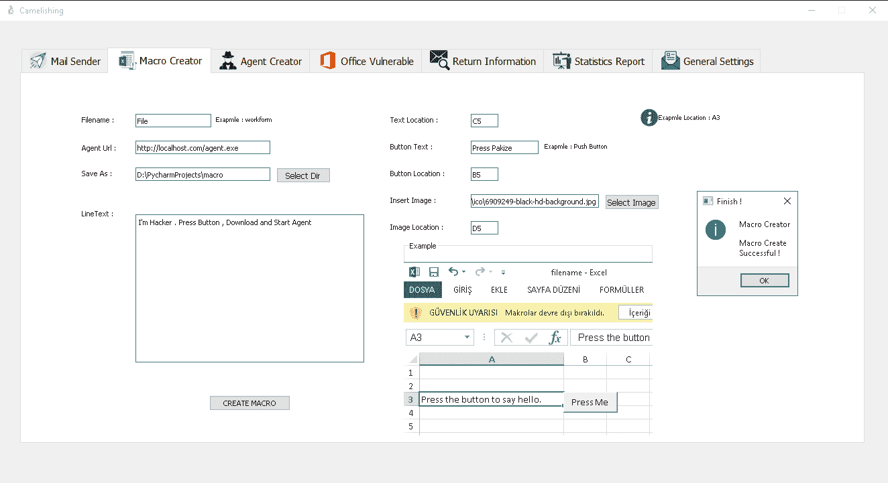
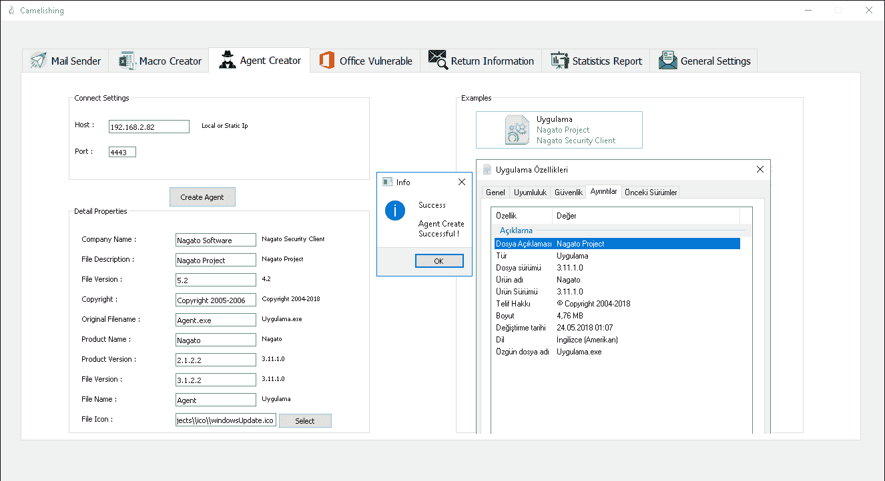
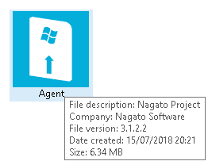
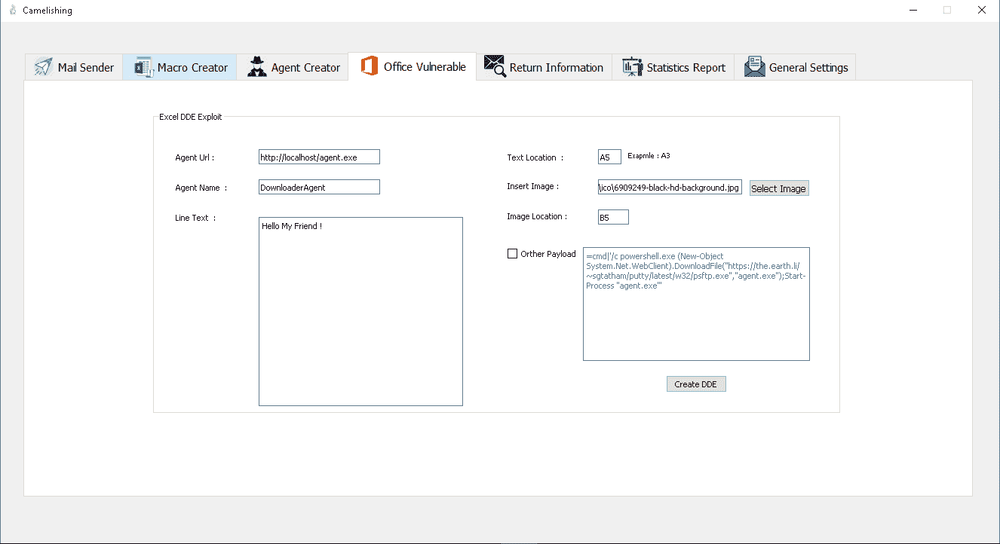
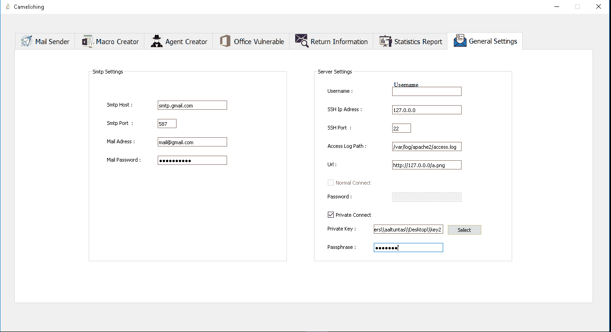
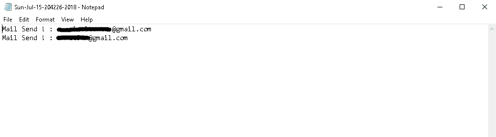

# 狩猎——社会工程工具

> 原文：<https://kalilinuxtutorials.com/camelishing/>

**Camelishing** 是一款社交工程工具，具有群发[邮件](https://techincidents.com/disposable-temporary-email-address/)发送、基本 Python 代理创建器、Office Excel 宏创建器、DDE Excel 创建器(或自定义负载)、返回 i̇nformation、邮件打开跟踪、代理打开跟踪、自动保存、统计报告和用户控制等功能。windows 7 和 10 支持 Camelishing。

## **骆驼捕鱼装置**

```
**$ pip install -r requirements.txt
$ Install Microsoft Office**
```

**又读[XSS-有效载荷-列表:跨站脚本(XSS)漏洞有效载荷列表](https://kalilinuxtutorials.com/xss-payload-list/)**

## **截图**



### **宏创建者**



### **代理创建人**



### **代理人**



### **DDE 创建者**



### **一般设置**



### **邮件发送**



### **打开邮件**


### **返回信息**


### **统计报告**

