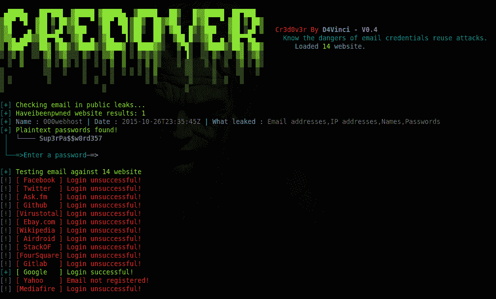
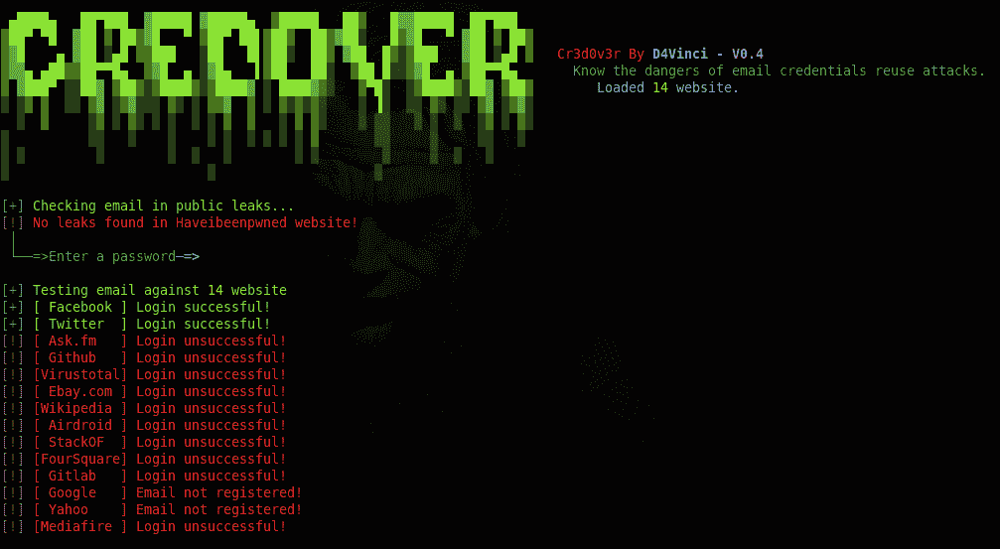

# Cr 3 dov3r–了解凭据重用攻击的危险

> 原文：<https://kalilinuxtutorials.com/cr3dov3r-reuse-attacks/>

Cr3dOv3r 被认为是凭证重用攻击的危险。在凭证重用攻击中，它将是您最好的朋友。你给 Cr3dOv3r 发一封电子邮件，然后它用它做两个简单有用的工作:

*   搜索电子邮件的公共泄漏，并返回关于泄漏的最有用的细节的结果(使用 haveibeenpwned API ),并尝试从找到的泄漏中获取纯文本密码。
*   现在你给它一个密码或泄露的密码，然后它会用这个凭证去验证一些著名的网站(例如:facebook，twitter，google…)，并判断登录是否成功！

**又读[EVI losx——MAC OS/OS X](https://kalilinuxtutorials.com/evilosx-remote-administration-tool/)T5 的邪恶远程管理工具**

## 【Cr3dOv3r 的一些场景可以用在里面

*   检查目标电子邮件是否存在任何漏洞，然后使用泄露的密码与网站进行核对。
*   检查您找到的目标凭据是否在其他网站/服务上重复使用。
*   检查你从 target/leaks 得到的旧密码是否还在任何网站使用。

## **截图**



## **用法 Cr3dOv3r**

```
**usage: Cr3d0v3r.py [-h] [-p] [-np] [-q] email

positional arguments:
  email       Email/username to check

optional arguments:
  -h, --help  show this help message and exit
  -p          Don't check for leaks or plain text passwords.
  -np         Don't check for plain text passwords.
  -q          Quiet mode (no banner).**
```

## **安装&要求**

### **要让工具发挥最佳性能，您必须具备:**

*   Python 3.x 或 2.x(首选 3)。
*   Linux 或 Windows 系统。
*   用 MacOS 和 python3 在一些机器上工作过。
*   接下来几行中提到的需求。

## **安装**

**对于 windows 系统:(下载 ZIP 文件并解压后)**

```
**cd Cr3dOv3r-master
python -m pip install -r win_requirements.txt
python Cr3dOv3r.py -h** 
```

**对于 Linux :**

```
**git clone https://github.com/D4Vinci/Cr3dOv3r.git
cd Cr3dOv3r
python3 -m pip install -r requirements.txt
python3 Cr3dOv3r.py -h**
```

**对于 docker :**

```
git clone https://github.com/D4Vinci/Cr3dOv3r.git
docker build -t cr3dov3r Cr3dOv3r/
docker run -it cr3dov3r "example@gmail.com"
```

## **免责声明**

创建 Cr3dOv3r 是为了展示凭证重用攻击是如何变得危险的，它不对误用或非法目的负责。仅用于笔测试或教育目的！！！

[](https://github.com/D4Vinci/Cr3dOv3r)