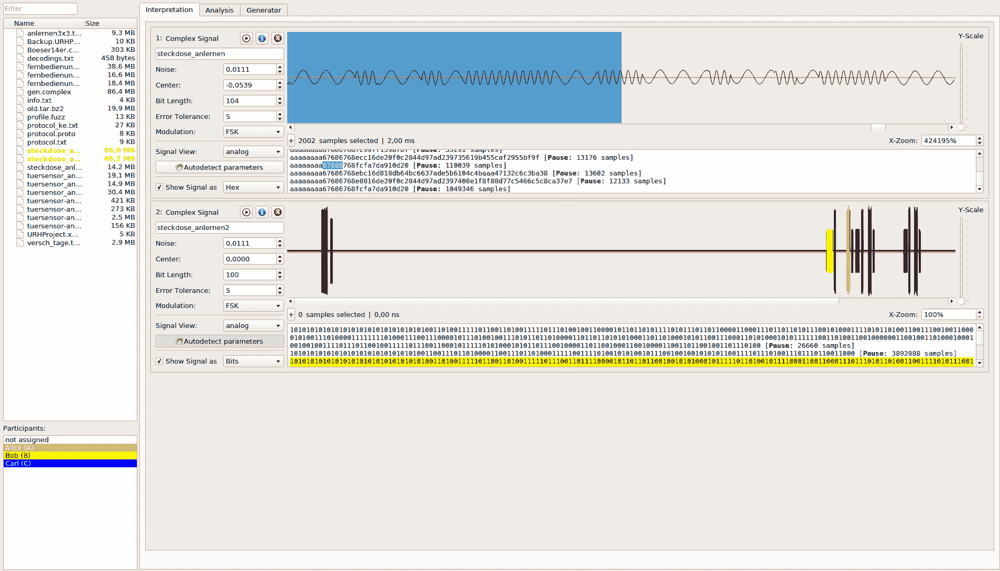
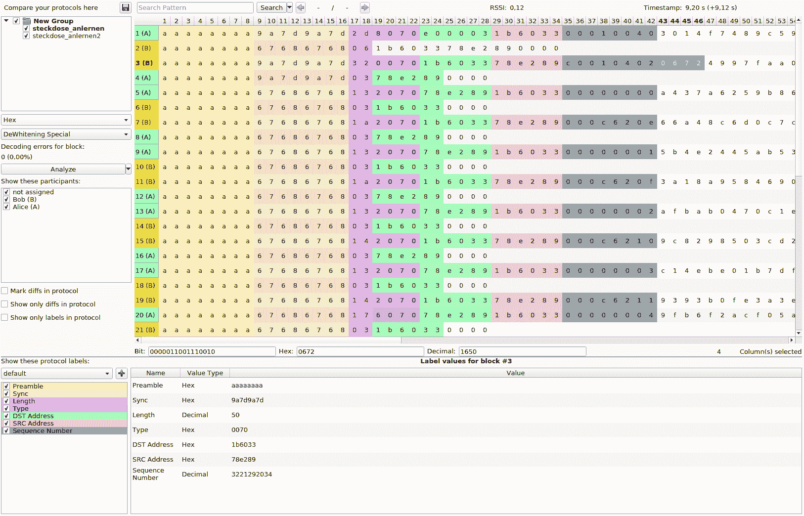
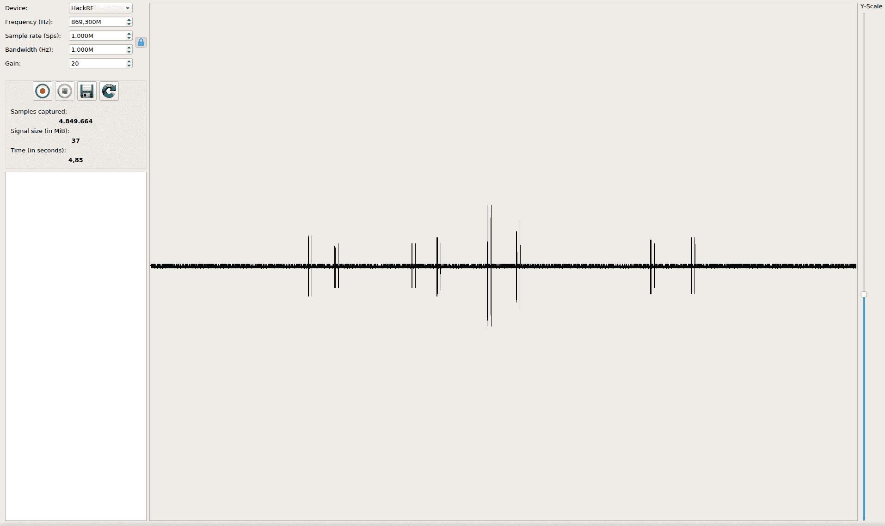

# URH:像老板一样调查无线协议的通用无线电黑客

> 原文：<https://kalilinuxtutorials.com/urh-universal-radio-hacker/>

URH(通用无线电黑客)是一个软件，用于调查未知的无线协议。功能包括

*   **普通软件无线电的硬件接口**
*   **信号的简易解调**
*   **指派参与者**对您的数据进行概述
*   **定制解码**破解复杂的编码，如 CC1101 数据白化
*   **分配标签**以显示协议的逻辑
*   **模糊组件**查找安全漏洞
*   **调制支持**将数据注入回系统
*   **模拟环境**执行有状态攻击

**又读[EVI losx——MAC OS/OS X](https://kalilinuxtutorials.com/evilosx-remote-administration-tool/)T5 的邪恶远程管理工具**

## **URH 安装**

通用无线电黑客可以通过 **pip** 或者使用你的发行版的**包管理器**来安装(如果包含的话)。以下是更具体的安装说明:

#### **窗户**

在 Windows 上，URH 可以安装它的 MSI 安装程序。不需要更多的依赖关系。

如果你得到一个关于缺少`**api-ms-win-crt-runtime-l1-1-0.dll**`的错误，运行 Windows Update 或者直接安装 [KB2999226](https://support.microsoft.com/en-us/help/2999226/update-for-universal-c-runtime-in-windows) 。

#### **Linux**

##### **通过包管理器**

对于下面的 linux 发行版，您可以使用您的软件包管理器安装 URH。

| 分配 | 与一起安装 |
| --- | --- |
| Arch Linux | `yaourt -S urh` |
| Gentoo /小狗 | `emerge -av urh` |
| Fedora 25+ | `dnf install urh` |
| openSUSE | `zypper install urh` |

#### **带有 pip 的通用方式(Ubuntu/Debian)**

URH 你也可以用`pip3 install urh`安装 **pip** 。如果你运行的是 Ubuntu 或 Debian，请继续阅读更多具体说明。

为了使用本地设备后端，请确保为您想要的 SDRs 安装了 **-dev** 包，即`**libairspy-dev**` **、`libhackrf-dev`、`librtlsdr-dev`、`libuhd-dev`** 。

如果您的设备没有`-dev`包，例如 LimeSDR，您需要手动创建一个到`.so`的符号链接，如下所示:

```
**sudo ln -s /usr/lib/x86_64-linux-gnu/libLimeSuite.so.17.02.2 /usr/lib/x86_64-linux-gnu/libLimeSuite.so**
```

**在**安装 URH 之前，使用:

```
sudo apt-get update
sudo apt-get install python3-numpy python3-psutil python3-zmq python3-pyqt5 g++ libpython3-dev python3-pip cython3
sudo pip3 install urh
```

#### 麦克·OS X

1.  安装 Python 3 for Mac OS X。如果您遇到预装 Python 的问题，请确保使用给定的链接更新到最新版本。
2.  (可选)安装所需的本地库，例如`**brew install librtlsdr**`以获得相应的本地设备支持。
3.  在终端中，键入:`**pip3 install urh**`。
4.  在终端中键入`**urh**`来启动它。

## **更新您的安装**

#### **用 Pip 更新**

如果你通过 pip 安装了 URH，你可以用`pip3 install --upgrade urh`保持它最新，或者，如果这不工作`python3 -m pip install --upgrade urh`。

#### **用 MSI 更新**

如果您在 Windows 上使用`.msi`安装程序更新 URH 后遇到问题，请执行**完全卸载**。即通过 Windows 卸载 URH，然后移除安装文件夹(类似于 **`C:\Program Files\Universal Radio Hacker`** )。现在，使用最近的`.msi`安装新版本。

## **从源头运行**

如果你喜欢生活在危险边缘，你可以从源头上运行 URH。

#### **未安装**

要在不安装的情况下执行通用无线电黑客，只需运行:

```
git clone https://github.com/jopohl/urh/
cd urh/src/urh
./main.py
```

注意，在第一次使用之前，将会构建 C++扩展。

#### **从源头安装**

要从源代码安装，您需要安装`python-setuptools`。例如，您可以通过`pip install setuptools`获得。安装设置工具后，请使用:

```
**git clone https://github.com/jopohl/urh/
cd urh
python setup.py install**
```

并通过在终端中键入`urh`来启动应用程序。

## **截图**

#### **从原始信号中获取数据**



#### **即使是复杂的协议也要保持一个概览**

#### 

#### **记录&发送信号**



[](https://github.com/jopohl/urh)