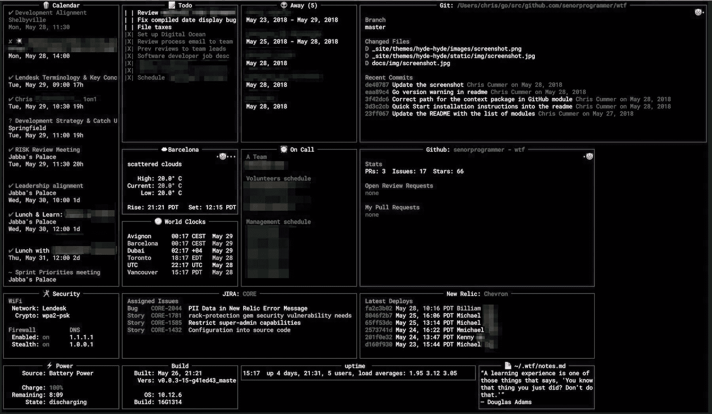

# WTF——您终端的个人信息仪表板

> 原文：<https://kalilinuxtutorials.com/wtf-personal-information-dashboard/>

WTF 是一个基于个人终端的仪表板实用程序，设计用于显示不经常需要但非常重要的日常数据。WTF 是*唯一*兼容 Go 版本 **1.9.2** 或更高版本。它当前*不与`gccgo`一起*编译。



**也读[Cr 3 dov3r——知道凭证重用攻击的危害](https://kalilinuxtutorials.com/cr3dov3r-reuse-attacks/)**

## **WTF**T2【安装

安装 WTF 有两种方法:

#### **来源于**

获取此 repo 并安装依赖项:

```
go get -u github.com/senorprogrammer/wtf
cd $GOPATH/src/github.com/senorprogrammer/wtf
make install
make run
```

这应该就够了。

#### **为二进制**

从这里获取最新版本:

```
https://github.com/senorprogrammer/wtf/releases
```

展开它，并`cd`到结果目录中。然后运行:

```
./wtf
```

这应该也可以了。

## **配置**

#### **配置文件**

默认情况下，WTF 会在`**~/.config/wtf/**`目录中查找名为`**config.yml**`的 YAML 文件。如果`**~/.config/wtf/**`目录不存在，它将在启动时创建该目录，然后显示创建新配置文件的说明。

换句话说，它希望在:`**~/.config/wtf/config.yml**`有一个 YAML 配置文件。

##### **示例配置文件**

Git 存储库的`**_sample_configs/**`目录中提供了几个示例配置文件。

为了快速试用 WTF，将`simple_config.yml`复制成`**~/.config/wtf/**` **作为`config.yml`** 并重新启动 WTF。您应该会看到应用程序启动，并在屏幕上显示安全性、时钟和状态小部件。

##### **自定义配置文件**

要尝试不同的配置(或者运行 WTF 的多个实例)，可以在启动时通过命令行参数将路径传递给配置文件。

要加载一个定制的配置文件(即:不是`**~/.config/wtf/config.yml**`的文件)，在启动时将配置文件的路径作为参数传入:

```
 **$> wtf --config=path/to/custom/config.yml
```

##### **配置属性**

可以设置许多顶级属性来定制您的 WTF 安装。详情见[属性](https://wtfutil.com/posts/configuration/attributes/)。

#### **环境变量**

有些模块需要环境变量才能正常工作。通常这些是 API 键或其他敏感数据，人们不希望将它们放在配置文件中。

对于需要它们的模块，所需环境变量的名称可以在该模块文档的“所需环境变量”一节中找到。

#### **网格布局**

WTF 使用 tview 中的`Grid`布局系统在屏幕上定位小部件。这是如何工作的还不是很明显，所以这里有一个解释:

把你的终端屏幕想象成一个字母位置的矩阵，比如说`100`宽`58`高。

Columns 将屏幕的宽度分成块，每个块有指定数量的字符宽。使用

`**[10, 10, 10, 10, 10, 10, 10, 10, 10, 10]**`

十个字符宽的十列

行将屏幕的高度分成块，每个块有指定数量的字符高。如果我们想要五行:

`**[10, 10, 10, 10, 18]**`

坐标系从左上角开始，定义小部件的宽度和高度。如果我们想在屏幕底部放置一个 2 列 2 行的小部件，我们应该把它放在:

```
 **`top: 4     // top starts in the 4th row
  left: 9    // left starts in the 9th column
  height: 2  // span down rows 4 & 5 (18 characters in size, total)
  width: 2   // span across cols 9 & 10 (20 characters in size, total)
```

[](https://github.com/deltaxflux/wtf)