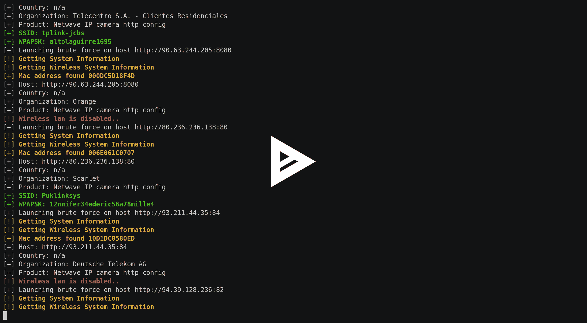

# shodan wave–探索和获取相机信息的工具

> 原文：<https://kalilinuxtutorials.com/shodanwave-exploring-information-cameras/>

Shodanwave 是一个工具，用于探索和获取相机信息，特别是 Netwave IP Camera。该工具使用一个名为 shodan 的搜索引擎，可以轻松地在线搜索相机。

这个工具有什么用？看，一份名单！

*   搜索
*   强力
*   SSID 和 WPAPSK 密码泄露
*   电子邮件、FTP、DNS、MSN 密码泄露
*   剥削

这是一个 shodan wave 运行的例子，通过原始的力量没有找到密码，所以该工具试图泄漏相机的内存。如果该工具找到了密码，它不会尝试泄漏内存。

**也可阅读[OWTF——攻击性 Web 测试框架伟大工具&让笔测试更高效](https://kalilinuxtutorials.com/owtf-offensive-web-testing-framework/)**

[](https://asciinema.org/a/G7gVOiReMiv43V8wlMbB4mm9B?autoplay=1)

## **如何使用 Shodanwave？**

要使用 shodanwave，你需要一个 api 密匙，你可以在[https://www.shodan.io/](https://www.shodan.io/)免费获得，然后你需要遵循下面的步骤。

## **安装**

```
$ cd /opt/
$ git clone https://github.com/fbctf/shodanwave.git
$ cd shodanwave
$ pip install -r requirements.txt 
```

## **用法**

```
**Usage: python shodanwave.py -u usernames.txt -w passwords.txt  -k Shodan API key --t OUTPUT
       python shodanwave.py --help** 
         __              __                                   
 **_____/ /_  ____  ____/ /___ _____ _      ______ __   _____ 
  / ___/ __ \/ __ \/ __  / __ `/ __ \ | /| / / __ `/ | / / _ \
 (__  ) / / / /_/ / /_/ / /_/ / / / / |/ |/ / /_/ /| |/ /  __/
/____/_/ /_/\____/\__,_/\__,_/_/ /_/|__/|__/\__,_/ |___/\___/ 

This tool is successfully connected to shodan service
Information the use of this tool is illegal, not bad.

usage: shodanwave.py [-h] [-s SEARCH] [-u USERNAME] [-w PASSWORD] [-k ADDRESS]

optional arguments:**
 **-h, --help            show this help message and exit
  -s SEARCH, --search SEARCH
                        Default Netwave IP Camera
  -u USERNAME, --username USERNAME
                        Select your usernames wordlist
  -w PASSWORD, --wordlist PASSWORD
                        Select your passwords wordlist
  -k ADDRESS, --shodan ADDRESS
                        Shodan API key
  -l LIMIT, --limit LIMIT
                        Limit the number of registers responsed by Shodan
  -o OFFSET, --offset OFFSET
                        Shodan skips this number of registers from response
  -t OUTPUT, --output OUTPUT
                        Save the results** 
```

## **注意**

明智地使用这个工具，而不是为非作歹。要获得此工具的最佳性能，您需要为 shodan 付费以获得完整的 API 访问选项–限制和–偏移可能需要付费 API 密钥，并消耗您的 Shodan 帐户的查询信用。

[](https://github.com/evilsocketbr/shodanwave)