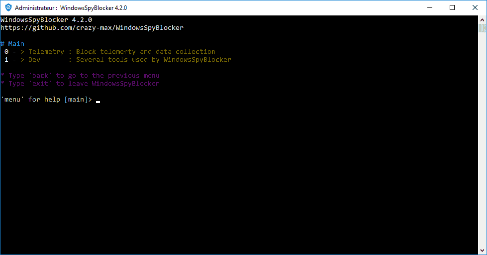
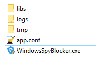

# Windows spyblocker–阻止 Windows 上的间谍和跟踪

> 原文：<https://kalilinuxtutorials.com/windowsspyblocker/>

**WindowsSpyBlocker** 是一个用 Go 编写的应用程序，作为单个可执行文件交付，用于阻止 Windows 系统上的间谍和跟踪。该应用程序的初始方法是基于一组工具来捕获和分析网络流量。

Main window of WindowsSpyBlocker

首次启动时生成配置文件 **`app.conf`** :

**亦作[Shodanwave——探索的工具&从摄像头](https://kalilinuxtutorials.com/shodanwave-exploring-information-cameras/)** 获取信息

## **WindowsSpyBlocker 遥测&数据采集**

为了捕获和分析遥测选项的网络流量，QEMU 虚拟机在服务器虚拟化管理平台 Proxmox VE 上使用，基于:

*   启用了自动更新的 Windows 10 Pro 位。
*   启用了自动更新的 Windows 8.1 Pro 位。
*   启用自动更新的 Windows 7 SP1 专业版 64 位。

每天清理流量转储，并与当前规则进行比较，以添加/删除一些主机或防火墙规则。

用于捕获流量的工具:

*   `**qemu -net dump**`:捕获
*   Wireshark:捕获+日志
*   Sysmon:捕获+日志
*   代理:日志

`data`文件夹包含基于捕获过程中检测到的域或 IP 的阻止规则:

*   `**data/<type>/extra.txt**`:阻止第三方应用程序
*   `***data/<type>/spy.txt***`:阻止 Windows 间谍/遥测
*   `**data/<type>/update.txt**`:阻止 Windows 更新

防火墙和主机数据是主要类型。其他的是从这些中产生的:

*   **DNSCrypt** :一种用于保护客户端和 DNS 解析器之间通信的协议。
*   OpenWrt :一个在嵌入式设备上使用的开源项目，用于路由网络流量。
*   **P2P**:PeerGuardian 的一种明文 IP 数据格式。
*   **proxy ifier**:Windows 上的高级代理客户端，具有灵活的规则系统。
*   **Simplewall** :配置 Windows 过滤平台的简单工具(WFP)。

