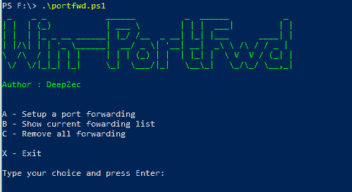
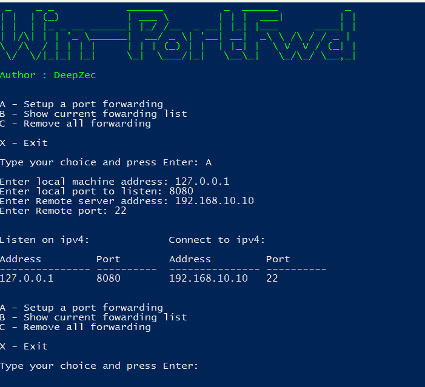

# Win-PortFwd:使用本机 Netsh 客户端设置 Windows 端口转发的 Powershell 脚本

> 原文：<https://kalilinuxtutorials.com/win-portfwd/>

Win-PortFwd 是一个 powershell 脚本，用于使用本机 netsh 客户端设置 windows 端口转发。

## **安装**

```
git clone **https://github.com/deepzec/Win-PortFwd.git
```

## **Win-PortFwd 用法**

```
.\win-portfwd.ps1
```

或者

```
powershell.exe -noprofile -executionpolicy bypass -file .\win-portfwd.ps1
```



**也读作[MAC substrate——MAC OS 上进程间代码注入的工具](https://kalilinuxtutorials.com/macsubstrate-macos/)**

### **举例:**



#### **注意:**该脚本需要管理员权限才能运行，如果您在普通用户权限下运行该脚本，该脚本将自动尝试提升权限。

[](https://github.com/deepzec/Win-PortFwd)