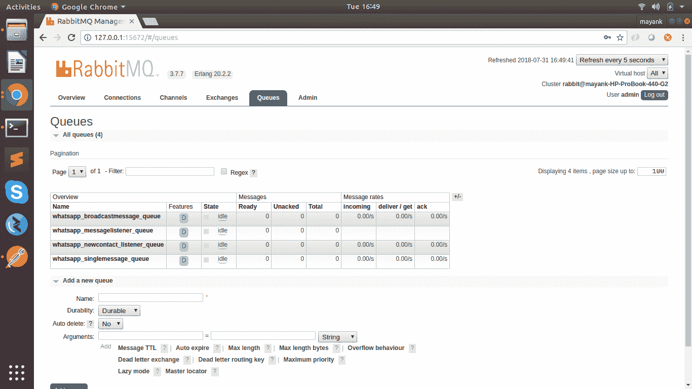
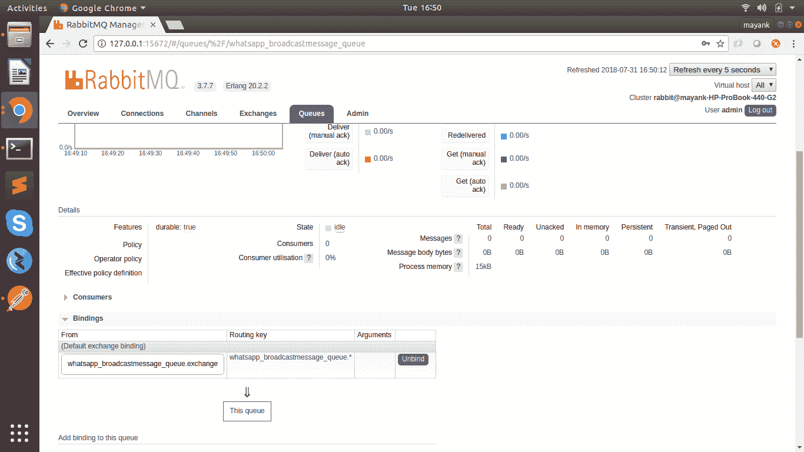

# Whatsapp _ Automation:API 集合与运行在 Android 模拟器中的 WhatsApp 交互

> 原文：<https://kalilinuxtutorials.com/whatsapp_automation-android-emulator/>

Whatsapp_Automation 是一组与运行在 Android 模拟器中的 WhatsApp messenger 进行交互的 API，允许开发人员构建自动发送和接收消息的项目，添加新联系人和向多个联系人广播消息。

该项目使用 Selinium，Appium，Python 和 Android 虚拟设备仿真器。

## **Whatsapp _ 自动化需求**

1.  Java 语言（一种计算机语言，尤用于创建网站）
2.  最新 Android 版本的 Android Studio 和 Android 模拟器设置
3.  Appium 服务器与仿真器交互
4.  运行 Flask 的 python 环境
5.  RabbitMQ 用于维护传入请求的队列系统

## **配置**

使用您创建的 mysql 凭证、RabbitMQ 凭证和队列名称编辑 configs/dev.cfg 文件。需要在运行之前创建队列名称。

1.  用适当的名称创建队列。
2.  用适当的名称创建交换。
3.  将 Exchange 与队列绑定，并将路由关键字设置为格式(queue_name。*)和交换格式(queue_name.exchange)

#### **截图供参考**

 

## **跑步步骤**

1.  为你的项目创造一个虚拟环境
2.  激活 virtualenv 后，使用命令(pip install-r whatsapp _ pip _ requirement . txt)安装依赖项
3.  现在您需要首先通过命令行启动模拟器。/Android/Sdk/emulator/emulator-avd pixel _ 1)。pixel_1 是我的 avd 名称
4.  您需要启动 appium 服务器，并将默认功能设置为(" noReset"="true ")
5.  一旦 Emulator 和 Appium 都在运行，现在您将运行您的主 app.py 文件。
6.  通过在终端中键入(export ENV=dev)来指定环境，以便读取 dev.cfg 进行配置。
7.  键入(python app.py)运行主 flask 应用程序
8.  现在类似地打开新标签，激活虚拟环境并导出开发环境。然后运行(python single _ message _ producer . py)。RabbitMQ 使用者侦听单个消息队列。
9.  (python add _ new _ contact _ producer . py)(python broadcast _ message _ producer . py)(python new _ message _ listener _ producer . py)

现在，您已经运行了 Android 虚拟仿真器、Appium、Flask 和 rabbit MQ 以及 workers。

第一次，你需要手动设置 Whatsapp 的手机号码来发送信息。你需要验证 Whatsapp 的 OTP，设置好就可以用了。

现在这里是这个项目公开的 API，用它所有的东西都将被自动化。

#### **在谷歌联系人应用中添加联系人**

*   网址:[http://127 . 0 . 0 . 1:5000/API/v 0.1/add _ new _ contact](http://127.0.0.1:5000/api/v0.1/add_new_contact)
*   类型:邮政
*   标题:
*   内容类型:应用程序/json
*   正文:

**{ "手机 _ 号码":"+91 XXXXX XXXXX "，"仿真器 _ 名称":"像素 _ 1 "}**

*   回应:

**{ " corr _ id ":" 767 AE 095-0066-49fb-b955-063286 ceed 1 e "，" message ":"收到添加联系人的信号"，" status": "1" }**

#### **通过 Whatsapp 发送单条消息**

*   网址:[http://127 . 0 . 0 . 1:5000/API/v 0.1/send _ single _ message](http://127.0.0.1:5000/api/v0.1/send_single_message)
*   类型:邮政
*   标题:
*   内容类型:应用程序/json
*   正文:

**{ " mobile _ number ":"+91 XXXXX XXXXX "，" emulator _ name ":" pixel _ 1 "" message _ body ":"嗨 Mayank！你过得怎么样，自从我们上次谈话已经有几年了。”}**

*   回应:

**{ " corr _ id ":" 78f 21 f 25-b781-4312-87e 5-ebcd 73 e 9 b 67 e "，" message ":"已收到发送消息的信号"，" status": "1" }**

#### **通过 Whatsapp 发送广播消息**

*   网址:[http://127 . 0 . 0 . 1:5000/API/v 0.1/send _ broadcast _ message](http://127.0.0.1:5000/api/v0.1/send_broadcast_message)
*   类型:邮政
*   HEADERS:
*   内容类型:应用程序/json
*   正文:

**{ " mobile _ number _ list ":["+91 XXXXX XXXXX "，"+91 XXXXX XXXXX"]，" emulator _ name ":" pixel _ 1 ", " message _ body ":"嘿伙计们！享受比赛吧！”}**

*   回应:

**{ " corr _ id ": " ea 8894 C1-8193-46de-8269-033060135791 "，"消息":"收到发送消息的信号"，"状态":" 1 " }**

#### **通过 Whatsapp 收听新来电**

*   网址:[http://127 . 0 . 0 . 1:5000/API/v 0.1/listen _ new _ message](http://127.0.0.1:5000/api/v0.1/listen_new_message)
*   类型:邮政
*   标题:
*   内容类型:应用程序/json
*   正文:

**{ " special _ code ":" E3 gi 8d 2 I 8d 2382 @ @ # " }**

*   回应:

**{ " corr _ id ":" a 2952 cc1-0703-4362-9740-88ede 47391 CB "，" message ":"收到监听消息的信号"，" status": "1" }**

#### **点记:**

1.  Android 版本和 Whatsapp 版本需要小心，因为代码是针对特定版本编写的。您可以转到 workers 文件夹并相应地编辑文件，以更改您的平台版本和活动类。像目前的代码有:**desired _ caps[' platform name ']= ' Android ' desired _ caps[' platform version ']= ' 9 ' desired _ caps[' device name ']= ' emulator-5554 ' desired _ caps[' app package ']= ' com . whatsapp ' desired _ caps[' app activity ']= '。**主线任务

## **演示**

[https://www.youtube.com/embed/TRFLzbDw80k?feature=oembed](https://www.youtube.com/embed/TRFLzbDw80k?feature=oembed)

