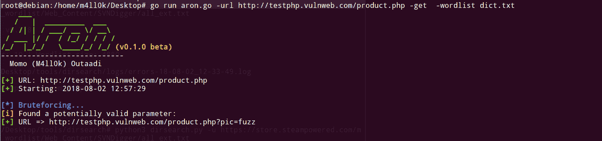

# Aron——一个查找隐藏的 GET & POST 参数的 GO 脚本

> 原文：<https://kalilinuxtutorials.com/aron-script-hidden-get-post-parameters/>

Aron 是一个简单的 GO 脚本，用 bruteforce 查找隐藏的 GET & POST 参数。



## **阿隆安装**

```
**$ git clone https://github.com/m4ll0k/Aron.git aron
$ cd aron 
$ go get github.com/m4ll0k/printer
# now check if $GOPATH is set
$ go env | grep -i gopath
# if $GOPATH not set, try with:
$ export GOPATH=$HOME/go
$ go run aron.go
# OR 
$ go build aron.go
$ cp aron /usr/bin/
$ aron**
```

**又读[Whatsapp _ Automation:API 集合与运行在 Android 模拟器中的 Whatsapp 交互](https://kalilinuxtutorials.com/whatsapp_automation-android-emulator/)**

## **用途**

```
 **___                         
   /   |  _________  ___       
  / /| | / ___/ __ \/ __\   
 / ___ |/ /  / /_/ / / / /   
/_/  |_/_/   \____/_/ /_/ (v0.1.0 beta)
----------------------------
  Momo (M4ll0k) Outaadi 

Usage of aron:
  -data="":             Set post data
  -get=false:           Set get method
  -post=false:          Set post method
  -url="":              Set target URL
  -wordlist="dict.txt": Set your wordlist**
```

**得到布鲁特斯:**

```
**$ go run aron.go -url http://www.test.com/index.php -get 
$ go run aron.go -url http://www.test.com/index.php<[?|id=1|id=1&]> -get
$ go run aron.go -url http://www.test.com/index.php<[?|id=1|id=1&]> -get -wordlist my_wordlist.txt**
```

*<【什么？| id = 1 | id = 1&>***=>可能的结束网址**

**或** **注意:**在这种情况下 aron 需要单词列表路径

```
$ aron -url http://www.test.com/index.php -get -wordlist path/wordlist.txt
$ aron -url http://www.test.com/index.php<[?|id=1|id=1&]> -get -wordlist path/wordlist.txt
```

**后暴力:**

```
$ go run aron.go -url http://www.test.com/index.php -post 
$ go run aron.go -url http://www.test.com/index.php<[?id=1]> -post
$ go run aron.go -url http://www.test.com/index.php<[?id=1]> -post -data "user=1"
$ go run aron.go -url http://www.test.com/index.php<[?id=1]> -post -data "user=1" -wordlist my_wordlist
```

**或** **注意:**在这种情况下 aron 需要单词列表路径

```
$ aron -url http://www.test.com/index.php -post -wordlist path/wordlist.txt
$ aron -url http://www.test.com/index.php<[?id=1]> -post -data "user=1" -wordlist path/wordlist.txt
```

[](https://github.com/m4ll0k/Aron)