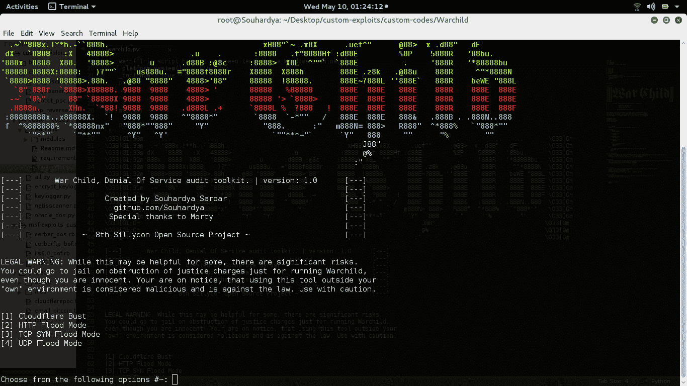

# war child–为分析而设计的拒绝服务测试套件

> 原文：<https://kalilinuxtutorials.com/warchild-denial-service-testing/>

Warchild 是一个拒绝服务测试套件，用于分析您的网站针对不同类型的拒绝服务攻击的能力，这些攻击主要是由骗子组织的，会对您的网站造成损害。



## **WarChild 安装**

```
**For Installing the required modules just run the following command in your terminal :) 

                 pip install -r requirements.txt** 
```

**也可理解为[CertCrunchy——使用 SSL 证书中的数据寻找潜在主机名的愚蠢侦察工具](https://kalilinuxtutorials.com/certcrunchy-data-ssl-certificates/)**

## **使用**

```
`python warchild.py` 
```

## **概述**

这种拒绝服务套件包括以下功能:

1.  **CloudBust:-**CloudBust a . k . a aet hon 是一款 cloudflare 解析器，它会查看受 cloudflare 保护的网站中配置错误的 DNS 配置，基本上使用 dnsdumpster.com 作为其解析器:)，并识别网站的后端 IP。我们将在接下来的时间里添加更多的更新。
2.  **HTTP Flood :-** HTTP Flood 是一种拒绝服务攻击，攻击者操纵 HTTP 并发布不需要的请求，以攻击 web 服务器或应用程序。在 HTTP 泛洪中，web 浏览器等 HTTP 客户端与应用程序
    或服务器进行交互，以发送 HTTP 请求。攻击的目的是迫使服务器分配尽可能多的资源来应对攻击，从而拒绝合法用户访问服务器的资源。ALISA 是一个 http d.o.s 工具，以这样一种方式编写，以吸取网站的所有资源，是一个第 7 层 d.o.s .工具。
3.  **TCP SYN Flood:-**SYN Flood 是拒绝服务攻击的一种形式，攻击者向位于
    的目标系统发送一系列 SYN 请求，试图消耗足够的服务器资源，使系统无法响应合法流量。
4.  **UDP Flood:-**UDP Flood 攻击是一种使用用户数据报协议(UDP)的拒绝服务(DoS)攻击，UDP 是一种无会话/无连接的计算机网络协议。

## **开源**

不受任何限制地重新分发和修改🙂

如果您遇到任何关于代码的问题，请在我们的存储库中打开一个问题，我们将尽快修复它。

## **免责声明**

任何非法使用该工具对他人造成损害的行为都可能直接导致你入狱🙂请将此框架仅用于安全测试目的。我们不对你的任何行为负责。

[](https://github.com/Souhardya/Warchild)