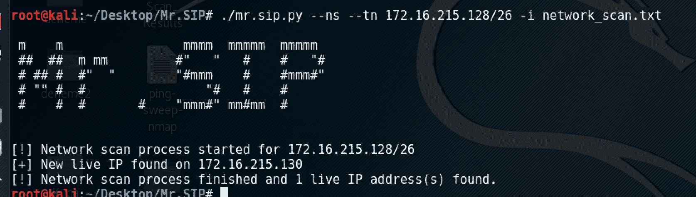
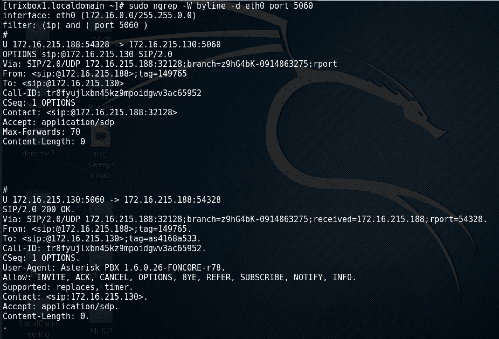
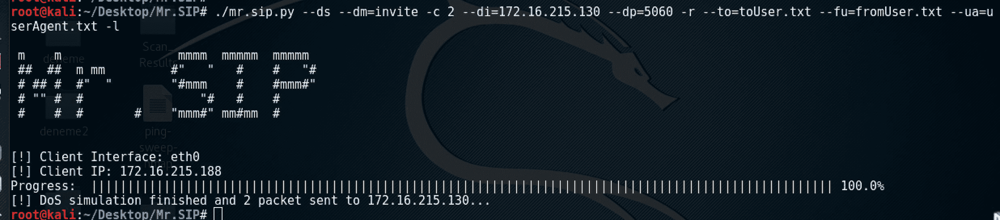
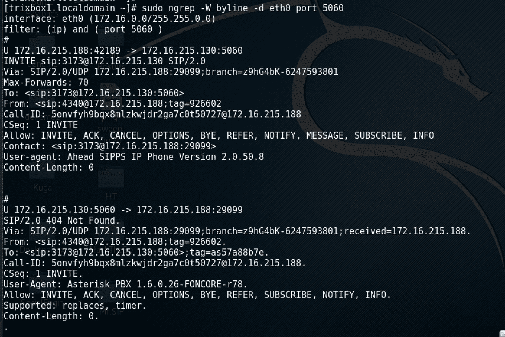

# SIP 先生:基于 SIP 的审计和攻击工具

> 原文：<https://kalilinuxtutorials.com/mr-sip-based-audit-attack-tool/>

Mr SIP 是为审计和模拟基于 SIP 的攻击而开发的工具。最初，它被开发用于学术工作，以帮助开发新的基于 SIP 的 DDoS 攻击和防御方法，然后作为一个想法，将其转换为一个全功能的基于 SIP 的渗透测试工具，它已被重新开发为当前版本。

它被 Elsevier，Science Direct 发表在 Computers & Security 63(2016)29-44 上的一篇题为“新颖的基于 SIP 的 DDoS 攻击和有效的防御策略”的学术期刊论文所使用。

在当前状态下，Mr SIP 包括四个子模块，命名为 SIP-NES、SIP-ENUM、SIP-DAS 和 SIP-ASP。由于它为开发者提供了一个模块化的结构，更多的模块将由作者继续添加，并且它对开源开发者社区的贡献是开放的。

SIP-NES 需要输入 IP 范围或 IP 子网信息。它向子网中的每个 IP 地址发送 SIP OPTIONS 消息，并根据响应输出该子网中的潜在 SIP 客户端和服务器。

SIP-ENUM 通过向 SIP-NES 输出端的每个客户端 IP 地址发送注册消息，根据该网络中的响应输出其用户是有效的。

SIP-DAS (DoS 攻击模拟器)是一个模拟基于 SIP 的 DoS 攻击的模块。它包括四个部分:欺骗 IP 地址生成器，SIP 消息生成器，消息发送器和场景播放器。它需要 SIP-NES(网络扫描器)和 SIP-ENUM(枚举器)的输出以及一些预定义的文件。

SIP-DAS 基本上生成合法的 SIP INVITE 消息，并通过 TCP 或 UDP 将其发送到目标 SIP 组件。它有三种不同的选项来生成欺骗 IP 地址，即手动、随机和从子网中选择欺骗 IP 地址。

IP 地址可以手动指定，也可以随机生成。此外，为了绕过用于阻止不属于该子网的 IP 地址通过互联网的 URPF 过滤，我们设计了一个欺骗 IP 地址生成模块。

欺骗 IP 生成模块计算使用的子网，并随机生成看起来来自子网内的欺骗 IP 地址。

为了绕过自动消息生成检测(异常检测)系统，生成随机的“邀请”消息，该消息中不包含任何模式。

每个生成的“邀请”消息在语法上与 SIP RFCs 兼容，并且可被所有 SIP 组件接受。

“INVITE”消息产生机制在消息的“To”报头中指定目标用户。这种攻击可以针对目标 SIP 服务器上的单个用户或合法 SIP 用户执行，作为 DoS 攻击前的中间步骤。

合法的 SIP 用户被枚举并写入文件。接下来，它们被随机放在生成的“INVITE”消息的“To”头中。“INVITE”消息中的“Via”、“User-Agent”、“From”和“Contact”报头是使用从有效用户代理和 IP 地址列表中随机选择的信息在语法上生成的。

“From”报头中的 tag 参数、“Via”报头中的 branch 和 source-port 参数以及“Call-ID”报头中的值是使用有效用户代理列表按语法随机生成的。此外，“Contact”和“Via”报头中的源 IP 地址也是使用 IP 欺骗生成的。

**也读[WarChild——为分析](https://kalilinuxtutorials.com/warchild-denial-service-testing/)** 而制作的拒绝服务测试套件

UDP 作为传输协议在 SIP 系统中被广泛使用，因此对目标服务器的攻击是通过使用 UDP 在网络中发送生成的攻击消息来实现的。

此外，还可以选择使用 TCP。SIP-DAS 的消息发送者允许可选地选择在一秒钟内可以发送多少 SIP 消息。每秒发送的 SIP 消息数量取决于攻击者机器的资源(CPU 和 RAM)。

SIP-ASP(攻击场景播放器)通过使用 SIP-DAS 作为框架，允许开发各种基于 SIP 的 DoS 攻击场景。

## **先生 SIP 用法示例**

**SIP-NES 扫描输出**

**SIP-NES 创建的呼叫流**

**SIP-DAS 攻击输出**

**SIP-DAS 创建的呼叫流程**

